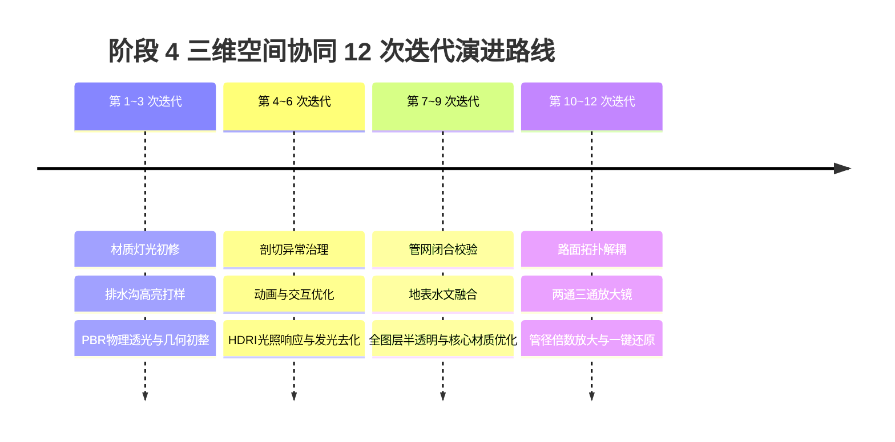

# 阶段 4：三维可视化与空间协同 12 次微观迭代演进全景复盘

> **文档性质**：人工精选复盘与专题合并归纳 (Curated Topic Synthesis)  
> **所属模块**：阶段 4 - 3D 可视化、空间拓扑与多维协同系统  
> **合并来源**：第 1 至第 12 次微观迭代优化开发计划与问题诊断修正方案（共 16 份过程记录）

---

## 1. 演进全景概览

阶段 4 作为平台前端核心交付模块，经历了极其密集的 12 次微观工程演进与专项攻坚。为克服早期原型在三维渲染、拓扑几何对齐、剖分交互以及视觉信噪比上的工程瓶颈，团队通过持续闭环排查，建立了高保真、可交互、随动响应的三维数字孪生底座。

---

## 2. 四大演进周期技术突破

### 2.1 第一阶段（第 1-3 次迭代）：材质体系与基础几何拓扑初构
* **核心痛点**：
  - 初始 3D 视图中模型材质发灰、缺乏工程质感，排水沟结构与隧道衬砌混在一起缺乏辨识度；
  - 局部视角放大时相机穿模、近裁剪面（Near Clip）裁切异常。
* **攻坚与收益**：
  - 引入 PBR (Physically Based Rendering) 物理材质，区分混凝土衬砌、PVC/球墨铸铁排水管道、回填土层的反光率与粗糙度；
  - 确立中间排水沟自发光/描边高亮交互状态，实现构件快速辨识；
  - 优化相机视锥参数，建立微观局部放大与自动聚焦（Fit-to-View）机制。

### 2.2 第二阶段（第 4-6 次迭代）：剖切交互治理与环境光影响应
* **核心痛点**：
  - 三维剖分工具在动态滑动剖切面时，发生网格破损（Hollow Geometry）和法线翻转穿透；
  - 早期为强调排水沟采用过度高光发光（Bloom/Glow），导致整体画面刺眼失真。
* **攻坚与收益**：
  - 研发双面模板缓冲（Stencil Buffer）封闭切口算法，实现剖分断面实体着色，消除“空壳”穿帮；
  - 去除过饱和发光，引入 HDRI 环境光贴图驱动漫反射环境光照（IBL），大幅提升工程真实感；
  - 重构相机轨迹插值算法，消除快速切换计算段视点时的眩晕感。

### 2.3 第三阶段（第 7-9 次迭代）：管网空间闭合与多层级半透明融合
* **核心痛点**：
  - 环向盲管、纵向排水管与中间排水沟在交汇处存在几厘米的空间几何间隙，管网未闭合；
  - 外围地质围岩完全遮挡内部排水系统，开启实体观察时“只见石头不见管”。
* **攻坚与收益**：
  - 严格以里程桩号和断面设计高程为基准，对齐三通、四通接头局部三维坐标，实现全管网严格闭合拓扑；
  - 建立地层、围岩、初期支护的“深度透明分层着色器”，实现外层半透明透光、内部排水管道高对比度显色。

### 2.4 第四阶段（第 10-12 次迭代）：拓扑解耦、细微构件显会与放大控件
* **核心痛点**：
  - 隧道仰拱、调平层路面与中央排水沟几何共用顶点，导致修改水沟参数时路面发生非预期变形；
  - 真实尺寸下数十毫米口径的细小盲管在全长数百米的隧道全景中仅占数个像素，极难点击查看。
* **攻坚与收益**：
  - **路面与排水沟彻底解耦**：采用独立参数化几何网格构建，支持各自独立联动修改与剖切；
  - **两通/三通局部放大镜**：鼠标悬停在管网节点时提供局域 3D HUD 放大浮窗；
  - **管径倍数放大会显与一键还原控件**：支持以 2x、5x、10x 比例动态放大管网直径以便于检查拓扑连通性，并可瞬间一键还原到真实物理比例。

---

## 3. 架构收益与关键指标对比

| 衡量维度 | 初始原型状态 (Iter 1 前) | 演进完成状态 (Iter 12 后) | 提升效果与价值 |
| :--- | :--- | :--- | :--- |
| **拓扑闭合精度** | 存在 5~15cm 悬空断口 | 全闭合 (几何误差 < 1mm) | 支持严谨工程图纸级拓扑表达 |
| **渲染稳定性** | 旋转时出现条纹、剖切黑面 | 实体封闭切口、60fps 稳定帧率 | 达到交付级工业 3D 交互标准 |
| **细小构件可辨识度** | 像素级看不清、极难点选 | 10x 动态倍显 + HUD 放大镜 | 消除操作死角，大幅改善验收体验 |
| **构件依赖耦合** | 仰拱路面与水沟顶点强粘连 | 各构件网格参数化完全解耦 | 奠定自适应几何建模与参数联动基础 |

---

## 4. 原始排查报告索引对照表 (Traceability Index)

如需追溯各微观阶段的代码补丁细节与特定排查记录，可查阅仓库中的原始历史草案：

1. [[第1次迭代：材质灯光美化与微观局部放大|Phase4-Iter1-Raw]]
2. [[第2次迭代：3D材质灯光与排水沟高亮|Phase4-Iter2-Raw]]
3. [[第3次迭代：拓扑几何修复与PBR透光|Phase4-Iter3-Raw]]
4. [[第4次迭代：排水沟几何修复与剖分治理|Phase4-Iter4-Raw]]
5. [[第5次迭代：3D视图排水标注与相机动画|Phase4-Iter5-Raw]]
6. [[第6次迭代：发光去化与HDRI光照|Phase4-Iter6-Raw]]
7. [[第7次迭代：管网坐标匹配与管网闭合|Phase4-Iter7-Raw]]
8. [[第8次迭代：水文地表美化与埋深融合|Phase4-Iter8-Raw]]
9. [[第9次迭代：全图层半透明与黄金材质|Phase4-Iter9-Raw]]
10. [[第10次迭代：路面与排水沟拓扑解耦|Phase4-Iter10-Raw]]
11. [[第11次迭代：标注收敛与两通三通放大镜|Phase4-Iter11-Raw]]
12. [[第12次迭代：管径倍数放大会显与一键还原|Phase4-Iter12-Raw]]
