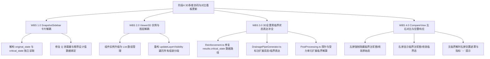

# 阶段4 - 3D多维协同与对比看板优化更新方案

## 1. 目标与概述 (Objectives)

本方案旨在全面诊断并解决隧道智能排水自适应平台前端在工况快照序列库（`SnapshotSidebar.vue`）、3D空间可视化引擎（`Viewer3D.vue`）以及多维双视角对比看板（`CompareView.vue`）中存在的状态数据混淆、图层控制失效、临界表达缺失及左右视角无差异等核心问题。

通过重构数据映射链路、多实例图层生命周期管理、多状态几何/标注绘制机制以及双屏空置响应交互，实现：
1. **快照卡片状态完全解耦**：精准区分原始解算态与临界自适应加固态的分区涌水量 $Q$、水头高度 $H$ 及排水管网建议设计参数。
2. **3D场景图层生命周期与显隐解耦**：解决多快照序列组装时单例覆盖导致的图层控制失效问题，实现任意组装工况下的图层精确独立/批量显隐。
3. **三维空间临界全要素表达**：补全【临界注浆加固圈】3D几何体渲染，扩展【排水管网参数标注】、【最不利探针】及【最不利受力单元】看板对临界加固态数据的双态表达。
4. **对比看板左右解算差异与空状态表达**：明确左屏（原始超限态）与右屏（临界加固态）的图层与数据分界；当工况无临界加固态时，右屏实现优雅空置与自适应达标提示。

---

## 2. 约束条件 (Constraints)

1. **架构Preservation**：严禁改变 Pinia 全局状态库（`snapshotStore` / `parameterStore`）的核心数据结构，保持后端 API 响应格式（`original_state`, `critical_state`, `input_parameter`）契约不变。
2. **逻辑完整性 (Output Completeness)**：方案需覆盖前端所有相关视图组件及 Three.js 渲染类（`Viewer3D.vue`, `CompareView.vue`, `SnapshotSidebar.vue`, `Reinforcement.ts`, `DrainagePipeGenerator.ts`, `PostProcessing.ts`），不留任何 TODO 或未定接口。
3. **渲染性能与内存安全**：在 3D 引擎处理多快照多段组装时，必须维持 CPU/GPU 内存的及时释放（Dispose）与 InstancedMesh 绘制效率，帧率不低于 45 FPS。

---

## 3. 架构设计与问题根因诊断 (Architecture & Root Cause Diagnosis)

### 3.1 快照卡片原始与临界渗漏量 Q 冗余归因
* **问题现象**：在 `SnapshotSidebar.vue` 的快照卡片中，原始状态与临界状态下的【分区总涌水量 Q】（渗漏量 Q）显示完全一致。
* **根因定位**：查看 `SnapshotSidebar.vue` 第 126-129 行：
  ```typescript
  const getRec = (snap: any, key: string) => {
    if (!snap.results) return null;
    return snap.results.critical_state?.[key] ?? snap.results.original_state?.[key];
  };
  ```
  数据提取函数 `getRec` 采用了 `critical_state` 优先的空值合并逻辑。当快照计算成果中包含 `critical_state` 时，原始状态网格区域（第 44, 48, 52, 56 行）直接读取到了 `critical_state` 中的数据，导致原始状态与临界状态的渗漏量 $Q$ 及推荐管径间距被错误地渲染为同一组数值。

### 3.2 Viewer3D 3D渲染及图层显隐失效归因
1. **【临界注浆加固圈】没有内容**：
   * **根因**：查看 `Reinforcement.ts` 第 283-301 行 `updateFromSnapshot(snapshot)`，代码读取 `const critical = snapshot.critical_state ?? {}`。但后端计算引擎与 Pinia 存储的快照实际数据结构为 `snapshot.results.critical_state`（或 `snapshot.results.original_state`）。导致传入的 `rg_crit` 与 `tg_crit` 恒为 `undefined`，`criticalGroutingMesh.count` 被设为 0，3D 视图中无法渲染出橙色临界注浆圈。
2. **多快照组装时图层显隐控制失效**：
   * **根因**：查看 `Viewer3D.vue` 第 390-393 行与 `renderSceneData()` 循环逻辑。组件内部使用单例变量 `tGenInstance`, `rManagerInstance`, `pipeGenInstance`, `envInstance` 保存渲染对象。当组装多个快照段（`snapshotsToRender.length > 1`）时，后创建的实例会直接覆盖全局变量。而用户点击【图层显隐控制】触发 `updateLayerVisibility()` 时，仅能更新最后一段快照的 Mesh 显隐，前面段的 Mesh 脱离控制，导致图层控制失效。
3. **标注、探针与受力单元缺失临界表达**：
   * **根因**：在 `Viewer3D.vue` 第 1043 行中，`probeManager.updateFromSnapshot` 传入的 `targetViewMode` 被硬编码为 `props.mode === 'all' ? 'original' : props.mode`。当在主 3D 视图（`mode="all"`）中时，探针与受力单元被强制限定为仅渲染 `original` 状态；同时 `DrainagePipeGenerator` 的标注组在 `mode="all"` 下也仅生成 `[原始]` 标注。

### 3.3 CompareView 左右对比流失与空置表达缺失归因
1. **左右侧无差别**：
   * 主要是由于 `Viewer3D.vue` 及 `Reinforcement.ts` 内部对 `critical_state` 数据路径读取失效，导致右屏（`mode="critical"`）解算出的几何特征（临界注浆圈、临界排水管间距）退化为原始状态，左右呈现相同景象。
2. **状态表达界限模糊**：
   * 左屏（原始解算态）未显式屏蔽【临界注浆加固圈】图层；右屏未将标注与受力探针严格收敛至临界状态。
3. **无临界解时的降级表达缺失**：
   * 当工况原始安全系数已满足要求（$K \ge 2.0$，无需降水与注浆）时，`activeSnapshot.value.results.critical_state` 为 `null` 或不存在。当前 `CompareView.vue` 的 `critMetrics` 直接降级回 `original_state` 填充，导致右屏依然显示数值，缺乏“工况安全，无需加固”的空置提示与视觉遮罩。

---

## 4. 工作分解结构与技术实现方案 (Work Breakdown Structure & Technical Solutions)



### WBS 1.0 快照侧边栏 (SnapshotSidebar.vue) 数据解耦方案

#### 1.1 数据读取函数重构
取消统一混淆的 `getRec` 方法，定义明确的状态提取 helper 函数，实现原始解算态与临界加固态的物理隔离：

```typescript
// 提取原始状态指标
const getOrigMetric = (snap: any, key: string) => {
  if (!snap.results) return null;
  const orig = snap.results.original_state;
  return orig?.[key] ?? snap.results?.input_parameter?.[key] ?? null;
};

// 提取临界状态指标
const getCritMetric = (snap: any, key: string) => {
  if (!snap.results || !snap.results.critical_state) return null;
  const crit = snap.results.critical_state;
  return crit?.[key] ?? null;
};
```

#### 1.2 模板渲染解耦
在 `SnapshotSidebar.vue` 卡片 DOM 结构中：
* **原始状态数据网格**：
  * 环向间距：`getOrigMetric(snap, 'ring_spacing_recommend')`
  * 环向孔径：`getOrigMetric(snap, 'ring_diam_recommend') * 1000`
  * 横向管径：`getOrigMetric(snap, 'lateral_diam_recommend') * 1000`
  * 渗漏量 Q：`getOrigMetric(snap, 'Q') ?? snap.results.original_state?.q_drain`
* **临界状态数据网格** (`v-if="snap.results.critical_state"`）：
  * 临界环向间距：`getCritMetric(snap, 'ring_spacing_recommend')`
  * 临界环向孔径：`getCritMetric(snap, 'ring_diam_recommend') * 1000`
  * 临界横向管径：`getCritMetric(snap, 'lateral_diam_recommend') * 1000`
  * 临界渗漏量 Q：`getCritMetric(snap, 'Q') ?? snap.results.critical_state?.final_Q`

---

### WBS 2.0 3D 视图 (Viewer3D.vue) 多段组装与图层管理重构

#### 2.1 实体实例集合化 (Multi-segment Instance Tracking)
将 `Viewer3D.vue` 中的单例引用替换为数组集合，以便追踪多个快照组装产生的所有几何体：

```typescript
// 升级为数组，支持多快照段组装时的完整追踪
let tGenInstances: TunnelGenerator[] = [];
let rManagerInstances: ReinforcementManager[] = [];
let pipeGenInstances: DrainagePipeGenerator[] = [];
let envInstances: Environment[] = [];
```

#### 2.2 图层显隐控制函数 (`updateLayerVisibility`) 遍历重构
修改 `updateLayerVisibility`，确保作用于所有已挂载的快照段：

```typescript
const updateLayerVisibility = () => {
  // 1. 衬砌
  tGenInstances.forEach(tGen => {
    if (tGen.mesh) tGen.mesh.visible = layerVisibility.lining;
  });

  // 2. 注浆加固圈（支持原始与临界）
  rManagerInstances.forEach(rManager => {
    if (rManager.groutingMesh) {
      // 原始解算态左屏强制隐藏临界圈
      rManager.groutingMesh.visible = layerVisibility.initialGrouting;
    }
    if (rManager.criticalGroutingMesh) {
      // 仅在非 original 模式且勾选时可见
      rManager.criticalGroutingMesh.visible = 
        props.mode !== 'original' && layerVisibility.criticalGrouting;
    }
  });

  // 3. 排水管网与标注
  pipeGenInstances.forEach(pipeGen => {
    pipeGen.getMeshes().forEach(mesh => {
      mesh.visible = layerVisibility.pipes;
    });
    if (pipeGen.annotationGroup) {
      pipeGen.annotationGroup.visible = layerVisibility.pipes && layerVisibility.pipeAnnotations;
    }
  });

  // 4. 水文环境
  envInstances.forEach(env => {
    if (env.waterPlane) env.waterPlane.visible = layerVisibility.environment;
    if (env.groundPlane) env.groundPlane.visible = layerVisibility.environment;
    if (env.flowLines) env.flowLines.visible = layerVisibility.environment;
    if (env.depthIndicator) env.depthIndicator.visible = layerVisibility.environment;
    if (env.waterParticles) {
      env.waterParticles.visible = layerVisibility.environment && layerVisibility.waterParticles;
    }
  });

  // 5. 探针与受力图例
  if (probeManager) {
    probeManager.probeGroup.visible = layerVisibility.probe;
    probeManager.diagramGroup.visible = layerVisibility.probe;
  }

  updateParticleAnimationLoop();
  scheduleRender();
};
```

---

### WBS 3.0 3D 领域对象 (Reinforcement / Drainage / Probe) 临界表达补全

#### 3.1 注浆加固圈数据路径修复 (`Reinforcement.ts`)
更新 `updateFromSnapshot`，正确解析嵌套在 `results` 下的 `critical_state`：

```typescript
public updateFromSnapshot(snapshot: any): void {
  if (!snapshot) return;
  const params = snapshot.input_parameter ?? snapshot.params ?? {};
  // 修复核心：优先读取 snapshot.results.critical_state，兼容 snapshot.critical_state
  const critical = snapshot.results?.critical_state ?? snapshot.critical_state ?? {};

  const groutingConfig: GroutingConfig = {
    rg: params.r_g ?? params.rg ?? snapshot.rg ?? 8.57,
    r2: params.r_p ?? params.r2 ?? snapshot.r2 ?? 8.57,
    rg_crit: critical.rg_crit,
    tg_crit: critical.tg_crit,
    start_chainage: params.start_chainage ?? snapshot.start_chainage ?? 0,
    end_chainage: params.end_chainage ?? snapshot.end_chainage ?? 50,
    tunnel_type: params.tunnel_type ?? snapshot.tunnel_type ?? 'single',
    D_spacing: params.D_spacing ?? snapshot.D_spacing
  };

  this.updateGroutingFromSnapshot(groutingConfig);
}
```

#### 3.2 排水管网标注状态优先级与防溢出样式 (`DrainagePipeGenerator.ts`)
在 `updateFromSnapshot` 与 `updateAnnotations` 中，完善状态提取优先级与文本防溢出自适应逻辑：
* **状态提取优先级**：
  * `viewMode === 'original'`：强制提取 `original_state`，标注前缀 `[原始]`，颜色 `#38bdf8`。
  * `viewMode === 'critical'` 或 `viewMode === 'all'`（主视角）：**优先表达【临界状态】**。若 `critical_state` 存在且非空，标注前缀 `[临界]`，颜色 `#ff9900`，读取临界推荐管径与间距；若不存在临界加固解，主视角（`mode === 'all'`）自动降级表达 `[原始]` 参数，`mode === 'critical'` 视角显示醒目绿框标注 `[临界: 安全储备足够无需加固]`。
* **Canvas Sprite 动态字号适配（防止超出边框）**：
  * 在 `createTextSprite(text, color)` 中，使用 `ctx.measureText(text)` 测量文本渲染宽度。若宽度超过边框可用安全宽度（如 `460px`），等比例自动缩小 `fontSize`，确保长文本（如环向盲管标注）严格包裹在圆角背景框内，不超出边框。

#### 3.3 最不利探针与受力单元临界解算 (`PostProcessing.ts` & `Viewer3D.vue`)
* 在 `PostProcessing.ts` 的 `updateFromSnapshot` 中：
  ```typescript
  const isCriticalMode = viewMode === 'critical' && (snapshot?.results?.critical_state || snapshot?.critical_state);
  const state = isCriticalMode 
    ? (snapshot.results?.critical_state ?? snapshot.critical_state) 
    : (snapshot.results?.original_state ?? snapshot.original_state ?? {});
  ```
* 在 `Viewer3D.vue` 中，允许通过模板看板或受力模式面板切换探针表达状态：
  ```typescript
  // 根据 props.mode 精准确定探针解算模式
  const targetViewMode = props.mode === 'all' 
    ? (currentProbeStateTab.value === 'critical' ? 'critical' : 'original') 
    : props.mode;
  ```
* 受力单元看板 (`probeInfo`) 升级：增加 `stateTag` 标识（`[原始超限态]` 或 `[临界自适应态]`），呈现对应状态下的控制单元编号 #idx、最小安全系数 K、控制轴力 N 及控制弯矩 M。

---

### WBS 4.0 多维双视角对比看板 (CompareView.vue) 交互升级

#### 4.1 左右视图模式与图层严格收敛
* **左屏 (`mode="original"`)**：
  * 属性传参：`<Viewer3D mode="original" :snapshot-override="activeSnapshot" />`
  * 自动屏蔽临界注浆加固圈图层；
  * 标注与探针仅表达原始超限数据。
* **右屏 (`mode="critical"`)**：
  * 属性传参：`<Viewer3D mode="critical" :snapshot-override="activeSnapshot" />`
  * 正常保留临界注浆加固圈（若有）；
  * 标注与探针仅表达临界自适应数据。

#### 4.2 临界状态不存在时的空置响应 (Empty State Handling)
新增 `hasCriticalState` 校验计算属性：

```typescript
const hasCriticalState = computed(() => {
  const snap = activeSnapshot.value;
  if (!snap || !snap.results) return false;
  return !!snap.results.critical_state && Object.keys(snap.results.critical_state).length > 0;
});
```

* **顶部定量比对看板 (`metrics-banner`)**：
  当 `hasCriticalState.value === false` 时：
  * 临界安全系数 `critMetrics.minK` 显示 `≥ 2.0 (已达标)`；
  * 临界水头高度与注浆厚度显示 `--`（空置表达），并隐藏递进箭头或标蓝/绿差值。
* **右侧 3D 视口 (`right-pane`)**：
  当 `!hasCriticalState` 时，在右侧视口上方叠加半透明工程级空状态遮罩：
  ```html
  <div v-if="!hasCriticalState" class="empty-critical-overlay">
    <div class="empty-card">
      <div class="empty-icon">🛡️</div>
      <div class="empty-title">当前工况结构安全储备充足</div>
      <div class="empty-desc">原始状态最小安全系数 K ≥ 2.0，无需执行水头降深与注浆增厚</div>
    </div>
  </div>
  ```

---

## 5. 验收标准与验证方案 (Acceptance Criteria & Verification)

### 5.1 验收标准 (Acceptance Criteria)

| 模块/功能 | 验收标准 | 验证方法 |
| :--- | :--- | :--- |
| **快照侧边栏** | 1. 原始状态与临界状态下的涌水量 $Q$、环向间距、管径独立显示，互不干扰。<br>2. 无临界状态时卡片优雅折叠临界区域。 | 检查 `SnapshotSidebar.vue` 界面卡片数值与后端 JSON 原始/临界字段完全对齐。 |
| **3D 引擎图层控制** | 1. 多快照组装（勾选多个快照）时，控制面板勾选/取消勾选可同步控制所有快照段的 Mesh。<br>2. 临界注浆加固圈（橙色半透明马蹄形）在有解时正确渲染。 | 在 3D 视图中勾选 3 个快照段，操作图层显隐开关，观察全段 Mesh 响应。 |
| **管网标注与探针** | 1. 【排水管网参数标注】优先表达【临界状态】，若无临界解自动降级表达【原始状态】；标注文本框具备自适应缩放机制，无文字超出边框现象。<br>2. 【最不利探针】与受力单元看板能准确反映选中状态（原始或临界）的 $K, M, N$。 | 切换 3D 模式与探针选项，核对 3D 空间 Sprite 标注文字与悬浮看板。 |
| **对比看板 (CompareView)** | 1. 左屏无临界注浆圈，显示原始态；右屏有临界注浆圈，显示临界态。<br>2. 无临界解工况下，右屏显示“安全达标，无需加固”空状态遮罩，指标显示 `--`。 | 选中安全工况与超限工况分别测试 CompareView 左右对比表现。 |

### 5.2 自动化与手动验证步骤 (Verification Plan)

#### 手动操作验证流程：
1. **快照库测试**：点击“一键计算”生成包含临界状态与无临界状态的快照，检查 `SnapshotSidebar.vue` 中卡片渗漏量 $Q$ 是否解耦。
2. **3D 多段组装显隐测试**：勾选 2 个以上快照，在主 3D 界面切换【初始注浆圈】、【临界注浆加固圈】与【排水管网】，确认所有分段同步显隐。
3. **CompareView 双屏比对测试**：
   - 打开 CompareView，选择超限快照：观察左屏为红区原始态（无临界加固圈），右屏为绿区自适应态（有橙色临界加固圈、自适应管网标注与临界探针）。
   - 选择达标快照：观察右屏遮罩提示“结构安全储备充足”，指标看板对应临界列空置显示 `--`。
