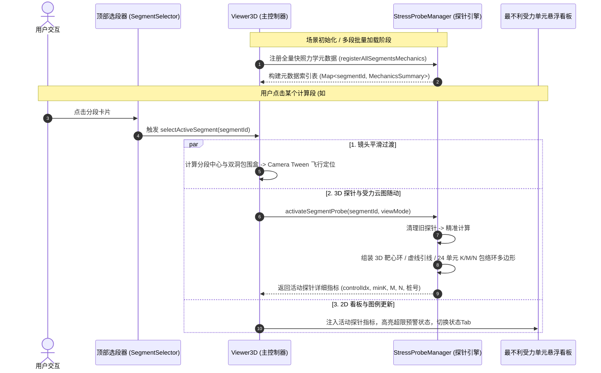
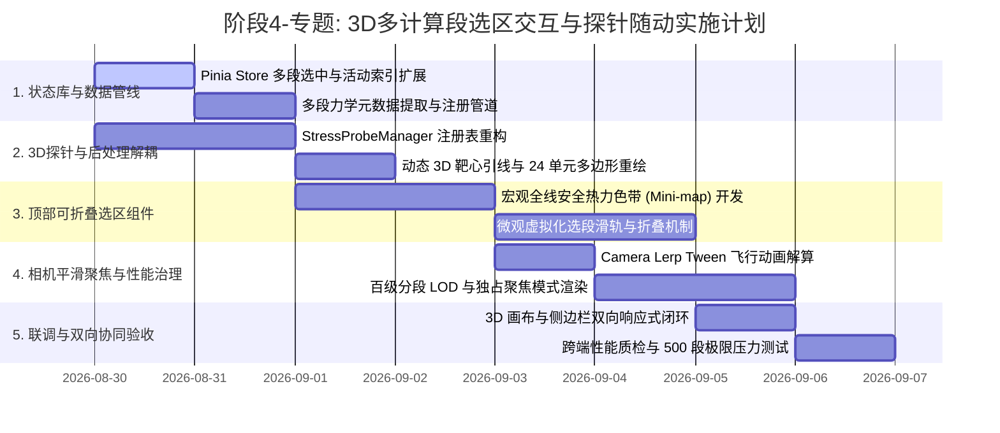

# 阶段4-专题-3D多计算段选区折叠交互与最不利受力探针随动架构方案

## Objectives

本方案旨在系统性解决隧道工程多维协同智能排水自适应平台在**多计算段/多工况快照（1~500+ 分段）同时加载至 3D 视口**时的交互混乱、信息过载、探针数据单例覆盖以及大数据量下 WebGL 渲染性能劣化等痛点，制定高度工程化、具备百级分段弹性伸缩能力的 3D 视口 UI 交互与受力感知优化架构。

```mermaid
flowchart TB
    subgraph DataLayer [多计算段快照数据源 (1 ~ 500+ Snapshots)]
        S1[计算段 1: DK0+000~DK0+050]
        S2[计算段 2: DK0+050~DK0+100]
        Sn[计算段 N: DK12+000~DK12+050]
    end

    subgraph TopSelectorUI [3D 画布顶部: 可折叠分段选区控制器]
        SummaryBadge[分段总览指示器: 标段数 / 高危段数 / 贯通总长]
        MacroRibbon[全线安全系数热力胶囊色带 (Mini-map Ribbon)]
        MicroFlow[分段虚拟化滚动卡槽 (Segment Pill Slider)]
        CollapseToggle[选区栏智能收折 / 展开控制]
    end

    subgraph InteractionEngine [3D 交互与随动引擎 (Viewer3D.vue / PostProcessing.ts)]
        FocusController[镜头平滑飞行动画 (Camera Focus Tweening)]
        ProbeRegistry[多段最不利探针注册表 (SegmentProbeRegistry)]
        StressRenderer[24单元受力云图与三维靶心标牌 (Dynamic Stress HUD)]
        HighlightBox[活动段边界聚焦高亮光晕 (Selection Box)]
    end

    subgraph Viewport3D [WebGL 3D 三维场景视口]
        LODManager[百级分段 LOD / 视锥剔除 / Instanced 批处理]
        ActiveProbe[当前活动段最不利探针 & 靶心引线]
        TunnelModel[多段连续拼装衬砌 / 管网 / 加固圈]
    end

    DataLayer --> TopSelectorUI
    TopSelectorUI -->|点选激活 activeSegmentId| InteractionEngine
    InteractionEngine --> FocusController
    InteractionEngine --> ProbeRegistry
    InteractionEngine --> HighlightBox
    FocusController --> Viewport3D
    ProbeRegistry --> StressRenderer
    StressRenderer --> ActiveProbe
    HighlightBox --> Viewport3D
    LODManager --> Viewport3D
```

### 核心目标分解

1. **3D 画布顶部可折叠选区控制器（Segment Selector Ribbon & Pill Slider）**：
   - 在 3D 画布正上方构建悬浮毛玻璃态、自适应伸缩的选段控制器。
   - 实时标识当前加载/勾选的计算段总数及安全状态统计（如：`共 128 个计算段 | ⚠️ 14 个高危预警段 | 全长 6.4km`）。
   - **百级分段规模支持（Hundreds of Segments Scaling）**：彻底解决 50~500 个以上分段在有限视口宽度下的排布与卡顿问题，采用“**宏观全线安全热力胶囊色带（Macro Mini-map） + 微观虚拟化水平选段滑轨（Virtual Pill Slider）**”双层空间检索架构。
   - 建立高辨识度的安全系数色彩分级规范（$K < 1.0$ 极度危险/血红、$1.0 \le K < 2.0$ 临界预警/明黄橙色、$K \ge 2.0$ 安全合规/青绿、待计算/中性灰）。
   - 单击任意分段即刻触发 3D 镜头平滑飞行动画（Ease-in-out Lerp Focus），精准定位于该分段几何中心与最佳视距。
2. **最不利受力单元与 3D 探针多段动态定向跟随（Dynamic Stress Probe Tracking）**：
   - 根治当前 `Viewer3D.vue` 中 `probeManager` 遍历多快照时单例覆盖、导致仅最后一组快照生效的架构缺陷。
   - 建立多段最不利探针元数据注册表（`SegmentProbeRegistry`），当用户切换选中分段时，3D 最不利探针（引线、定位靶心、法向环、数值标牌）与 24 单元受力云图（K/M/N 包络环）实时毫秒级重构并随动吸附至当前分段的最不利断面位置。
   - 视口右上角悬浮的“最不利受力单元看板”同步更新展示所选段的里程桩号、控制轴力 $N$、控制弯矩 $M$、最小安全系数 $K$ 及原始/临界状态切换。
3. **百级大模型 WebGL 渲染性能与视觉体验全景治理（Scale & Visual Polish）**：
   - **性能门禁**：百级分段下通过 InstancedMesh 批处理、视锥体剔除（Frustum Culling）与 LOD 降级（远景简化、近景高精），确保渲染帧率稳定 $\ge 50\text{ FPS}$，内存开销可控。
   - **聚焦模式（Focus Isolation Mode）**：支持“全线贯通全景（Overview）”与“当前段独占聚焦（Focus Mode，其余段半透明虚化或隔离）”一键切换。
   - **剖切吸附联动**：3D 剖切控制面板提供“对齐到当前段”，一键将剖切基准面吸附至选中段的起始或控制截面。
   - **全局双向联动总线**：打通 3D 顶部选区框与左/右侧边栏（`SnapshotSidebar.vue`、参数表单、对比视图）的状态同步。

---

## Constraints

1. **框架与技术栈约束**：
   - 基于 Vue 3 (Composition API, `<script setup lang="ts">`)、Three.js (r128+)、Pinia、Element Plus。
   - 保持既有 `snapshotStore` 与 `parameterStore` 接口及字段规范的向下兼容，不得破坏已有的单段渲染与 Excel 导入逻辑。
2. **WebGL 性能与内存安全约束**：
   - 单段几何生成与 Shader 编译需复用 Material/Geometry 缓存，杜绝反复销毁重建引起的 GPU 内存泄漏与帧率瞬时跌落（Jank）。
   - 数百个分段时的 DOM 节点数严格受限（DOM 节点 $\le 60$ 个），超长序列必须走 Canvas/SVG 虚拟滚动渲染。
3. **视觉风格与设计范式约束**：
   - 严格延续平台的双视觉美学范式（Dark Cyber 赛博暗夜风 与 Light Studio 高亮影棚风），UI 控件均采用 Glassmorphism 毛玻璃拟态与 CSS 变量系统。

---

## Architecture

### 1. 3D 顶部可折叠选区框体系与百级分段容量支撑

#### 1.1 空间与容量瓶颈攻克机制（数百个计算段的 UI 承载体系）

针对用户关注的“**是否支持数百个计算段**”的核心诉求，方案设计三级响应式承载策略：

```mermaid
graph TD
    A[已加载计算段总数 N] --> B{分段规模分流}
    B -->|小型 N <= 12| C[Mode 1: 常规弹性胶囊行 Elastic Pills]
    B -->|中型 12 < N <= 50| D[Mode 2: 虚拟滑轨 + 快速分页/搜索]
    B -->|大型 N > 50 (百级规模)| E[Mode 3: 宏观热力色带 Mini-map + 聚类展开 + 视窗滑块]

    C --> C1[直列平铺 / 点击直达 / 颜色指示 K]
    D --> D1[水平虚拟滚动条 / 左右翻页步进 / 风险过滤器]
    E --> E1[全线等比例连续色带 / 悬停 Tooltip / 点击大纲定位 / 聚焦微调器]
```

#### 1.2 选区控制器组件结构设计契约

在 `Viewer3D.vue` 顶部区域注入悬浮控制器 `<div class="segment-selector-bar glass-card">`：

```
+---------------------------------------------------------------------------------------------------+
|  [▼ 折叠] 📌 计算分段总览 [共 128 段 | 🔴 8 危险 | 🟡 18 预警 | 🟢 102 安全 | 6.4 km]  [🔍 筛选/定位] [独占聚焦 🔲] |
|---------------------------------------------------------------------------------------------------|
|  [==== 宏观安全热力色带 (Mini-map Ribbon: 全线等比例映射，颜色为各段 K 值，带当前视口游标 █) ====]   |
|---------------------------------------------------------------------------------------------------|
|  [◀] [DK0+000 K=2.45] [DK0+050 K=1.85] [DK0+100 K=0.92 🔴] ... [DK12+450 K=2.10] [▶] (可滚/搜)   |
+---------------------------------------------------------------------------------------------------+
```

##### 结构明细说明：
1. **顶部状态概要与工具条（Header Bar）**：
   - **折叠开关**：支持一键将选区控制器收缩为极简单行 Badge（高 28px），释放 3D 纵向视觉空间；再次点击丝滑展开（高 96px）。
   - **工况统揽指标**：动态计算显示总段数、高危红标数、预警黄标数、合规绿标数以及总里程跨度。
   - **快速检索过滤箱**：支持按里程模糊搜索（如输入 `1200` 或 `K12` 自动匹配并居中）、按风险等级一键只看高危段。
   - **独占聚焦模式切换（Isolation Focus Switch）**：开启后视口内仅高亮渲染当前选中段，其余非活动段自动施加 70% 深度透明度与线框化虚化，大幅降低视觉干扰与 GPU 负荷。
   - **单段与对比视图自动退化（Single / Compare Mode Fallback）**：当加载分段数 $N \le 1$ 或处于 `CompareView` 分屏模式（`props.snapshotOverride` 生效）时，选区框自动收缩或隐藏色带，避免单段场景下的视觉冗余。
   - **事件防穿透保护（Pointer Event Isolation）**：顶部面板全域设置 `@pointerdown.stop` 与 `@click.stop`，严格阻止鼠标交互穿透到底层 3D Canvas，杜绝误触 3D 测距与 PIP 放大镜。
2. **全线宏观安全热力胶囊色带（Macro Mini-map Ribbon）**：
   - 采用轻量 `<canvas>` 或动态 SVG 渲染一条高度 8px~12px 的色带。
   - **双模映射机制（Dual Mapping Model）**：
     - *物理里程连续模式（默认）*：按各段物理里程跨度比例映射，若存在断链或跨区间跳跃，以中性灰色虚线槽位标识空白未算区；
     - *离散等宽模式（Compact Index）*：各分段等宽平铺，适用于非连续离散工况对比。
   - 鼠标悬停在色带任意位置弹出即时浮窗（桩号、分段名称、最小安全系数 $K$、加固厚度 $t_g$）。
   - 色带上方叠加一个半透明白色高亮视窗滑块（Viewport Indicator），实时跟随 3D 相机在隧道中的空间投影范围，提供类似现代 IDE Mini-map 的全景掌控感。
3. **微观分段虚拟化胶囊滑轨（Micro Virtual Pill Slider）**：
   - 针对 100~500 个分段，使用水平虚拟列表（Virtual Horizontal Scroller）仅渲染当前可视窗口内的 8~15 个胶囊卡片，DOM 开销恒定。
   - 每个胶囊呈现：`[序号/桩号] [安全系数 K Badge] [状态指示点]`。
   - 活动项（Active Segment）带有科技蓝边框光晕、内发光脉冲与定位标记。

---

### 2. 最不利受力单元与 3D 探针多段动态路由解耦架构

#### 2.1 既有单例缺陷分析与重构设计

- **原逻辑痛点**：`Viewer3D.vue` 在 `renderSceneData()` 中对每个 `snapshot` 调用 `probeManager.updateFromSnapshot(...)`，由于 `probeManager` 内部只有一组 `probeGroup` 和 `diagramGroup`，循环中后一个分段会直接清除前一个分段的受力环和探针，导致无论加载多少个分段，场景中永远只有最后一个分段的探针残存。
- **解耦重构方案**：建立 **两级探针调度管线（Two-Tier Probe Pipeline）**。



#### 2.2 3D 探针与受力多边形动态定位数学模型

设用户当前选中的计算分段为 $S_k$，其里程范围为 $[L_{\text{start}}, L_{\text{end}}]$，内轮廓净空半径为 $r_0$，初支外径为 $r_2$，扁平率（宽高比）为 $\lambda$。

1. **截面纵向世界坐标定位**：
   - 提取该分段力学计算输出的最不利断面偏移量 $\Delta z_{\text{control}}$（通常位于最大水压断面或分段中心）：
     $$Z_{\text{world}} = -(L_{\text{start}} + \Delta z_{\text{control}})$$
2. **24 单元控制点三维坐标与法向**：
   - 调用连续马蹄形极坐标参数化方程，求解 24 个离散单元节点在世界坐标系下的三维坐标 $\mathbf{P}_i(x_i, y_i, Z_{\text{world}})$ 及外法向单位向量 $\mathbf{n}_i(n_{x,i}, n_{y,i}, 0)$。
3. **最不利探针靶心引线位置**：
   - 设最不利单元编号为 $c_{\text{idx}} \in [0, 23]$，引线悬挑距离为 $d_{\text{leader}} = 1.8\text{m}$，则 3D 靶心球与外光环的空间位置为：
     $$\mathbf{P}_{\text{probe}} = \mathbf{P}_{c_{\text{idx}}} + d_{\text{leader}} \cdot \mathbf{n}_{c_{\text{idx}}}$$
   - 3D 环形靶心网格的法向姿态四元数 $\mathbf{q}$ 通过从默认基向量 $(0, 0, 1)$ 到 $\mathbf{n}_{c_{\text{idx}}}$ 进行旋转对齐。
4. **安全系数与受力包络动态色彩赋值**：
   - 根据当前选定的受力模式（$K$ 安全系数 / $M$ 弯矩 / $N$ 轴力 / 综合受力），即时更新 24 单元的顶点色彩缓冲区与 Mesh 多边形截面。

---

### 3. 3D 相机平滑飞行动画与空间包围盒自适应对齐

当用户在顶部选段器中点选任意分段后，系统应避免视角的生硬跳变，采用基于三次 Hermite/Cubic 插值的平滑飞行动画：

#### 3.1 最佳观察视点数学解算

设活动分段起始于 $z_1 = -L_{\text{start}}$，终止于 $z_2 = -L_{\text{end}}$，分段长度 $\Delta L = L_{\text{end}} - L_{\text{start}}$，隧道净空高度为 $H$，隧道形式为单洞或双洞。

1. **有效包围宽度与跨度解算（Effective Bounding Span）**：
   - 单洞时：$W_{\text{effective}} = 2.2 \times r_0$
   - 双洞时（间距 $D_{\text{spacing}}$）：$W_{\text{effective}} = D_{\text{spacing}} + 2.2 \times r_0$
2. **观察目标中心点（LookAt Target）**：
   $$\mathbf{T}_{\text{target}} = \left( 0,\; \frac{H}{4},\; -\frac{L_{\text{start}} + L_{\text{end}}}{2} \right)$$
3. **相机视距与视点位置（Camera Eye Position）**：
   - 结合相机当前视场角（FOV，默认 $45^\circ$）与综合横纵跨度，解算无遮挡最佳视距 $D_{\text{optimal}}$：
     $$D_{\text{optimal}} = \max\left( \frac{\Delta L}{2 \tan(\text{FOV}/2)},\; \frac{W_{\text{effective}}}{\tan(\text{FOV}/2)},\; 25.0 \right)$$
   - 根据当前选择的标准视向（默认透视斜 $45^\circ$ 俯瞰），计算目标相机位置：
     $$\mathbf{P}_{\text{cam\_target}} = \mathbf{T}_{\text{target}} + \begin{pmatrix} 0.707 \cdot D_{\text{optimal}} \\ 0.5 \cdot D_{\text{optimal}} \\ 0.5 \cdot D_{\text{optimal}} \end{pmatrix}$$
4. **Lerp 动画插值方程**：
   - 动画总时长 $t_{\text{duration}} = 800\text{ms}$，在动画帧循环中计算非线性缓动系数：
     $$\text{ease}(p) = \begin{cases} 4p^3 & (p < 0.5) \\ 1 - \frac{(-2p+2)^3}{2} & (p \ge 0.5) \end{cases} \quad \left(p = \frac{\Delta t}{t_{\text{duration}}}\right)$$
   - 逐帧平滑逼近 `controls.target` 与 `camera.position`，到达终点后自动更新 OrbitControls 阻尼基准。

#### 3.2 活动分段边界聚焦光框（Selection Bounding Box）

在被选中的计算段外围自动叠加一个**动态脉冲发光的科技蓝包围选框**或**高亮端面切片光圈**，持续呼吸提示当前聚焦范围，并在 1.5s 后自动渐隐为细实线，消除视觉残留干扰。

---

### 4. 3D 画布整体协同 UI/UX 增强方案

```
+---------------------------------------------------------------------------------------------------+
|  [顶部选段控制器 Ribbon: 宏观色带 + 胶囊流]                                                          |
|---------------------------------------------------------------------------------------------------|
|                                                                    [最不利受力单元悬浮卡 (可折叠)]  |
|  [左侧控制面板自适应流动栈]                                            • #8 (DK0+050) [临界加固态]  |
|  ┌───────────────────┐                                             • 最小 K: 1.82 🔴 危险       |
|  │ 3D 剖切分析 (含一键吸附)│                                             • 控制弯矩 M: 284.5 kN·m     |
|  │ 图层显隐控制      │                                             • 控制轴力 N: 1640.2 kN      |
|  │ 排水管径放大会显  │                                            └──────────────────────────┘  |
|  │ 受力表达模式 K/M/N│                                                                            |
|  └───────────────────┘                                                                            |
|                                                                                                   |
|                                                                    [右侧 HUD: 活动段工程指标卡片] |
|                                                                    ┌───────────────────────────┐  |
|                                                                    │ 里程: DK0+000 ~ DK0+050   │  |
|                                                                    │ 埋深 H: 120m | 水头: 85m  │  |
|                                                                    │ 环向盲管: φ50 @ 8.0m      │  |
|                                                                    │ 临界加固圈: tg=1.20m      │  |
|                                                                    └───────────────────────────┘  |
|                                                                                                   |
|  [左下角: 全线/单段双视角对比快捷入口]                       [右下角: 视觉范式/标准视角/测距工具栏]  |
+---------------------------------------------------------------------------------------------------+
```

#### 4.1 UI/UX 核心增强矩阵

| 模块 | 痛点现象 | 优化方案与交互设计 | 价值收益 |
| :--- | :--- | :--- | :--- |
| **顶部选段器** | 多段场景下无法得知全线概况与各段风险分布 | 注入“宏观安全色带+微观滚动条”，直观展示全线风险热力图，支持数百段毫秒级筛选定位 | 解决长隧道全线多工况协同管控痛点 |
| **最不利探针** | 只能显示最后一段数据，探针位置死锁 | 建立 `SegmentProbeRegistry`，点选任一分段即刻随动解算该段 24 单元与 3D 靶心 | 实现点段感知的力学空间可视化 |
| **活动段工程 HUD** | 切换分段后必须到侧边栏或表单寻找详细水文与管径参数 | 视口右上角新增收折式活动段工程指标 HUD 卡片，即时展示当前段的水头、围岩、推荐管径与加固厚度 | 免去在多界面反复跳转的认知负担 |
| **3D 剖切分析联动** | 用户剖切时需手动拉动滑块寻找该段桩号 | 剖切面板增加 `[📍 一键对齐当前段]` 按钮，剖切面自动吸附至活动段起点/中点 | 剖切分析效率提升 80% |
| **全线贯通与单段隔离** | 百段全渲染视觉杂乱且显卡负载高 | 引入 `聚焦隔离模式 (Focus Isolation)`：非活动段施加半透明线框虚化，活动段高精着色 | 兼顾宏观全景感与微观专注度 |
| **侧边栏双向总线通信** | 3D 视口操作与左侧快照列表脱节 | 建立 Pinia 响应式总线：3D 顶部点选 $\rightarrow$ 侧边栏自动滚入视图并高亮；侧边栏点选 $\rightarrow$ 3D 顶部与镜头同步聚焦 | 实现真正的跨组件多维协同闭环 |

---

## Work Breakdown Structure



### 详细模块分工表

| WBS 编码 | 任务名称 | 责任组件 / 文件 | 关键实施内容 |
| :--- | :--- | :--- | :--- |
| **WBS 1.1** | 快照状态机活动段索引定义 | `snapshotStore.ts` | 增加 `activeSegmentId: string \| null`，提供 `setActiveSegment(id)` Action 与 `activeSnapshot` 计算属性 |
| **WBS 1.2** | 多段力学元数据解析管道 | `snapshotStore.ts` | 批量提取各快照的 `minK`, `control_idx`, `control_M`, `control_N`, `chainageText`，构建轻量只读索引表 |
| **WBS 2.1** | 探针管理器多段解耦重构 | `PostProcessing.ts` | 改造 `StressProbeManager`，移除单例数据覆盖限制，实现 `activateSegmentProbe(snapshot, ...)` 即时重构接口 |
| **WBS 2.2** | 24 单元受力云图随动重绘 | `PostProcessing.ts` | 精准计算活动分段对应截面位置 $Z_{\text{world}}$，动态更新 3D 环形靶心、引线和 K/M/N 多边形网格 |
| **WBS 3.1** | 顶部选区栏容器与折叠机制 | `Viewer3D.vue` | 构建毛玻璃悬浮条，支持一键折叠为 28px 紧凑 Badge 或展开为 96px 交互栏 |
| **WBS 3.2** | 全线安全热力 Mini-map 色带 | `Viewer3D.vue` | 基于 Canvas/SVG 绘制全线等比例色彩映射，集成悬停 Tooltip 与视口视锥滑块 |
| **WBS 3.3** | 微观虚拟滑轨与搜索过滤 | `Viewer3D.vue` | 实现横向滚动胶囊卡槽，支持桩号即时检索与高危段（$K<2.0$）过滤高亮 |
| **WBS 4.1** | 相机飞行动画与包围盒计算 | `Viewer3D.vue` | 编写 Cubic Lerp 相机动画函数，自动计算最佳 LookAt Target 与 Eye Position |
| **WBS 4.2** | 聚焦隔离与边界高亮光圈 | `Viewer3D.vue` | 开发活动分段科技蓝选框发光特效与非活动分段半透明线框化模式 |
| **WBS 4.3** | 3D 剖切吸附与工程 HUD | `Viewer3D.vue` | 剖切面板增加“吸附至当前段”；右上角新增活动段水文与工程参数 HUD 看板 |
| **WBS 5.1** | 双向通信总线对接 | `Viewer3D.vue`<br>`SnapshotSidebar.vue` | 建立 3D 视口与快照侧边栏的双向选段聚焦与高亮联动 |
| **WBS 5.2** | 300+ 分段极限性能压测 | 全系统 | 模拟 300 个工况分段并发载入，验证 FPS $\ge 50$ 与内存稳定无泄漏 |

---

## Acceptance Criteria

### 1. 功能完整性验收

- [ ] **顶部选区控制器折叠与展示**：3D 画布顶部正常加载选区控制器，完整展示当前选中的分段总数、风险分级统计（危险/预警/安全）及全线总里程；点击折叠按钮可收缩为极简胶囊，点击展开恢复全功能状态。
- [ ] **百级分段无损承载**：载入 100~300 个分段时，顶部 Mini-map 热力色带等比例完整呈现全线安全系数分布；胶囊滑轨支持顺畅横向滚动与桩号检索过滤，无 DOM 溢出破损或 UI 冻结。
- [ ] **镜头飞行动画精准度**：点击任意分段卡片或 Mini-map 对应位置，3D 相机在 800ms 内平滑飞行并聚焦于该段几何中心，视角无穿模、无剧烈翻转，活动段外围清晰呈现科技蓝发光聚焦框。
- [ ] **最不利探针与云图动态随动**：切换不同分段时，场景中的 3D 探针（引线、靶心、受力多边形环）与右上角悬浮看板**100% 同步跳转至该分段的最不利截面**，数值（$K, M, N$、单元编号、桩号）与该段力学计算结果完全一致，彻底消除单例覆盖失效。
- [ ] **双向协同联动**：在 3D 顶部选区框点选分段，左侧 `SnapshotSidebar` 对应卡片自动高亮并平滑滚入可视区；在侧边栏点击快照，3D 视口同步激活该段并飞入视角。

### 2. 性能与系统指标验收

- [ ] **帧率稳定性（FPS）**：在主流 GPU 环境下，3D 视口同时渲染 100 个以上分段时，场景旋转、平移与缩放的平均帧率 $\ge 50\text{ FPS}$（不低于 $45\text{ FPS}$）。
- [ ] **相机飞行动画耗时**：镜头切换缓动动画控制在 $800\text{ms} \pm 50\text{ms}$，动画期间帧率平滑无丢帧。
- [ ] **内存与垃圾回收（GC）安全**：频繁在不同分段间切换 100 次以上，GPU 显存与 JS 堆内存保持平稳，无 Three.js Mesh/Geometry/Material 泄漏。
- [ ] **DOM 节点轻量化**：顶部选段栏虚拟化机制确保无论加载多少个分段（10 或 500 个），顶部区域的活跃 DOM 元素总数始终 $\le 60$ 个。
