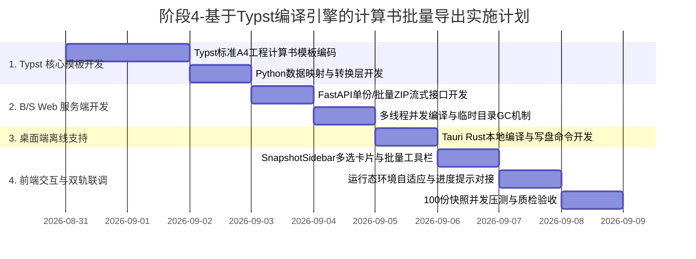

# 阶段4-专题-基于Typst编译引擎的计算书批量导出与ZIP打包架构方案

## Objectives

本方案旨在针对“隧道工程多维协同智能排水自适应平台”中**工况快照（Snapshot）的批量化、自动化工程出图与归档需求**，基于 **路径 A（FastAPI 后端 / Tauri 桌面端 + Typst 现代排版编译引擎）** 构建一套高性能、高保真、工业级的计算书批量生成与 ZIP 打包分发体系。

### 核心目标分解

1. **解决批量场景下的浏览器交互阻断与沙箱限制**：
   - 彻底摆脱纯前端 `window.print()` 只能单份手动确认、无法批量静默写盘的沙箱限制。
   - 实现用户在快照侧边栏（`SnapshotSidebar.vue`）多选或全选快照后，一键触发“批量导出计算书”，由后台 Worker/本地引擎异步生成并打包为标准 ZIP 压缩包下载。
2. **B/S 云端 Web 与桌面端离线单机（Dual Deployment）双轨并行**：
   - **B/S Web 模式**：前端发起 HTTP 请求至 FastAPI 后端，由服务端 Python 多协程调用 Typst 编译器批量生成并返回 `application/zip` 流式响应。
   - **Tauri 桌面端模式（离线独立运行）**：通过 Tauri Rust 宿主调用本地内嵌 Typst 编译能力或本地 Sidecar 进程，支持在断网、施工现场离线环境下直接将 ZIP 包或 PDF 文件集静默写入本地指定文件夹。
3. **极速编译吞吐与并发性能（100+ 快照秒级交付）**：
   - 利用 Typst（基于 Rust 编写的新一代现代排版引擎）增量编译与毫秒级渲染特性（单份多页复杂工程计算书耗时 $\le 30\text{ms}$）。
   - 建立并发编译池，使得 50 份 A4 计算书端到端编译与 ZIP 打包控制在 2 秒以内。
4. **100% 工业级排版与数学公式保真度**：
   - 模板基于 Typst 原生语法构建，严格遵循中国公路与铁路隧道工程规范（JTG 3370.1-2018 / GB 50108-2008）的标准三线表、多层上下标渗流水力公式、梁-弹簧内力大偏心受压校核与安全系数判定图章。
   - 生成的 PDF 具备全量矢量字体、矢量线条与公式字形，文本可检索、可选定，体积轻量（单份 $\approx 80\sim 150\text{KB}$）。
5. **归档颗粒度规范（按快照独立成文 + ZIP 聚合）**：
   - 严格按每份快照生成一份独立的 A4 PDF 计算书，互不杂糅，文件名规范绑定里程与报告编号；
   - 批量导出时统一汇聚为 ZIP 压缩包交付，兼顾工程分区独立追溯与集中批量分发。

---

## Constraints

1. **双部署架构兼容与无侵入安装**：
   - **B/S 后端**：Python 环境通过 PyPI 官方 `typst` 包（`pip install typst`）或预编译 CLI 接入；
   - **Tauri 桌面端**：利用 Tauri Sidecar 或 Rust 原生 `typst` crate 静态链接，无需在目标机器安装复杂的 TeXLive / Node / Chromium 全套重型环境，确保开箱即用与 100% 离线脱网运行。
2. **数据契约强一致性**：
   - Typst 模板的数据输入必须严格消费标准化 `CalculationBookData` 结构，严禁在模板内部发生未受版本管控的二次隐式数值计算。
3. **异步任务与高并发内存安全**：
   - 批量任务执行需在临时安全沙箱目录（`scratch/temp_pdf_batch_xxxx`）中进行，执行完毕或发生异常时必须提供自动清理与资源回收机制（Garbage Collection），防止磁盘爆满。
4. **网络传输与大文件流式响应**：
   - B/S 模式下批量 ZIP 打包采用流式传输（StreamingResponse）或前端进度条轮询（Task SSE），避免大体积文件生成时发生 HTTP 网关超时。

---

## Architecture

### 1. 系统总体数据流与模块架构（B/S Web 与 Tauri 桌面双轨）

```mermaid
flowchart TB
    subgraph FrontendLayer [前端交互与控制层 (Vue 3 + Pinia)]
        SidebarUI[SnapshotSidebar.vue / 快照管理侧栏]
        BatchSelect[快照多选 / 全选控制器]
        ExportBtn["批量导出计算书 (ZIP)" 按钮]
        ProgressBar[批量生成进度与下载提示弹窗]
        RuntimeCheck{运行环境判别: isTauri?}
        
        SidebarUI --> BatchSelect --> ExportBtn --> RuntimeCheck
    end

    subgraph BS_Pipeline [B/S Web 云端模式 (FastAPI + Python)]
        BatchRoute["POST /api/v1/calculation-books/batch-export"]
        FastAPI_Task[Python 并发调度池]
        DataExtractor[快照计算书数据转换器 (Data Mapper)]
        TypstRenderer_Py[Typst 模板动态变量注入器]
        CompilerPool_Py[Typst 编译器多线程池 (Python typst)]
        ZipPacker_Py[Python zipfile 打包器]
        ZipStream[application/zip 流式响应]
        
        RuntimeCheck -->|Web 浏览器端| BatchRoute
        BatchRoute --> FastAPI_Task --> DataExtractor --> TypstRenderer_Py --> CompilerPool_Py --> ZipPacker_Py --> ZipStream
    end

    subgraph Desktop_Pipeline [桌面端离线模式 (Tauri 2.x + Rust / Local Sidecar)]
        TauriCommand["invoke('batch_export_calculation_books')"]
        RustWorker[Rust 异步任务并发通道]
        LocalTypstEngine[内嵌 Typst 编译引擎]
        LocalZipWriter[本地文件系统直接写盘 (ZIP / 目录)]
        
        RuntimeCheck -->|Tauri 桌面端| TauriCommand
        TauriCommand --> RustWorker --> LocalTypstEngine --> LocalZipWriter
    end

    subgraph TypstTemplateSystem [Typst 工程计算书统一模板资产]
        MainTemplate["calculation_book_template.typ (主版式)"]
        Components["typst_components/ (封面/三线表/公式卡片/校核章)"]
        Fonts["fonts/ (思源黑体 / 思源宋体 / Consolas)"]
        
        MainTemplate --- Components
        MainTemplate --- Fonts
    end

    TypstRenderer_Py -.-> MainTemplate
    LocalTypstEngine -.-> MainTemplate
    ZipStream --> ProgressBar
    LocalZipWriter --> ProgressBar
```

---

### 2. 模块详细解构与职责划分

#### (1) 前端运行态自适应模块 (`SnapshotSidebar.vue` + `calculationBookApi.ts`)
- **环境自适应路由**：检测 `window.__TAURI_INTERNALS__`，若在桌面客户端运行则直接走 Tauri IPC 本地流，若在 Web 浏览器则调用 FastAPI 端点。
- **多选状态流转**：在侧边栏卡片上扩展 Checkbox 复选框，支持“当前筛选工况全选”、“按分区选定”以及“已计算工况快捷全选”。
- **请求 Payload 规范**：
  - 支持传参 `snapshot_ids: string[]`（后端查库生成）；
  - 或直接传参 `snapshots: Snapshot[]`（针对前端临时推演、未持久化快照的即时离线批量导出）。
- **下载状态拦截**：在生成期间展示全量进度环（如 `正在编译: 15/48...`），并支持取消任务。

#### (2) 数据映射器 (`data_mapper.py` / `data_mapper.rs`)
- 严格对照前端 `bookGenerator.ts` 算法，将快照输入/输出参数解构为 6 大章节数据对象：
  - `meta`: 项目名称、报告编号、桩号里程、工况描述、生成日期；
  - `chapter1` ~ `chapter6`: 完整结构化指标、力学计算矩阵、多孔渗流参数、判定结论。
- 序列化为标准化 JSON，直接注入 Typst 模板作为根字典参数。

#### (3) Typst 模板引擎资产 (`app/templates/typst/`)
- **`report_layout.typ`**：定义 A4 边距（`margin: (top: 14mm, bottom: 14mm, left: 15mm, right: 15mm)`）、页眉页脚（带动态章节名称与第 X 页/共 Y 页）、中文字体 fallback。
- **`math_formulas.typ`**：收录 SCS-CN 降雨下渗、多层圆筒外水压力公式、梁-弹簧偏心受压承载力 $K$ 计算推导块。
- **`tables.typ`**：标准工程三线表（Top Rule, Mid Rule, Bottom Rule），支持数值高亮与单元格自适应跨行。
- **`verdict_box.typ`**：合格/警戒视觉判定框与工程签章栏。

#### (4) 编译调度与 ZIP 打包服务
- **独立 PDF 生成与命名策略**：
  - 单文件命名格式：`【计算书】DK{startChainage}+{endChainage}_{tunnelName}_{snapshotName}_{reportCode}.pdf`
  - ZIP 压缩包命名格式：`【批量计算书】{projectName}_{timestamp}_共{count}份.zip`
- **生命周期守护**：使用临时沙箱目录，接口响应完成或桌面端写盘完成后立即销毁中间编译产物，保证零磁盘残留与内存恒定。

---

## Work Breakdown Structure (WBS)



### 任务分解清单

1. **Task 1.1：Typst 6大章节高保真规范模板开发**
   - 编写 `calculation_book.typ`，包含设计依据、参数总表、渗流水力计算、结构安全验算、优化方案对比、结论与建议。
   - 针对公式采用 Typst 原生数学语法（如 `$P_w = rho_w dot g dot (H - z)$`），支持毫秒级解析。
2. **Task 2.1：B/S Web 后端批量导出与 ZIP 流式服务**
   - 在 `backend/requirements.txt` 中引入 `typst>=0.11.0`。
   - 编写 `POST /api/v1/snapshots/batch-export-calculation-books` 接口，支持多线程并发编译并直接打包流式返回 `.zip`。
3. **Task 3.1：Tauri 桌面端离线导出适配**
   - 编写 Tauri command `batch_export_calculation_books`，支持在无网络环境下调用本地内嵌 Typst 编译并将 `.zip` 写入用户自选路径。
4. **Task 4.1：前端侧边栏批量交互开发**
   - 修改 `SnapshotSidebar.vue`，在工况列表上方增加“批量选择/反选”控制栏与“导出计算书 (ZIP)”按钮。
   - 集成运行态环境自适应检测（Web 调用 API，Desktop 走 Tauri IPC）。
5. **Task 5.1：一致性与性能验收**
   - 对比前端 Web 端预览与后端 Typst 编译输出的 PDF，确保数值、公式、结论 100% 吻合。

---

## Acceptance Criteria

### 1. 功能完备性指标
- [ ] **双模态并行支持**：在 B/S Web 浏览器端与 Tauri 离线桌面端均能无差别触发计算书批量导出。
- [ ] **多选批量触发**：在前端侧边栏勾选 1~100 份工况快照后，点击“批量导出”可在无需用户逐一点击打印框的前提下，直接触发浏览器/客户端的 `.zip` 压缩包下载与保存。
- [ ] **单份极速直下**：在快照卡片或模态框中，提供“下载独立 PDF”按钮，点击后 1 秒内直接下载对应快照的 `.pdf` 文件。
- [ ] **压缩包完整性**：解压生成的 `.zip` 包后，每个快照独立成文，文件名规范清晰，无乱码，无遗漏。

### 2. 排版与数学质量指标
- [ ] **100% 纯矢量输出**：PDF 中文字、三线表边框、数学公式、判定徽章放大至 800% 无任何栅格化模糊与锯齿。
- [ ] **文本可检索复制**：PDF 内的所有参数文本、公式符号与结论均可直接选定并复制。
- [ ] **跨页排版规则**：表格、公式块、结论框严格遵循不跨页断裂约束（`break-inside: avoid`），封面与标题对齐符合工程技术报告规范。

### 3. 性能与资源指标
- [ ] **编译耗时**：单份计算书后端编译时间 $\le 50\text{ms}$；50 份快照并发编译 + ZIP 打包总响应时间 $\le 2.5\text{s}$。
- [ ] **文件体积**：单份 PDF 大小控制在 $80\sim 200\text{KB}$ 之间（ZIP 压缩后 50 份约 $3\sim 6\text{MB}$）。
- [ ] **零残留安全**：每次批量请求结束后，中间临时文件与内存缓存 100% 自动清除，无临时文件泄露。
