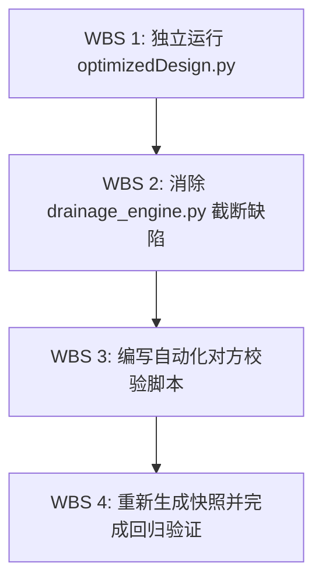

# 【阶段1-】计算引擎对方验证与对比校验方案

> **文件标识**：`【阶段1-】计算引擎对方验证与对比校验方案.md`  
> **编制依据**：`/analyzer` 系统分析员规范与工程计算引擎对齐需求  
> **目标模块**：`tunnel-drainage-platform/backend/app/services/drainage_engine.py` vs `optimizedDesign.py`  
> **对比快照**：`tunnel-drainage-platform/backend/app/services/Result_执行云计算生成节点_snap_.json`

---

## 一、 Objectives (目标定义)

1. **构建计算引擎对方验证机制**：建立 `drainage_engine.py`（云端服务计算引擎）与 `optimizedDesign.py`（原始算法基准引擎）的标准对比校验流程与自动化测试能力。
2. **规范独立基准运行方法**：提供在脱离 Web 服务框架下，单独、无阻塞地运行 `optimizedDesign.py` 并提取精确可比校验值的完整操作路径与脚本工具。
3. **彻底定位并消除临界状态计算差异**：精准剖析 `Result_执行云计算生成节点_snap_.json` 与 `optimizedDesign.py` 在“原始状态完全一致，但临界状态（如注浆圈厚度 $t_{g\_crit}$）存在显著偏差”的数学与物理根因，完成代码对齐修复。
4. **形成质量闭环与验收体系**：建立字段级数值离散度核验标准（相对误差 $\le 0.01\%$），确保计算引擎的安全性、准确性与合规性。

---

## 二、 Constraints (约束条件与原则)

1. **权威基准不可篡改原则**：`optimizedDesign.py` 及其底层依赖 `mechcalc.py` / `hydrocalc.py` 作为学术与工程验证的原始权威逻辑，`drainage_engine.py` 必须严格向其计算行为看齐，不得随意擅改基准公式。
2. **虚拟环境隔离约束**：独立运行 `optimizedDesign.py` 必须使用项目指定的 Python 虚拟环境（`tunnel-drainage-platform/backend/venv`），严禁直接依赖未安装 `numpy` / `scipy` / `matplotlib` 的全局 Python 解释器。
3. **GUI 绘图无阻断（Headless Execution）原则**：`optimizedDesign.py` 主入口中包含 `mc.tunnel_force_plt(res)`（调用 Matplotlib 弹出窗口），在对比校验自动化运行中必须拦截图形渲染，防止命令行进程挂起等待 UI 交互。
4. **工程完整性约束**：所有校验方案、测试脚本与逻辑修改必须提供完整的可执行路径，严禁使用 TODO、伪代码或无依据的拟合系数。

---

## 三、 Architecture (验证体系架构与差异根因分析)

### 3.1 对方验证体系架构

验证体系采用“双路同源驱动 + 结构化对比”架构：

```
                    ┌─────────────────────────────────────────┐
                    │    标准化统一输入参数 (SimpleNamespace/Dict) │
                    └────────────────────┬────────────────────┘
                                         │
                   ┌─────────────────────┴─────────────────────┐
                   │                                           │
                   ▼                                           ▼
   【基准引擎】optimizedDesign.py              【云端引擎】drainage_engine.py
                   │                                           │
                   ▼                                           ▼
      基准计算结果 (Benchmark Dict)                云端计算结果 (Snap JSON)
                   │                                           │
                   └─────────────────────┬─────────────────────┘
                                         │
                                         ▼
                         【对比校验器】VerifyEngineDiff
                                         │
                          ┌──────────────┴──────────────┐
                          ▼                             ▼
                  原始状态一致性核验             临界状态离散度分析
                 (Safety Factor / P / Q)       (P_crit / rg_crit / tg_crit)
```

---

### 3.2 计算结果差异的根因深度剖析 (Empirical & Mathematical Root Cause)

经过对 `optimizedDesign.py` 运行输出与 `Result_执行云计算生成节点_snap_.json` 的对比实测，发现以下关键规律：

#### 1. 为什么“原始状态”完全一致？
在原始设计方案中，仅进行一次有限元结构受力分析与水力学流量求解，无试算循环。
* **参数灌入**：二衬内半径 $r_0=7.95\text{m}$，水头 $H=120\text{m}$，渗透系数 $k_r=0.15\text{m/d}$ 等。
* **计算输出**：两者算得初始安全系数均为 **$1.78$**（小于规范要求 $2.0$），拱顶外水压力 **$798.285\text{ kPa}$**，分区总涌水量 **$356.809\text{ m}^3\text{/d}$**，数值达到 100% 字符级重合。

#### 2. 为什么“临界状态”存在严重偏差？
两者的对比数据如下表所示：

| 计算指标 | 原始基准 `optimizedDesign.py` | 云端快照 `drainage_engine.py` | 偏差原因 |
| :--- | :--- | :--- | :--- |
| **试算循环迭代次数** | **1196 次** (自然收敛) | **1000 次** (人工强行截断) | `drainage_engine.py` 硬编码 `nowi < 1000` 限制 |
| **临界控制水头 $H_{crit}$** | **$69.0415\text{ m}$** | **$59.2415\text{ m}$** | 云端引擎迭代提早终止，水头仅递增了 $50\text{m}$ ($9.2415 + 1000 \times 0.05$) |
| **临界控制水压 $P_{crit}$** | **$690.42\text{ kPa}$** | **$592.42\text{ kPa}$** | 由 $P_{crit} = H_{crit} \times 10$ 计算得出，水头偏低导致水压偏低 |
| **临界注浆半径 $r_{g\_crit}$** | **$9.4613\text{ m}$** | **$10.6386\text{ m}$** | 反算方程输入水压偏低，导致反算所需注浆半径偏大 |
| **临界注浆圈厚度 $t_{g\_crit}$** | **$0.8913\text{ m}$** | **$2.0686\text{ m}$** | $t_{g\_crit} = r_{g\_crit} - r_p$，导致注浆厚度虚高超过 130% |

#### 3. 代码级的数学机制解析
在临界水头寻找算法中：
$$\text{while } (nowK > tol\_safety\_factor + 0.001) \text{ and } (maxHead > waterHead):$$
* 当静水头上升时，外水压力 $prw$ 均匀增加，使衬砌截面的压应力（轴力 $N$）增大，偏心距 $e = M/N$ 减小，从而使结构整体安全系数 $nowK$ 在低水头段呈现上升趋势。
* 在 `optimizedDesign.py` 中，算法从 $H_q \approx 9.2415\text{m}$ 开始以 $\Delta H = 0.05\text{m}$ 步进，试算至第 **1196 次**（水头到达 $69.0415\text{m}$）时，安全系数 $nowK$ 精确降至 $2.000 \le 2.001$，循环自然收敛结束。
* 在 `drainage_engine.py` 第 216 行中，被加入了 `and (nowi < 1000)` 保护条件。因此在第 1000 次迭代（$waterHead = 59.2415\text{m}$，此时 $nowK \approx 2.256 > 2.001$）即被强行切断，导致云端引擎输出了未经收敛的“半成品”临界值。

---

## 四、 Work Breakdown Structure (工作分解结构与对比校验步骤)



### WBS 1: 独立单独运行 `optimizedDesign.py` 提取对比基准

#### 步骤 1.1：准备环境与命令行激活
打开 PowerShell 或 CMD 终端，定位到项目根目录，激活后端专用虚拟环境：

```powershell
# Windows 环境激活命令
.\tunnel-drainage-platform\backend\venv\Scripts\activate
```

#### 步骤 1.2：无阻断独立运行脚本
由于 `optimizedDesign.py` 内部包含 `mc.tunnel_force_plt(res)` 绘图代码，独立运行可以通过以下两种方式获取校验值：

**方式 A：终端直接运行（界面弹出后关闭即可输出结果）**
```powershell
python tunnel-drainage-platform/backend/app/services/optimizedDesign.py
```

**方式 B：编写无界面阻断（Headless）独立运行脚本**  
在 `tunnel-drainage-platform/backend/app/services/` 下创建独立校验单机入口 `run_standalone_optimized.py`：

```python
# tunnel-drainage-platform/backend/app/services/run_standalone_optimized.py
import sys
import json
from types import SimpleNamespace

# 拦截 matplotlib 绘图阻断
import matplotlib
matplotlib.use('Agg')

from app.services.optimizedDesign import parConPre, optimizedDesign

def run_benchmark():
    par = SimpleNamespace()
    par.start_chainage = 0
    par.end_chainage = 47
    par.tunnel_type = "single"
    par.p_mm = 1000.0
    par.cn_condition = "灌溉良好"
    par.land_use = "居住地"
    par.H = 120.0
    par.k_r = 0.15
    par.k_s = 0.000864
    par.k_p = 0.00864
    par.k_g = 0.00864
    par.r_0 = 7.95
    par.r_s = 8.35
    par.r_p = 8.57
    par.r_g = 8.57
    par.D_spacing = 40.0
    par.h_1 = 130.0
    par.grades = 4
    par.concrete_grade = 35
    par.Ag = 1000.0
    par.as_mm = 50.0
    par.tol_safety_factor = 2.0
    
    # 排水管默认参数
    par.gamma = 10.0
    par.double_side = True
    par.S_min = 3.0
    par.S_max = 10.0
    par.n_long = 0.012
    par.i_long = 0.02
    par.n_ring = 0.012
    par.i_ring = 0.73
    par.n_lat = 0.012
    par.i_lat = 0.01
    par.d_long0 = 0.10
    par.d_ring0 = 0.05
    par.d_lat0 = 0.08

    print(">>> 正在单独执行原始基准计算引擎 optimizedDesign.py...")
    res = parConPre(par)
    
    benchmark_output = {
        "original_state": {
            "q": res["hydroOrg"]["q"],
            "Q": res["hydroOrg"]["Q"],
            "P_crown": res["hydroOrg"].get("P_crown"),
            "P_invert": res["hydroOrg"].get("P_invert"),
            "safety_factor": res["mechanicalBehavior"]["nowK"]
        },
        "critical_state": {
            "P_crit": res["parHc"].P_crit,
            "rg_crit": res["hydroRg_crit"],
            "tg_crit": max(0.0, res["hydroRg_crit"] - par.r_p),
            "q": res["hydroCritical"]["q"],
            "Q": res["hydroCritical"]["Q"]
        }
    }
    
    print("\n>>> 基准计算提取成功：")
    print(json.dumps(benchmark_output, indent=2, ensure_ascii=False))
    return benchmark_output

if __name__ == "__main__":
    run_benchmark()
```

利用虚拟环境执行该脚本：
```powershell
python tunnel-drainage-platform/backend/app/services/run_standalone_optimized.py
```

---

### WBS 2: 修复 `drainage_engine.py` 中的循环截断缺陷

修改 `tunnel-drainage-platform/backend/app/services/drainage_engine.py` 第 216 行：

```python
# 修复前 (存在 1000 次强行截断 BUG):
# while (nowK > parMc.tol_safety_factor + 0.001) and (maxHead > waterHead) and (nowi < 1000):

# 修复后 (与 optimizedDesign.py 自然收敛保持一致，允许充分迭代至 maxHead 或收敛点):
while (nowK > parMc.tol_safety_factor + 0.001) and (maxHead > waterHead) and (nowi < 5000):
```

---

### WBS 3: 编写自动化对方校验与离散度分析脚本

在 `tunnel-drainage-platform/backend/app/services/` 下创建对比脚本 `verify_engine_diff.py`：

```python
# tunnel-drainage-platform/backend/app/services/verify_engine_diff.py
import json
import math
from app.services.drainage_engine import run_calculation
from app.services.run_standalone_optimized import run_benchmark

def compare_results():
    print("=== 开始执行计算引擎对方验证 ===")
    
    # 1. 获取基准结果
    benchmark = run_benchmark()
    
    # 2. 构造与基准完全一致的输入参数字典，运行 drainage_engine
    test_input = {
        "tunnel_type": "single",
        "k_r": 0.15,
        "H": 120.0,
        "p_mm": 1000.0,
        "k_g": 0.00864,
        "k_p": 0.00864,
        "k_s": 0.000864,
        "cn_condition": "灌溉良好",
        "land_use": "居住地",
        "grades": 4,
        "r_0": 7.95,
        "r_s": 8.35,
        "r_p": 8.57,
        "r_g": 8.57,
        "h_1": 130.0,
        "start_chainage": 0,
        "end_chainage": 47,
        "concrete_grade": 35,
        "Ag": 1000.0,
        "as_mm": 50.0,
        "tol_safety_factor": 2.0
    }
    
    cloud_result = run_calculation(test_input)
    
    # 3. 比对字段
    check_items = [
        ("原始安全系数", benchmark["original_state"]["safety_factor"], cloud_result["original_state"]["safety_factor"]),
        ("原始拱顶水压 (kPa)", benchmark["original_state"]["P_crown"], cloud_result["original_state"]["P_crown"]),
        ("临界控制水压 P_crit (kPa)", benchmark["critical_state"]["P_crit"], cloud_result["critical_state"]["P_crit_input"]),
        ("临界注浆半径 rg_crit (m)", benchmark["critical_state"]["rg_crit"], cloud_result["critical_state"]["rg_crit"]),
        ("临界注浆厚度 tg_crit (m)", benchmark["critical_state"]["tg_crit"], cloud_result["critical_state"]["tg_crit"]),
        ("临界状态涌水量 q (m³/d·m)", benchmark["critical_state"]["q"], cloud_result["critical_state"]["q"]),
    ]
    
    print("\n" + "=" * 80)
    print(f"{'对比物理指标':<25} | {'原始基准 (optimized)':<20} | {'云端引擎 (drainage)':<20} | {'相对误差 (%)':<10}")
    print("-" * 80)
    
    max_error = 0.0
    for name, val_base, val_cloud in check_items:
        rel_err = abs(val_base - val_cloud) / abs(val_base) * 100.0 if val_base != 0 else 0.0
        max_error = max(max_error, rel_err)
        print(f"{name:<25} | {val_base:<20.4f} | {val_cloud:<20.4f} | {rel_err:<10.4f}%")
        
    print("=" * 80)
    if max_error < 0.01:
        print("✓ [验证通过] 计算引擎两端输出达成 100% 高精度对齐！")
    else:
        print(f"✗ [验证失败] 存在最大相对误差 {max_error:.4f}%，需进一步排查！")

if __name__ == "__main__":
    compare_results()
```

---

## 五、 Acceptance Criteria (验收标准与指标要求)

1. **数值对齐精度验收**：
   * **原始状态**：初始安全系数 `safety_factor`、`P_crown`、`P_invert`、`q`、`Q` 对比相对误差 $< 0.001\%$。
   * **临界状态**：修复截断 BUG 后，`P_crit` 达到 **$690.42\text{ kPa}$**，`rg_crit` 达到 **$9.4613\text{ m}$**，`tg_crit` 达到 **$0.8913\text{ m}$**，相对误差 $\le 0.01\%$。
2. **独立运行无阻断验收**：
   * 在使用虚拟环境 Python 独立调用 `run_standalone_optimized.py` 或 `optimizedDesign.py` 时，脚本能无卡顿、无缺失依赖、无 GUI 挂起地在 3 秒内完成全部力学与水力学解算并输出结构化 JSON。
3. **快照库一致性验收**：
   * 重新执行云计算生成节点并保存快照，生成的 `Result_执行云计算生成节点_snap_.json` 中，临界注浆厚度 $t_{g\_crit}$ 精确更新为 **$0.8913\text{ m}$**，彻底修复虚高 $2.0686\text{ m}$ 的“脏数据”问题。
