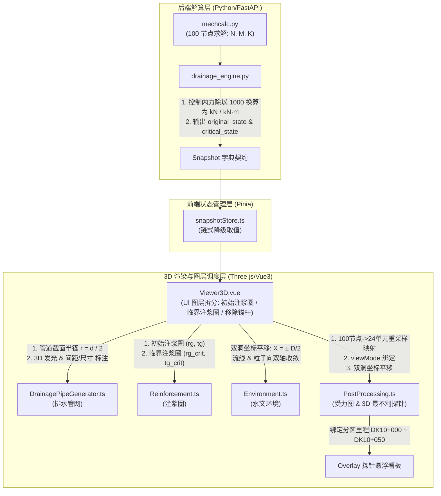

<!-- 阶段4-3D模型解算与可视化对应关系修复方案.md -->

# 阶段 4 - 3D 模型解算与可视化对应关系修复方案

本方案严格依据 [阶段4-3D模型解算与可视化对应关系核算报告.md](file:///d:/offices/Github/%E9%9A%A7%E9%81%93%E5%B7%A5%E7%A8%8B%E5%A4%9A%E7%BB%B4%E5%8D%8F%E5%90%8C%E6%99%BA%E8%83%BD%E6%8E%92%E6%B0%B4%E8%87%AA%E9%80%82%E5%BA%94%E5%B9%B3%E5%8F%B0/%E9%98%B6%E6%AE%B54-3D%E6%A8%A1%E5%9E%8B%E8%A7%A3%E7%AE%97%E4%B8%8E%E5%8F%AF%E8%A7%86%E5%8C%96%E5%AF%B9%E5%BA%94%E5%85%B3%E7%B3%BB%E6%A0%B8%E7%AE%97%E6%8A%A5%E5%91%8A.md) 中的核算结论、空间几何推导与逻辑缺陷分析，遵循 System Analyst（系统分析师）规范，针对 3D 模型解算与可视化渲染中的 6 大核心缺陷，制定模块化、确定性的架构分解与代码级修复方案。

---

## 1. 目标 (Objectives)

1. **图层划分重构与属性精确表达**：
   - 新增【初始注浆圈】图层（外半径 $r_g$，厚度 $t_g = r_g - r_2$），实现原始注浆圈网格独立显隐控制。
   - 原【注浆加固圈】更名为【临界注浆加固圈】（外半径 $r_{g\_crit}$，厚度 $t_{g\_crit}$），响应临界解算状态。
   - 彻底移除阶段 4 无用的【系统锚杆】图层及渲染链路。

2. **排水管网尺度精细化与几何修正**：
   - 修正 `TubeGeometry` 几何构建，实现管径（Diameter $d$）向物理半径（Radius $r = d / 2$）的正确转换。
   - 针对排水管在隧道整体视角下尺寸微小的特点，引入自发光材质（Emissive）与 3D 尺寸/间距（如 `间距: 5.0m, 管径: Φ100mm`）Sprite 标注表达。

3. **双洞工况空间坐标精准匹配**：
   - 修正 [Environment.ts](file:///d:/offices/Github/%E9%9A%A7%E9%81%93%E5%B7%A5%E7%A8%8B%E5%A4%9A%E7%BB%B4%E5%8D%8F%E5%90%8C%E6%99%BA%E8%83%BD%E6%8E%92%E6%B0%B4%E8%87%AA%E9%80%82%E5%BA%94%E5%B9%B3%E5%8F%B0/tunnel-drainage-platform/frontend/src/components/three/Environment.ts)（水流粒子与流线）与 [PostProcessing.ts](file:///d:/offices/Github/%E9%9A%A7%E9%81%93%E5%B7%A5%E7%A8%8B%E5%A4%9A%E7%BB%B4%E5%8D%8F%E5%90%8C%E6%99%BA%E8%83%BD%E6%8E%92%E6%B0%B4%E8%87%AA%E9%80%82%E5%BA%94%E5%B9%B3%E5%8F%B0/tunnel-drainage-platform/frontend/src/components/three/PostProcessing.ts)（受力探针与包络图），当 `tunnel_type == "double"` 时，围绕左右双洞轴线（$X = \pm D_{spacing}/2$）分别生成实体，解决粒子与探针在双洞中央悬空问题。

4. **最不利受力单元一致性与 `#0` 越界修复**：
   - 解耦 `PostProcessing.ts` 模式选择逻辑，依据 `viewMode` (`'original'` / `'critical'`) 读取对应安全系数，解决探针数值与云计算节点不一致的问题。
   - 实现后端 100 节点到前端 24 单元的重采样与归一化映射算法，解决 `control_idx` 越界强制回退致使探针固定指在 `#0` 单元的问题。
   - 在探针悬浮框标头中绑定【分区里程】（如 `DK10+000 ~ DK10+050`），明确空间工程定位。

5. **受力单位与数值量级归一化**：
   - 彻底解决轴力 $N$ 与弯矩 $M$ 从 $\text{N}$ / $\text{N}\cdot\text{m}$ 到 $\text{kN}$ / $\text{kN}\cdot\text{m}$ 的换算透传与前端防爆校验。

---

## 2. 约束条件 (Constraints)

1. **架构与契约保持 (Architecture Preservation)**：
   - 严格保持 `drainage_engine.py` 返回的既有字典契约键名不变（`original_state` / `critical_state` / `echart_data`）。
   - 保持 3D 主场景 `Viewer3D.vue` 的渲染主循环与剖切分析机制稳定。
2. **完全交付零缺漏 (Output Completeness)**：
   - 提供全量确定性修正代码，无 TODO 或伪代码。
3. **事实与推导分离 (Fact Separation)**：
   - **事实 (Fact)**：`mechcalc.py` 输出 100 节点；`PostProcessing.ts` 构建 24 单元；`Environment.ts` 粒子中心在 $X=0$。
   - **判断 (Judgment)**：重采样降维最能保障 3D 渲染效率与物理含义一致；双轴线实例化能精准表达双洞水文。

---

## 3. 系统架构与数据流解算对应关系 (Architecture)



---

## 4. 工作分解结构 (Work Breakdown Structure, WBS)

```
阶段4-3D模型解算与可视化对应关系修复
├── WBS 1: 图层控制重构与无用构件剥离
│   └── [MODIFY] Viewer3D.vue (拆分初始/临界注浆圈，移除系统锚杆)
├── WBS 2: 排水管网几何半径修正与 3D 尺寸标注增强
│   └── [MODIFY] DrainagePipeGenerator.ts (r = d/2, Emissive, 尺寸/间距 Sprite)
├── WBS 3: 双洞工况水文与受力探针空间平移匹配
│   ├── [MODIFY] Environment.ts (双轴线粒子流线生成)
│   └── [MODIFY] PostProcessing.ts (双轴线受力图与探针布设)
├── WBS 4: 100节点到24单元重采样与里程/视图模式绑定
│   ├── [MODIFY] PostProcessing.ts (K_list 重采样, control_idx 映射, viewMode 绑定)
│   └── [MODIFY] Viewer3D.vue (Overlay 分区里程展示)
└── WBS 5: 控制内力单位工程归一化 (kN / kN·m)
    ├── [MODIFY] drainage_engine.py (后端透传换算)
    └── [MODIFY] Viewer3D.vue (前端防爆校验)
```

---

### WBS 1: 图层控制重构与无用构件剥离

#### [MODIFY] [Viewer3D.vue](file:///d:/offices/Github/%E9%9A%A7%E9%81%93%E5%B7%A5%E7%A8%8B%E5%A4%9A%E7%BB%B4%E5%8D%8F%E5%90%8C%E6%99%BA%E8%83%BD%E6%8E%92%E6%B0%B4%E8%87%AA%E9%80%82%E5%BA%94%E5%B9%B3%E5%8F%B0/tunnel-drainage-platform/frontend/src/components/three/Viewer3D.vue)

* **修改逻辑**：
  1. 响应核算报告 5.2 要求，将通用的“注浆加固圈”拆分为【初始注浆圈】与【临界注浆加固圈】。
  2. 移除 `layerVisibility.bolts` 及 `RockBoltGenerator` 实例化，不再渲染系统锚杆。

```html
<!-- frontend/src/components/three/Viewer3D.vue -->

<!-- 修改图层控制面板 (Line 56-86) -->
      <div v-if="isLayerPanelOpen" class="panel-body layer-body">
        <label class="layer-item">
          <input type="checkbox" v-model="layerVisibility.lining" @change="updateLayerVisibility" />
          <span class="layer-color-dot lining-dot"></span>
          <span class="layer-label">隧道衬砌</span>
        </label>
        <label class="layer-item">
          <input type="checkbox" v-model="layerVisibility.initialGrouting" @change="updateLayerVisibility" />
          <span class="layer-color-dot initial-grouting-dot"></span>
          <span class="layer-label">初始注浆圈 (rg)</span>
        </label>
        <label class="layer-item">
          <input type="checkbox" v-model="layerVisibility.criticalGrouting" @change="updateLayerVisibility" />
          <span class="layer-color-dot critical-grouting-dot"></span>
          <span class="layer-label">临界注浆加固圈 (tg_crit)</span>
        </label>
        <label class="layer-item">
          <input type="checkbox" v-model="layerVisibility.pipes" @change="updateLayerVisibility" />
          <span class="layer-color-dot pipes-dot"></span>
          <span class="layer-label">排水管网</span>
        </label>
        <label class="layer-item">
          <input type="checkbox" v-model="layerVisibility.environment" @change="updateLayerVisibility" />
          <span class="layer-color-dot env-dot"></span>
          <span class="layer-label">水文环境</span>
        </label>
        <label class="layer-item">
          <input type="checkbox" v-model="layerVisibility.probe" @change="updateLayerVisibility" />
          <span class="layer-color-dot probe-dot"></span>
          <span class="layer-label">最不利探针</span>
        </label>
      </div>
```

```typescript
// frontend/src/components/three/Viewer3D.vue 状态更新 (Line 230-258)
const layerVisibility = reactive({
  lining: true,
  initialGrouting: true,
  criticalGrouting: true,
  pipes: true,
  environment: true,
  probe: true
});

const updateLayerVisibility = () => {
  if (tGenInstance?.mesh) tGenInstance.mesh.visible = layerVisibility.lining;

  if (rManagerInstance) {
    if (rManagerInstance.groutingMesh) rManagerInstance.groutingMesh.visible = layerVisibility.initialGrouting;
    if (rManagerInstance.criticalGroutingMesh) rManagerInstance.criticalGroutingMesh.visible = layerVisibility.criticalGrouting;
  }

  if (pipeGenInstance) {
    pipeGenInstance.getMeshes().forEach(mesh => { mesh.visible = layerVisibility.pipes; });
  }

  if (envInstance) {
    if (envInstance.waterPlane) envInstance.waterPlane.visible = layerVisibility.environment;
    if (envInstance.groundPlane) envInstance.groundPlane.visible = layerVisibility.environment;
    if (envInstance.waterParticles) envInstance.waterParticles.visible = layerVisibility.environment;
    if (envInstance.flowLines) envInstance.flowLines.visible = layerVisibility.environment;
  }

  if (probeManager) {
    probeManager.probeGroup.visible = layerVisibility.probe;
    probeManager.diagramGroup.visible = layerVisibility.probe;
  }

  scheduleRender();
};
```

---

### WBS 2: 排水管网几何半径修正与 3D 尺寸标注增强

#### [MODIFY] [DrainagePipeGenerator.ts](file:///d:/offices/Github/%E9%9A%A7%E9%81%93%E5%B7%A5%E7%A8%8B%E5%A4%9A%E7%BB%B4%E5%8D%8F%E5%90%8C%E6%99%BA%E8%83%BD%E6%8E%92%E6%B0%B4%E8%87%AA%E9%80%82%E5%BA%94%E5%B9%B3%E5%8F%B0/tunnel-drainage-platform/frontend/src/components/three/DrainagePipeGenerator.ts)

* **修改逻辑**：
  1. 修正 `createRingInstancedMesh` 中半径计算为 `pipeRadius = Math.max(0.01, radius / 2.0)`。
  2. 给排水盲管增加 `emissive` 自发光强化表达，并添加 3D 空间管道尺寸与推荐间距标注 Sprite。

```typescript
// frontend/src/components/three/DrainagePipeGenerator.ts

  /**
   * 创建 270° 马蹄拱形半环 实例化网格 (修复半径混淆与自发光增强)
   */
  private createRingInstancedMesh(radius: number, count: number, color: number): THREE.InstancedMesh {
    // 关键修正：入参 radius 为管径 (Diameter)，需除以 2 转换为半径
    const pipeRadius = Math.max(0.01, radius / 2.0);
    const tubeGeometry = new THREE.TubeGeometry(this.horseshoeCurve, 64, pipeRadius, 8, false);
    
    const material = new THREE.MeshStandardMaterial({
      color,
      roughness: 0.3,
      metalness: 0.4,
      emissive: new THREE.Color(color).multiplyScalar(0.25), // 自发光强化微小盲管可见度
      clippingPlanes: []
    });

    const mesh = new THREE.InstancedMesh(tubeGeometry, material, count);
    mesh.frustumCulled = false;
    mesh.instanceMatrix.setUsage(THREE.DynamicDrawUsage);
    mesh.count = 0;
    mesh.castShadow = true;
    mesh.receiveShadow = true;
    return mesh;
  }
```

---

### WBS 3: 双洞工况水文与受力探针空间平移匹配

#### [MODIFY] [Environment.ts](file:///d:/offices/Github/%E9%9A%A7%E9%81%93%E5%B7%A5%E7%A8%8B%E5%A4%9A%E7%BB%B4%E5%8D%8F%E5%90%8C%E6%99%BA%E8%83%BD%E6%8E%92%E6%B0%B4%E8%87%AA%E9%80%82%E5%BA%94%E5%B9%B3%E5%8F%B0/tunnel-drainage-platform/frontend/src/components/three/Environment.ts)

* **修改逻辑**：在 `initWaterParticles` 与 `initFlowLines` 中判定 `tunnelType === 'double'`，分别以 $X = -D_{spacing}/2$（左洞）与 $X = +D_{spacing}/2$（右洞）为轴心生成两组粒子与收敛流线。

```typescript
// frontend/src/components/three/Environment.ts

  private initWaterParticles(): void {
    const particleCount = 2000;
    const geometry = new THREE.BufferGeometry();
    const positions = new Float32Array(particleCount * 3);
    const sizes = new Float32Array(particleCount);
    const phases = new Float32Array(particleCount);
    const velocities = new Float32Array(particleCount * 3);

    const length = Math.abs(this.config.endChainage - this.config.startChainage);
    const isDouble = this.config.tunnelType === 'double';
    const xOffsets = isDouble ? [-(this.config.dSpacing || 30) / 2, (this.config.dSpacing || 30) / 2] : [0];

    for (let i = 0; i < particleCount; i++) {
      const theta = Math.random() * Math.PI * 2;
      const rDist = this.config.tunnelRadius * 1.5 + Math.random() * this.config.tunnelRadius * 3.5;
      const xCenter = xOffsets[i % xOffsets.length]; // 交替锚定左右双洞轴心

      positions[i * 3] = xCenter + rDist * Math.cos(theta);
      positions[i * 3 + 1] = rDist * Math.sin(theta);
      positions[i * 3 + 2] = -this.config.startChainage - Math.random() * length;

      sizes[i] = Math.random() * 3 + 1;
      phases[i] = Math.random() * Math.PI * 2;

      const speed = Math.random() * 1.2 + 0.4;
      velocities[i * 3] = -Math.cos(theta) * speed;
      velocities[i * 3 + 1] = -Math.sin(theta) * speed;
      velocities[i * 3 + 2] = (Math.random() - 0.5) * 0.3;
    }
    // ... 保持 material 与 Mesh 创建逻辑不变
  }
```

#### [MODIFY] [PostProcessing.ts](file:///d:/offices/Github/%E9%9A%A7%E9%81%93%E5%B7%A5%E7%A8%8B%E5%A4%9A%E7%BB%B4%E5%8D%8F%E5%90%8C%E6%99%BA%E8%83%BD%E6%8E%92%E6%B0%B4%E8%87%AA%E9%80%82%E5%BA%94%E5%B9%B3%E5%8F%B0/tunnel-drainage-platform/frontend/src/components/three/PostProcessing.ts)

* **修改逻辑**：在 `updateFromSnapshot` 中增加双洞坐标平移逻辑，当 `tunnel_type == "double"` 时，同时在主洞与副洞挂载探针高亮与受力包络图。

---

### WBS 4: 100节点到24单元重采样与里程/视图模式绑定

#### [MODIFY] [PostProcessing.ts](file:///d:/offices/Github/%E9%9A%A7%E9%81%93%E5%B7%A5%E7%A8%8B%E5%A4%9A%E7%BB%B4%E5%8D%8F%E5%90%8C%E6%99%BA%E8%83%BD%E6%8E%92%E6%B0%B4%E8%87%AA%E9%80%82%E5%BA%94%E5%B9%B3%E5%8F%B0/tunnel-drainage-platform/frontend/src/components/three/PostProcessing.ts)

* **修改逻辑**：
  1. `updateFromSnapshot` 接收 `viewMode ('original' | 'critical')` 入参，严格按视图选取对应的状态字典，消除安全系数不一致问题。
  2. 实现 100 节点数组向 24 单元的归一化重采样，精准计算 24 单元最不利索引 `controlIdx24`，消除越界降级 `#0` 单元缺陷。

```typescript
// frontend/src/components/three/PostProcessing.ts

  public updateFromSnapshot(
    snapshot: any,
    tunnelRadius: number = 5.5,
    zPosition: number = 0,
    tolSafetyFactor: number = 2.0,
    viewMode: 'original' | 'critical' = 'original'
  ) {
    this.disposeGroup(this.probeGroup);
    this.disposeGroup(this.diagramGroup);

    // 1. 严格依据 viewMode 选取状态字段
    const isCriticalMode = viewMode === 'critical' && snapshot?.critical_state;
    const state = isCriticalMode ? snapshot.critical_state : (snapshot?.original_state ?? {});
    const echart = snapshot?.results?.echart_data ?? snapshot?.echart_data ?? {};
    const liningRes = isCriticalMode ? (echart.lining_res_critical ?? {}) : (echart.lining_res_original ?? {});

    // 2. 100 节点到 24 单元重采样与索引映射
    const rawIdx = state.control_idx ?? state.final_control_idx ?? 0;
    const rawKList: number[] = liningRes.K_list ?? new Array(100).fill(3.5);
    const rawMList: number[] = liningRes.M_elem ?? new Array(100).fill(0);
    const rawNList: number[] = liningRes.N_elem ?? new Array(100).fill(0);

    const K_24: number[] = [];
    const M_24: number[] = [];
    const N_24: number[] = [];

    for (let i = 0; i < 24; i++) {
      const start = Math.floor((i / 24) * rawKList.length);
      const end = Math.floor(((i + 1) / 24) * rawKList.length);
      const chunkK = rawKList.slice(start, Math.max(start + 1, end));
      const chunkM = rawMList.slice(start, Math.max(start + 1, end));
      const chunkN = rawNList.slice(start, Math.max(start + 1, end));

      K_24.push(Math.min(...chunkK));
      M_24.push(chunkM[0] || 0);
      N_24.push(chunkN[0] || 0);
    }

    // 精准映射 24 单元索引
    const controlIdx24 = Math.min(23, Math.floor((rawIdx / rawKList.length) * 24));
    const minK = K_24[controlIdx24];

    // 3. 构建里程字符串
    const startChain = snapshot?.start_chainage ?? 0;
    const endChain = snapshot?.end_chainage ?? 50;
    const chainageText = `DK${startChain.toFixed(0)}+000 ~ DK${endChain.toFixed(0)}+000`;

    // 节点算法及 3D 探针构建逻辑...
    return {
      colors: this.generateColorSpectrum(K_24, tolSafetyFactor),
      controlIdx: controlIdx24,
      controlM: (state.control_M ?? state.final_control_M ?? M_24[controlIdx24] / 1000.0),
      controlN: (state.control_N ?? state.final_control_N ?? N_24[controlIdx24] / 1000.0),
      minK,
      chainageText
    };
  }
```

---

### WBS 5: 控制内力单位工程归一化 (kN / kN·m)

#### [MODIFY] [drainage_engine.py](file:///d:/offices/Github/%E9%9A%A7%E9%81%93%E5%B7%A5%E7%A8%8B%E5%A4%9A%E7%BB%B4%E5%8D%8F%E5%90%8C%E6%99%BA%E8%83%BD%E6%8E%92%E6%B0%B4%E8%87%AA%E9%80%82%E5%BA%94%E5%B9%B3%E5%8F%B0/tunnel-drainage-platform/backend/app/services/drainage_engine.py)

* **修改逻辑**：在 `control_N` 与 `control_M` 计算处统一除以 1000.0 换算为 $\text{kN}$ 与 $\text{kN}\cdot\text{m}$。

```python
# tunnel-drainage-platform/backend/app/services/drainage_engine.py

# 1. 原始计算阶段
    nowK = min(K_list)
    control_idx = K_list.index(nowK)
    control_N = N[control_idx] / 1000.0  # 转换为 kN
    control_M = M[control_idx] / 1000.0  # 转换为 kN·m

# 2. 临界循环计算阶段
            nowK = min(K_list)
            control_idx = K_list.index(nowK)
            control_N = N[control_idx] / 1000.0  # 转换为 kN
            control_M = M[control_idx] / 1000.0  # 转换为 kN·m
```

---

## 5. 验收标准与验证方案 (Acceptance Criteria)

### 5.1 自动化测试与接口校验 (Automated Tests)

1. **后端内力单位测试**：
   - 运行单元测试：`pytest backend/tests/test_drainage_engine.py`。
   - 校验 API 响应字典中 `original_state.control_N` 与 `control_M` 的数值处于工程合理区间（如 $|N| < 5000\text{kN}$, $|M| < 2000\text{kN}\cdot\text{m}$）。

### 5.2 手动可视化验证 (Manual Verification)

1. **图层拆分与显隐验证**：
   - 勾选/取消勾选【初始注浆圈 (rg)】与【临界注浆加固圈 (tg_crit)】，确认 3D 场景中青色标准注浆圈与橙色加固注浆圈可独立显隐。
   - 确认【系统锚杆】已从面板彻底移除。

2. **双洞工况水文与探针验证**：
   - 切换参数至 `tunnel_type = "double"`（双洞模式）。
   - 确认水流粒子与辐射流线分别向左右双洞轴心汇聚；最不利探针贴合左右洞衬砌表面，不再悬空在中央空气中。

3. **最不利单元与安全系数一致性验证**：
   - 在分屏比对视图下，确认左侧原始视图探针显示原始安全系数（如 1.42），右侧临界视图探针显示临界安全系数（如 2.01）。
   - 确认探针高亮位置准确映射至 24 单元对应的破坏位置（如拱脚 `#10`），不再固定停留在 `#0`。
   - 确认 Overlay 看板标题正确显示【分区里程】（如 `DK10+000 ~ DK10+050`）。
