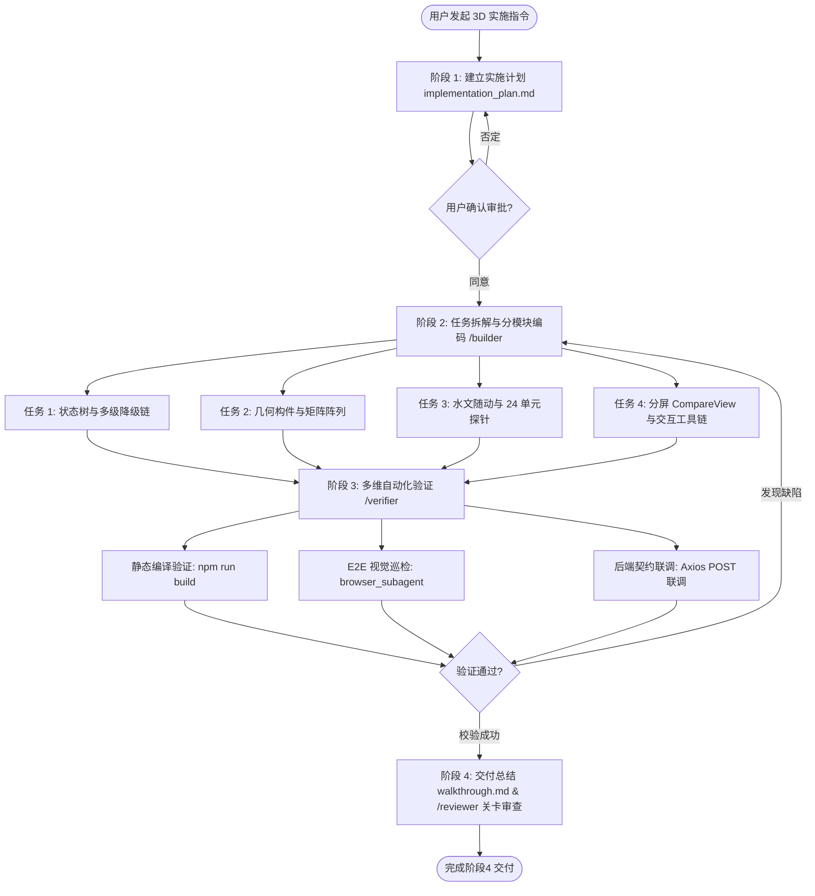

<!-- 阶段4-Agent编码实现与验证步骤指南.md -->

# 【阶段4-实施指南】：Antigravity Agent 3D 模块编码实现与验证规程

本文档依据 [阶段4-3D可视化交互工程方案.md](file:///d:/offices/Github/隧道工程多维协同智能排水自适应平台/阶段4-3D可视化交互工程方案.md) 的工程规范与后端 [drainage_engine.py](file:///d:/offices/Github/隧道工程多维协同智能排水自适应平台/tunnel-drainage-platform/backend/app/services/drainage_engine.py) 的解算契约，详细规定在 Antigravity IDE 中使用 Agent 协同完成 3D 模块编码实现、自动化构建与 E2E 视觉验证的标准操作规程（SOP）。

---

## 一、 总体 Agent 自动化实施工作流

系统的 Agent 落地遵循 **计划 (Plan) $\to$ 审批 (Approval) $\to$ 分模块构建 (Build) $\to$ 多维验证 (Verify) $\to$ 质量审查 (Review)** 的五阶段闭环流。



### 💡 一键单次全流程自动执行模式 (Single-Run / `/goal` Mode)

用户**完全可以要求 Agent 在单次交互中一次性完成全部代码修改与验证**。Antigravity IDE 支持 Agent 在单次 Session 内连续调用多个工具，自动完成全套流程而无需中途打断。

* **单次全自动执行触发词**：
  > “请一次性完成阶段4 3D 模块的全部代码修改、静态编译验证与浏览器 E2E 视觉检查，并输出交付报告。”
* **推荐使用斜杠命令**：使用 `/goal` 快捷指令：
  > `/goal 一次性完成阶段4 3D可视化交互模块的全部代码编写、编译检查与浏览器 E2E 视觉巡检。`
  * `/goal` 模式下，Agent 会保持超高专注度，自动连续执行任务 1~4 的代码编写，并自动运行 `npm run build` 和 `browser_subagent` 截图录像，直到整个阶段 100% 验证通过为止。

---

## 二、 分阶段 Agent 编码实现指令与步骤

### 步骤 1：创建 Implementation Plan (实施计划阶段)
* **Agent 触发行为**：在 Planning Mode 下，Agent 优先在 `<appDataDir>/brain/<conversation-id>/implementation_plan.md` 创建详细的实施方案。
* **配置属性**：设置 `user_facing: true` 与 `request_feedback: true`。
* **规划重点**：将阶段4 的任务明确划分为 4 个无依赖/递进式的独立代码构建子任务。

---

### 步骤 2：分模块增量编码实现 (Task-by-Task Building Phase)

Agent 必须使用 `/builder` 工作流，结合 `replace_file_content` 或 `write_to_file` 工具，分步完成以下 4 个代码模块的增量重构：

#### 任务 1：状态树与双分支数据降级链重构
* **目标文件**：
  * `tunnel-drainage-platform/frontend/src/store/snapshotStore.ts`
  * `tunnel-drainage-platform/frontend/src/store/parameterStore.ts`
* **Agent 编码要求**：
  1. 在 `snapshotStore.ts` 中增加 `hasCriticalState: boolean` 状态标识。
  2. 实现多级链式降级提取函数：
     `snap.results?.critical_state?.[key] ?? snap.results?.original_state?.[key] ?? snap.results?.input_parameter?.[key]`。
  3. 处理 `snap.status === 'pending'` 状态，向渲染器下发线框模式（Wireframe）挂载标志。

#### 任务 2：几何构件与矩阵阵列生成器完善
* **目标文件**：
  * `tunnel-drainage-platform/frontend/src/components/three/TunnelGenerator.ts`
  * `tunnel-drainage-platform/frontend/src/components/three/Reinforcement.ts`
  * `tunnel-drainage-platform/frontend/src/components/three/DrainagePipeGenerator.ts`
* **Agent 编码要求**：
  1. `TunnelGenerator.ts`：解析内半径 $r_0$ (`r`)、二衬外半径 $r_s$ (`r1`)，配合 $aspect\_ratio$ 拉伸截面总高 $h = (r_1+r) \times aspect\_ratio$；若判定为 `"double"` 洞型，应用 $\pm D\_spacing/2$ 的 X 轴平移矩阵；当 $r > 5.0\text{m}$ 时自动开挖仰拱中心排水沟。
  2. `Reinforcement.ts`：构建常规注浆圈（$t_g = r_g - r_2$），当存在 `critical_state` 时提取 `tg_crit` 动态拉伸临界注浆圈实体；使用 `InstancedMesh` 建立系统锚杆与超前小导管（带 `conduit_angle` 发散矩阵）。
  3. `DrainagePipeGenerator.ts`：优先读取推荐环向管间距与管径（`ring_spacing_recommend` / `ring_diam_recommend`），推演 $4 \times 4$ 仿射变换矩阵 $M = T \cdot R \cdot S$ 更新 InstancedMesh。

#### 任务 3：水文环境随动与 24 单元云图探针
* **目标文件**：
  * `tunnel-drainage-platform/frontend/src/components/three/Environment.ts`
  * `tunnel-drainage-platform/frontend/src/components/three/PostProcessing.ts`
  * `tunnel-drainage-platform/frontend/src/assets/shaders/lining.vert` 与 `lining.frag`
* **Agent 编码要求**：
  1. `Environment.ts`：绑定地下水位 PlaneGeometry 的 Y 轴高程为 `waterHead` 或 `final_waterHead`；将总渗漏量 $Q$ 作为控制阈值注入粒子着色器。
  2. `PostProcessing.ts` & Shaders：解析 24 单元力学全量数组 `lining_res_original.K_list` / `lining_res_critical.K_list`，注入 `lining.vert` 驱动衬砌表面顶点的逐点色阶映射；根据 `control_idx` / `final_control_idx` 高亮最不利点并挂载 3D 探针。

#### 任务 4：填补 CompareView 页面与交互工具链
* **目标文件**：
  * `tunnel-drainage-platform/frontend/src/views/CompareView.vue` (使用 `write_to_file`)
  * `tunnel-drainage-platform/frontend/src/components/three/Viewer3D.vue`
* **Agent 编码要求**：
  1. `CompareView.vue`：构建双路 `Viewer3D.vue` 画布挂载，主屏加载 `original_state`（超限红区），副屏加载 `critical_state`（加固安全区），实现同频 Camera 矩阵同步与标量看板比对。
  2. `Viewer3D.vue`：配置 Three.js Layers 通道（Layer 0~5）、镜头变换复位（`OrbitControls`）、`clippingPlanes` 剖切与 CSS2DRenderer 空间测距线段。

---

## 三、 Agent 自动化验证与质量控制规程

Agent 完成代码编写后，必须严格执行三层自动化验证流程：

### 1. 静态代码与构建编译验证 (Build Verification)
* **执行工具**：`run_command`
* **执行命令**：
  ```bash
  cd tunnel-drainage-platform/frontend
  npm run build
  ```
* **合格标准**：无 TypeScript 类型断言错误、无 Vite 模块解析失败，打包过程 0 Error 退出。

### 2. 浏览器 E2E 视觉巡检与快照验证 (Visual & E2E Verification)
* **执行工具**：`browser_subagent`
* **巡检任务指令**：
  1. 启动浏览器导航至前端视图 `http://localhost:1420/#/compare`。
  2. 验证左侧与右侧 3D 画布是否正常渲染衬砌、排水管网与注浆圈实体。
  3. 模拟点击 3D 衬砌最不利单元探针，检查 Tooltip 悬浮框是否正确弹出轴力 $N$ 与弯矩 $M$ 标量。
  4. 截取当前分屏对比画面存入 `artifacts` 目录。
* **合格标准**：无 WebGL 上下文丢失错误（Context Lost），多图层开关响应正常，分屏对比左右视图画面对齐。

### 3. 数据契约与实时重算联调 (Integration Verification)
* **执行工具**：`browser_subagent` 结合终端日志
* **验证流程**：在 2D 表单中拖拽修改参数（如将内半径 $r$ 或水头 $h$ 调大），触发脏数据拦截（`isDirty`）；点击“开始计算”，验证 Axios 请求发送至 `http://localhost:8000/api/v1/calculate/drainage`，且 3D 视图接收最新字典后无缝更新阵列密度与云图色彩。

---

## 四、 交付归档与关卡审查规程 (Review & Sign-off)

1. **生成 Walkthrough 产物**：
   Agent 在 `<appDataDir>/brain/<conversation-id>/walkthrough.md` 中汇总本次编码修改的组件列表，嵌入 `browser_subagent` 截取的 3D 双分屏与云图实测图片，并说明自动化构建与验证命令的输出结果。
2. **执行 Reviewer 质量审查**：
   调用 `/reviewer` 指令对全部修改文件执行最终审核。审查维度包括：
   - 需求与方案对齐度（Requirement Alignment）
   - 修改范围合规性（Scope Compliance）
   - 架构与工程规范（Architecture & Quality Compliance）
   - 无 AI 虚构代码与逻辑漏洞
3. **完成交付标志**：当 `/reviewer` 输出 `FINAL_STATUS: PASS` 时，完成阶段4 3D 模块的开发落地。
