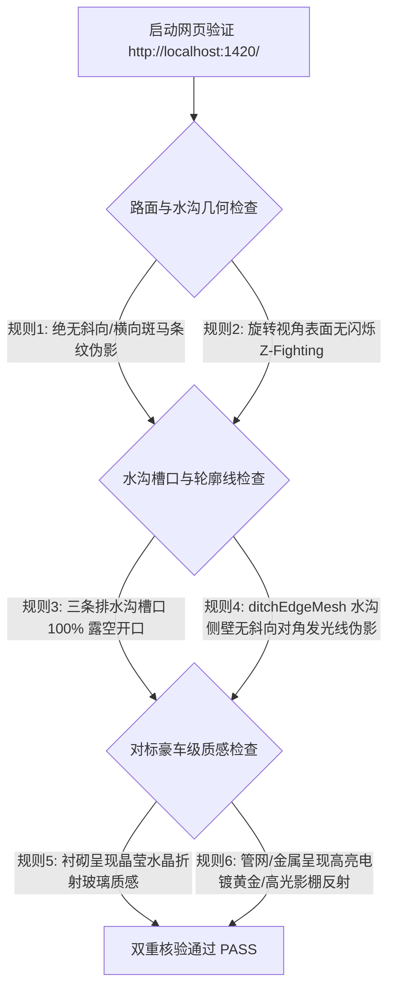

<!-- 阶段4-第三次-拓扑几何修复与PBR物理透光美化方案.md -->
# 阶段4-第三次-拓扑几何修复与PBR物理透光美化方案 (v3.1 根因归因、ditchEdgeMesh平行过滤与物理透光终极重塑版)

---
**版本**: v3.1 (补充 ditchEdgeMesh 线段平行性过滤修缮方案)  
**定位**: 隧道防排水自适应平台 - 几何拓扑修复、ditchEdgeMesh 异常发光斜线平行性过滤修缮、物理级 PBR Transmission 透光、HDRI 影棚光影与双重核验终极实施方案  
**依据**: 基于前两次美化方案（第一次 v2.2、第二次 v2.4）的失败经验总结与代码级剖析，彻底修复 [TunnelGenerator.ts:L135-L154](file:///d:/offices/Github/隧道工程多维协同智能排水自适应平台/tunnel-drainage-platform/frontend/src/components/three/TunnelGenerator.ts#L135-L154) 中 `roadShape` 的非简单自交多边形点序；同时针对人工实现后发现的 `ditchEdgeMesh` 异常发光斜线，补充线段平行性过滤机制，配合双重拓扑核验机制与物理透光管线，对标豪车级 PBR 光效美学。
---

## 0. 背景研究事实与前两次失败根因归因 (Research Facts & Failure Root Cause)

### 0.1 源码证据与前两次失败根因
1. **代码几何拓扑自交（致命根因）**：
   在 `TunnelGenerator.ts` (L135-L154) 中，`roadShape`（路面 2D 截面剖面）顶沿顶点绘制顺序存在逻辑错乱：
   $$\text{moveTo}(-halfRoadW) \xrightarrow{\text{跳跃到正向}} +sideRightXInner \to +sideRightX \xrightarrow{\text{跳回中央}} +centralRightX \to -centralLeftX \xrightarrow{\text{跳到负向}} -sideLeftXInner$$
   $X$ 轴坐标前后剧烈跳跃构成了**非简单自交多边形 (Self-intersecting Polygon)**。Three.js 执行 `ExtrudeGeometry` 时，内部 Earcut 三角剖分算法在交叉线段间切割出成百上千个重叠交错的乱纹三角形。
2. **后处理/Shader 补丁误区**：
   前两次方案（第一次 v2.2 与第二次 v2.4）过度聚焦于 Shader `fwidth()` 屏幕导数抗锯齿、相机近远裁剪面收窄、阴影 Bias 及 PMREMGenerator 后处理。**在基础 Mesh 几何体已严重拓扑自交的前提下，任何 Shader 补丁均无法消除几何交叠导致的斜向斑马纹与水沟覆盖现象**。

### 0.2 三维深层归因与改进机制
- **工作流**：确立“拓扑校验优先于材质光照”原则，先确保 2D/3D Geometry 无自交，再叠加 PBR 材质。
- **Agent 编排与 Verifier 配合**：单一代码生成容易引入拓扑盲区，必须建立“Agent 自动代码级不变量断言 + 独立 Verifier 运行期视觉校验”的双重拦截机制。

### 0.3 人工实现后补充实测归因 (ditchEdgeMesh 异常发光斜线)
- **现象描述**：人工手动实现方案代码后进行 WebGL 视觉实测，发现排水沟发光轮廓（`ditchEdgeMesh`）在水沟侧壁产生了非预期的斜向发光线条。
- **根因剖析**：`ditchEdgeMesh` 的线框几何体采用了 `new THREE.EdgesGeometry(ditchGeo, 15)`。在 `ExtrudeGeometry` 算法生成 3D 水沟槽体时，矩形侧壁被三角剖分 (Triangulation) 为三角形对，`EdgesGeometry` 在提取邻面法线夹角大于 $15^\circ$ 的边缘时，将侧壁上的斜向对角线 (Diagonal Edges) 一并误抽取为线框。
- **修缮策略**：后续若需修缮 `ditchEdgeMesh`，必须在生成 `EdgesGeometry` 之后为线段 Position Buffer 补充**线段平行性过滤条件 (Line Parallelism Filter)**，剔除所有不平行于主坐标轴 ($X / Y / Z$) 的斜向对角线。

---

## 1. Objectives (方案目标)

本方案旨在彻底解决在网页实测（`http://localhost:1420/`）中暴露的路面乱纹与沟槽封死问题，并直击豪车级的物理级 3D 美学标准：

1. **几何拓扑修复与水沟开口解封**
   * **消除路面交叉乱纹伪影**：重构 `roadShape` 的顶沿顶点序列，强制**严格 X 轴单调递增**（$-halfRoadW \to +halfRoadW$），从根本上消除自交多边形剖分乱纹。
   * **彻底解封排水沟槽口**：移除覆盖在左侧沟槽与中央深水沟上方的错误顶面连线，确保三沟槽口 100% 开口透明可见。
   * **消灭 Z-Fighting 闪烁**：在水沟槽外壁与路面切口之间引入 $\delta_x = 0.008\,\text{m}$ 的物理退让容差，配合 `polygonOffset` 消除共面深度争用。

2. **升维 PBR 物理透光与 HDRI 光影注入**
   * **注入真实 HDRI 影棚环境贴图**：引入真实 `RGBELoader` + `PMREMGenerator` 预过滤影棚贴图（Studio HDRI），提供高动态反射与高光弧点。
   * **升级 MeshPhysicalMaterial 物理 Transmission 管线**：
     * **隧道衬砌**：升维至 `MeshPhysicalMaterial`（$\text{transmission} = 0.95$, $\text{ior} = 1.5$, $\text{thickness} = 1.2\,\text{m}$），打造晶莹水晶透视体。
     * **排水管网与金属构件**：升维至物理级电镀金属（$\text{metalness} = 1.0$, $\text{roughness} = 0.15$, $\text{clearcoat} = 1.0$），展现璀璨反射。

---

## 2. Constraints (工程约束)

1. **WebGL 性能约束**：在 1000m 全长隧道、包含 1000 个 InstancedMesh 实例的场景下，维持 60 FPS 流畅帧率，Transmission 材质控制在单次 Pass 渲染。
2. **双范式兼容性**：物理透光材质与 HDRI 贴图无缝适配 `Light Studio (影棚风)` 与 `Dark Cyber (赛博暗夜风)` 两种视觉范式。
3. **既有 API 契约保护**：不破坏 `TunnelGenerator.ts` 与 `Viewer3D.vue` 导出的方法签名与图层显隐控制逻辑。

---

## 3. Architecture & Technical Solutions (架构与技术方案)

### 3.1 顶沿单调递增路面拓扑几何模型 (Monotonic Top-Edge Road Model)

重新定义二维路面截面轮廓 $\mathcal{S}_{\text{road}}$ 的顶点输入序列，强制顶点沿 $X$ 轴单调递增：

$$X_0 < X_1 < X_2 < X_3 < X_4 < X_5 < X_6 < X_7 < X_8 < X_9 < X_{10} < X_{11} < X_{12} < X_{13}$$

| 顶点序号 | 坐标 $(X, Y)$ | 说明 / 物理意义 |
| :--- | :--- | :--- |
| $V_0$ | $(-halfRoadW, roadY)$ | 路面最左侧起点（切合左边墙内壁） |
| $V_1$ | $(sideLeftX, roadY)$ | 左侧水沟左外边缘切口 |
| $V_2$ | $(sideLeftX, yBot\_side)$ | 左侧水沟左垂直内下槽点 |
| $V_3$ | $(sideLeftXInner, yBot\_side)$ | 左侧水沟右垂直内下槽点 |
| $V_4$ | $(sideLeftXInner, roadY)$ | 左侧水沟右内边缘切口 |
| $V_5$ | $(centralLeftX, roadY)$ | 中央水沟左边缘切口 |
| $V_6$ | $(centralLeftX, yBot\_central)$ | 中央水沟左垂直内下槽点 |
| $V_7$ | $(centralRightX, yBot\_central)$ | 中央水沟右垂直内下槽点 |
| $V_8$ | $(centralRightX, roadY)$ | 中央水沟右边缘切口 |
| $V_9$ | $(sideRightXInner, roadY)$ | 右侧水沟左内边缘切口 |
| $V_{10}$ | $(sideRightXInner, yBot\_side)$ | 右侧水沟左垂直内下槽点 |
| $V_{11}$ | $(sideRightX, yBot\_side)$ | 右侧水沟右垂直内下槽点 |
| $V_{12}$ | $(sideRightX, roadY)$ | 右侧水沟右外边缘切口 |
| $V_{13}$ | $(halfRoadW, roadY)$ | 路面最右侧终点（切合右边墙内壁） |
| $V_{14} \sim V_{30}$ | $\text{Arc}(R_3, \text{invertCenterY})$ | 沿仰拱内壁圆弧从右侧 $halfRoadW$ 扫掠回左侧 $-halfRoadW$ |

该顺序**彻底移除了自交线段**，生成的 2D 多边形顶沿完全暴露了三个排水沟的开口空间。

---

### 3.2 水沟槽避让容差与消 Z-Fighting 几何方程 (Clearance Model)

水沟外壁 Shape 坐标采用缩进避让模型：

$$\begin{cases}
X_{\text{min, ditch}} = X_{\text{cutout}} + \delta_x \\
X_{\text{max, ditch}} = X_{\text{cutout, right}} - \delta_x \\
Y_{\text{bot, ditch}} = Y_{\text{cutout, bot}} + \delta_y
\end{cases} \quad \text{其中 } \delta_x = 0.008\,\text{m}, \; \delta_y = 0.005\,\text{m}$$

```
    路面槽口 (Road Cutout)            水沟 Mesh (Ditch Mesh)
    |------------------|              |------------------|  <- 顶沿 (Y = roadY)
    |                  |    容差避让   |   |----------|   |  
    |                  |  ==========> |   | 槽腔 Hole |   |  (壁厚 t = 0.04m)
    |                  |  δx=8mm      |   |----------|   |
    |------------------|              |------------------|  <- 沟底 (+ δy=5mm)
```

---

### 3.3 拓扑验证方案 (Topology Verification: Agent Orchestration & Verifier)

针对“拓扑验证能否用 Agent 一起编排，还是需要单独 Verifier”的问题，本方案采用 **双重核验架构 (Dual-Tier Verification Strategy)**：

```
+-----------------------------------------------------------------------------------+
|                           双重拓扑核验架构 (Dual-Tier Verification)               |
+-----------------------------------------------------------------------------------+
| 阶段 1：Agent 编排内自动化不变量断言 (Automated Invariant Assertion in Builder)   |
|   ├── 几何生成函数中植入算法断言：检查 Shape 顶沿顶点 X 坐标是否严格单调递增           |
|   └── 几何线段自交判定：通过多边形简单性算法 (Simple Polygon Check) 阻止自交代码编译     |
+-----------------------------------------------------------------------------------+
| 阶段 2：独立 /verifier 角色运行期 Quality Gate 拦截                               |
|   ├── 3D Canvas 视口深度网格检测：核验路面与水沟接缝处是否有 Z-Fighting 闪烁面        |
|   └── 浏览器图像快照分析：确认排水三沟槽口 100% 露空开口且无覆盖多边形                 |
+-----------------------------------------------------------------------------------+
```

1. **Tier 1 (Agent 任务编排内自动化断言)**：
   在 `TunnelGenerator.ts` 开发阶段，Builder 智能体必须在几何体生成代码中包含单元断言或逻辑校验代码（需允许垂直下沉/上升段 $X_i = X_{i-1}$，仅捕获严格反向递减自交）：
   ```typescript
   // 拓扑单调性自动校验断言 (允许垂直边 X_i === X_{i-1}，仅当 X 严格反向递减时抛错)
   for (let i = 1; i < topVertices.length; i++) {
     if (topVertices[i].x < topVertices[i - 1].x - 1e-6) {
       throw new Error(`[Topology Error] Road shape top edge X coordinate decreased reverse: V[${i}].x (${topVertices[i].x}) < V[${i-1}].x (${topVertices[i-1].x})`);
     }
   }
   ```
2. **Tier 2 (独立 /verifier 角色拦截)**：
   在代码提交前，调用 `/verifier` 工作流独立执行 3D 几何建模与数学模型核验，并在 WebGL 视口中验证模型旋转无闪烁、无乱纹。

---

### 3.4 HDRI 贴图文件下载、部署与验证方案 (HDRI Asset Strategy)

#### 1) 下载来源与文件规范
- **下载来源**：推荐从 [Poly Haven HDRI](https://polyhaven.com/hdris) 免费开源库获取，或使用内置 HDR 纹理资源。
- **推荐文件**：
  - 影棚高光风：`studio_small_09_1k.hdr` (重命名为 `studio_bright.hdr`)
  - 赛博暗夜风：`night_city_1k.hdr` (重命名为 `cyber_night.hdr`)
- **格式与体积**：`.hdr` 格式，`1K` 分辨率 ($1024 \times 512$)，单文件体积 $\le 1.5\text{MB}$。

#### 2) 存储文件目录结构
文件需存放在前端项目静态资源目录下：
```
tunnel-drainage-platform/
└── frontend/
    └── public/
        └── textures/
            └── hdri/
                ├── studio_bright.hdr
                └── cyber_night.hdr
```

#### 3) 加载与运行期验证步骤
1. **静态资源 HTTP 可达性验证**：
   启动 Vite 开发服务器后，在浏览器访问 `http://localhost:1420/textures/hdri/studio_bright.hdr`，确保 HTTP 200 返回且 Content-Type 为二进制流。
2. **`RGBELoader` 与 `PMREMGenerator` 代码集成与断言**：
   ```typescript
   import { RGBELoader } from 'three/examples/jsm/loaders/RGBELoader.js';
   import { RoomEnvironment } from 'three/examples/jsm/environments/RoomEnvironment.js';

   const rgbeLoader = new RGBELoader();
   const pmremGenerator = new THREE.PMREMGenerator(renderer);
   pmremGenerator.compileEquirectangularShader();

   rgbeLoader.load('/textures/hdri/studio_bright.hdr', (texture) => {
     const envMap = pmremGenerator.fromEquirectangular(texture).texture;
     scene.environment = envMap;
     texture.dispose();
     pmremGenerator.dispose();
     console.log('[HDRI Pipeline] Successfully loaded & generated PMREM environment map');
   }, undefined, (err) => {
     console.warn('[HDRI Pipeline] HDR file load failed, falling back to RoomEnvironment', err);
     // 降级使用 RoomEnvironment 生成基础环境预过滤贴图，防止透光材质混浊黑化
     const roomEnv = new RoomEnvironment();
     scene.environment = pmremGenerator.fromScene(roomEnv).texture;
     roomEnv.dispose();
     pmremGenerator.dispose();
   });
   ```
3. **视觉反射断言**：
   观察衬砌高光点与加固圈金属反射，确定有真实天光/影棚环形高光弧，彻底消除玻璃黑灰混浊感。

---

### 3.5 水沟发光轮廓线线段平行性过滤算法 (ditchEdgeMesh Parallelism Filter)

针对 `ditchEdgeMesh` 中 `EdgesGeometry` 提取出水沟侧壁斜向对角线的问题，本方案给出确定性的**线段平行性过滤算法 (Line Parallelism Filter)**：

#### 1) 数学判据
对于 `EdgesGeometry` 提取出的任意顶点对构成的线段 $\mathbf{s} = [P_1, P_2]$，计算其归一化方向向量：

$$\hat{\mathbf{d}} = \frac{P_2 - P_1}{\|P_2 - P_1\|} = (\hat{d}_x, \hat{d}_y, \hat{d}_z)$$

定义平行性度量指标 $\mu(\mathbf{s})$ 为三个轴向分量绝对值的最大值：

$$\mu(\mathbf{s}) = \max\left(|\hat{d}_x|, \; |\hat{d}_y|, \; |\hat{d}_z|\right)$$

* 当且仅当线段平行于 $X$ 轴、 $Y$ 轴或 $Z$ 轴时，其对应主轴分量接近 $1.0$：
  $$\text{保留线段 } \mathbf{s} \iff \mu(\mathbf{s}) \ge 1 - \epsilon \quad (\text{其中容差 } \epsilon = 0.05)$$
* 若 $\mu(\mathbf{s}) < 1 - \epsilon$，说明该线段在某两个轴向上均有显著分量（如侧壁 $45^\circ$ 对角斜线 $\mu \approx 0.707 < 0.95$），属于三角剖分伪影，算法将其直接剔除。

#### 2) 代码实现方案
在 `TunnelGenerator.ts` 中，使用以下过滤函数包裹 `EdgesGeometry`：

```typescript
/**
 * 过滤线框几何体，仅保留平行于 X/Y/Z 主轴的线段，剔除侧壁斜向对角发光线 (WBS 1.4)
 */
function filterParallelEdges(edgesGeo: THREE.EdgesGeometry, tolerance: number = 0.05): THREE.BufferGeometry {
  const posAttr = edgesGeo.attributes.position;
  const filteredPos: number[] = [];
  const p1 = new THREE.Vector3();
  const p2 = new THREE.Vector3();
  const dir = new THREE.Vector3();

  for (let i = 0; i < posAttr.count; i += 2) {
    p1.fromBufferAttribute(posAttr, i);
    p2.fromBufferAttribute(posAttr, i + 1);
    dir.subVectors(p2, p1).normalize();

    // 计算方向向量的最大分量绝对值
    const maxComponent = Math.max(Math.abs(dir.x), Math.abs(dir.y), Math.abs(dir.z));
    if (maxComponent >= 1.0 - tolerance) {
      filteredPos.push(p1.x, p1.y, p1.z, p2.x, p2.y, p2.z);
    }
  }

  const cleanGeo = new THREE.BufferGeometry();
  cleanGeo.setAttribute('position', new THREE.Float32BufferAttribute(filteredPos, 3));
  return cleanGeo;
}

// 在构造函数中替换原有 edgesGeo 赋值：
const rawEdgesGeo = new THREE.EdgesGeometry(ditchGeo, 15);
const edgesGeo = filterParallelEdges(rawEdgesGeo, 0.05);
rawEdgesGeo.dispose();
```

---

## 4. Work Breakdown Structure (WBS 任务分解)

| WBS 编码 | 任务名称 | 技术细节与交付物 | 依赖项 |
| :--- | :--- | :--- | :--- |
| **1.0** | **几何拓扑与消条纹修复** | | |
| 1.1 | 顶沿单调递增 Shape 重写 | 在 `TunnelGenerator.ts` 中依据 $V_0 \sim V_{13}$ 重构 `roadShape`，加入 Agent 拓扑单调断言 | 无 |
| 1.2 | 水沟切口 8mm 避让容差 | 在 `createUShape` 算法中引入 $\delta_x = 0.008\,\text{m}, \delta_y = 0.005\,\text{m}$ 缩进，清除共面 Z-Fighting | 1.1 |
| 1.3 | 实例切片 Cap 彻底剔除 | 校验 `removeExtrudeEndCaps` 函数，清除 InstancedMesh 纵向 1m 缝隙伪影 | 1.1 |
| 1.4 | ditchEdgeMesh 发光斜线平行过滤 | 引入 `filterParallelEdges` 算法，过滤 `EdgesGeometry` 缓冲区中侧壁斜向对角线 | 1.1 |
| **2.0** | **HDRI 影棚环境部署与集成** | | |
| 2.1 | HDRI 静态文件下载与存放 | 获取 `studio_bright.hdr` 与 `cyber_night.hdr` 并存入 `public/textures/hdri/` | 无 |
| 2.2 | RGBELoader 加载器集成 | 在 `Viewer3D.vue` 中集成 `RGBELoader` 与 `PMREMGenerator`，实现 PMREM 辐射度预过滤 | 2.1 |
| 2.3 | 动态范式环境光切换 | 支持 `studio` 与 `cyber` 范式下 HDRI 亮度与色温的动态平滑过渡 | 2.2 |
| **3.0** | **PBR Transmission 物理美化**| | |
| 3.1 | 衬砌物理透光材质升级 | 将衬砌材质升级为 `MeshPhysicalMaterial`，配置 `transmission: 0.95`, `ior: 1.5`, `thickness: 1.2` | 2.2 |
| 3.2 | 水沟与管网电镀金属升维 | 排水管网与水沟升级为 `metalness: 1.0`, `clearcoat: 1.0` 物理反射材质 | 2.2 |
| 3.3 | 双重核验与 Quality Gate | 调用 `/verifier` 检查 360° 旋转零闪烁、零乱纹、排水沟 100% 露空、无发光斜线 | 1.1, 1.4, 3.1 |

---

## 5. Acceptance Criteria (验收标准)



1. **拓扑断言与几何无瑕疵验收**：控制台无拓扑单调性断言报错；隧道内路面表面光滑无斜向/横向乱纹；旋转相机视角时，路面与排水沟接缝处零闪烁。
2. **水沟开口与轮廓线验收**：左侧沟槽、右侧沟槽与中央深水沟的顶沿槽口 100% 露空开口，内部水流腔体清晰透见；`ditchEdgeMesh` 发光轮廓线全流程无侧壁斜向发光斜线伪影，线段呈现严格平行的三维立体框架感。
3. **HDRI & 物理透光验收**：
   * `public/textures/hdri/` 目录下 HDR 资源成功加载并生成 PMREM 环境贴图。
   * 衬砌在影棚光下展现出具有真实折射率（IOR 1.5）的水晶玻璃透视感。
   * 管网与水沟边缘吸收 HDRI 环境高光，呈现高对比度电镀金属质感。

