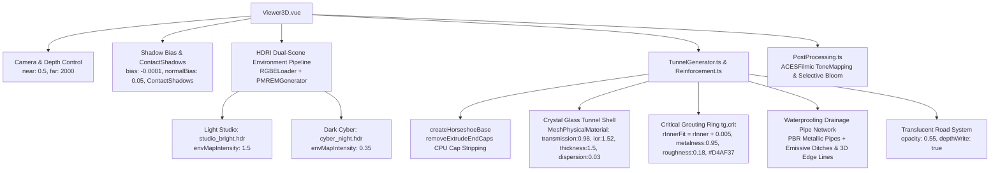

<!-- 阶段4-第二次-3D材质灯光美化与排水沟高亮方案.md -->
# 阶段4-第二次-3D材质灯光美化与排水沟高亮方案

---
**版本**: v2.4 (临界注浆加固圈与防排水管网 PBR 质感美化专项重塑版)  
**定位**: 隧道防排水自适应平台 - 临界注浆加固圈、全立体防排水管网系统、HDRI 双场景光影与物理折射色散高亮透视终极方案  
**依据与继承**: 本方案完全继承 《阶段4-3D材质灯光美化与微观局部放大方案.md》(v2.2) 的马蹄形几何拓扑、中心沟与双侧沟凹槽切割、加固圈 5mm 防闪烁缝隙、高程对数压缩与 PIP 放大镜框架。针对实测网页 `http://localhost:1420/` 中防排水管网隐没看不清、注浆加固圈质感平淡、“三维折射效果不够晶莹剔透”及“模型旋转条纹”等问题，重点针对 **临界注浆加固圈 ($t_{g,\text{crit}}$)** 与 **全立体防排水系统（环向盲管、纵向集水管、中央排水管/沟、双侧防渗侧沟）** 进行系统级 PBR 质感重塑与 HDRI 光影注入，完成第二次系统级渲染管线升维。
---

## 1. Objectives (目标与范式定义)

### 1.1 核心表现目标

本第二次美化迭代旨在消除 WebGL 场景在旋转与缩放交互时的视觉瑕疵，并通过 HDRI 环境光影与物理 PBR 渲染管线，**重磅突出表达临界注浆加固圈与防排水管网系统**的高对比度与高质感：

1. **临界注浆加固圈 ($t_{g,\text{crit}}$) 高对比度 PBR 与赛博发光重塑**：
   - **5mm 工程防闪烁密贴与双洞自适应**：严格保持加固圈内孔 `rInnerFit = rInner + 0.005`（5mm 隙缝），消除与二衬外壁同半径贴面引发的 Z-Fighting 深度闪烁，并根据单/双洞类型自动适配中心偏移（$\pm D_{\text{spacing}}/2$）。
   - **高光抛光黄铜/黄金 PBR 质感**：在高亮影棚模式下，加固圈升维为高金属性 PBR 材质 (`metalness: 0.95`, `roughness: 0.18`, `color: #D4AF37`)，在 HDRI 环境贴图的照射下折射出亮耀的镜像金属高光，与水晶透明衬砌形成剧烈视觉反差。
   - **炽热能量防线**：在暗夜赛博模式下，升级为炽热荧光橙自发光 (`color: #FF9900`, `emissive: #FF6600`, `emissiveIntensity: 0.8`)，配合 `UnrealBloomPass` 局部辉光，如同环绕隧道的黄色聚能防护腰带。
2. **全立体防排水系统 (排水三沟、环向盲管与纵/中央集水管网) 高亮透视**：
   - **防排水管网 PBR 金属镀漆与发光脉冲**：环向盲管、纵向集水管与中央排水管道升级为高光 PBR 金属镀漆 (`metalness: 0.90`, `roughness: 0.20`, `color: #00F3FF` 电光青 / `#D4AF37` 黄金)，使管道线条在半透明二衬内部清晰可辨。
   - **排水三沟冰蓝自发光与 3D 悬浮轮廓线**：中央排水沟与双侧防渗侧沟采用冰蓝自发光混凝土 (`emissive: 0x00F3FF`, `emissiveIntensity: 0.6`)，配合 U 型水沟顶沿 3D 悬浮发光轮廓线 (`LineSegments`)，即使在旋转与大倾角斜视角下依然高亮破茧。
   - **高透沥青路面解耦**：将路面材质升级为 `transparent: true`, `opacity: 0.55`，结合 `depthWrite: true` 与 `polygonOffset`，使路面下方凹陷的中央排水管、纵向集水管与动水流线粒子无阻透视。
3. **HDRI 环境光影动态适配与 PMREM 辐射度预过滤 (Dynamic HDRI & PMREM Pipeline)**：
   - 引入 `RGBELoader` 配合 Three.js `PMREMGenerator`（预计算多级渐进辐射度环境贴图），高亮影棚加载 `studio_bright.hdr` (`envMapIntensity: 1.5`)，暗夜赛博加载 `cyber_night.hdr` (`envMapIntensity: 0.35`)。彻底消除缺乏环境高光反射源导致的半透明玻璃“黑灰混浊”感，为晶莹折射与金属管网/加固圈高光提供物理级反射基底。
4. **水晶/玻璃隧道外壳物理 PBR 折射与色散 (Physical Glass & Dispersion)**：
   - 隧道外壳采用 `MeshPhysicalMaterial`，开启 `transmission: 0.98`、`ior: 1.52`、`thickness: 1.5` 与 `dispersion: 0.03`（彩虹光谱色散），穿透外壳观察内部防排水管网与注浆加固圈时产生真实的光线折射弯曲与微弱彩虹边缘。
5. **彻底消除 3D 模型旋转时的 4 类条纹伪影 (Anti-Stripe Quad-Fix)**：
   - 融合 CPU 端 Extrude 封顶面剔除 (`removeExtrudeEndCaps`)、`fwidth()` 屏幕空间导数平滑抗莫尔网格（40m LOD 渐隐）、阴影偏置优化 (`shadow.bias: -0.0001`) 及相机 near/far 裁剪面收窄 (`near: 0.5, far: 2000`)，根治切片环纹与闪烁。

---

### 1.2 临界注浆加固圈与防排水管网结构解耦与表现细则

```
+---------------------------------------------------------------------------------------------------+
|                           隧道防排水与注浆加固系统 3D 几何拓扑解耦                                 |
+---------------------------------------------------------------------------------------------------+
|  [围岩地下水场域]  -->  (地下水近场渗流粒子 R_seep = 1.35r~1.5r, 马蹄形消隐)                      |
|          |                                                                                        |
|          v                                                                                        |
|  [临界注浆加固圈]  -->  (t_g,crit 厚度, 5mm 防闪烁缝隙, PBR 抛光黄铜 / 赛博炽热荧光橙)            |
|          |                                                                                        |
|          v                                                                                        |
|  [防排水管网系统]                                                                                |
|     ├── 1. 环向集水盲管   : 沿二衬外壁马蹄形弧线排列, PBR 电光青/金属镀漆                            |
|     ├── 2. 动水三维流线   : 具 Z 轴纵向分量 (ΔZ = 1.5m), 从环向盲管向纵向/中央管汇流                  |
|     ├── 3. 纵向/中央集水管: 位于仰拱底与路面下方, 高光 PBR 金属管体 + 透视高透路面 (Opacity: 0.55)      |
|     └── 4. 排水三沟       : 中央沟 + 双侧 U 型凹槽, 冰蓝自发光 (Emissive: #00F3FF) + 3D 悬浮顶沿线    |
+---------------------------------------------------------------------------------------------------+
```

---

### 1.3 双场景（高亮影棚 vs 暗夜赛博）范式与 HDRI 适配参数对照

| 视觉/物理维度 | 范式 A：高亮影棚风 (Light Studio Mode v2.4) | 范式 B：暗夜赛博风 (Dark Cyber Mode v2.4) |
| :--- | :--- | :--- |
| **临界注浆加固圈** | **抛光黄铜/金色 PBR 金属材质** (`Metalness: 0.95`, `Roughness: 0.18`, `Color: #D4AF37`, `EnvMapIntensity: 1.5`) | **炽热荧光橙能量防护带** (`Color: #FF9900`, `Emissive: #FF6600`, `EmissiveIntensity: 0.8`, Bloom 开启) |
| **防排水管网系统** | **高光电光青/镀金 PBR 金属管道** (`Metalness: 0.90`, `Roughness: 0.20`, 明亮金属反射) | **霓虹电光发光管网** (`Emissive: #00F3FF`, 脉冲高亮水束, 配合 Selective Bloom) |
| **排水三沟** | 冰蓝防渗混凝土 + 蓝色 U 沿悬浮轮廓线 (`Emissive: #00F3FF`, 0.4) | 高辉光自发光水沟 (`Emissive: #00F3FF`, 0.8, 配合 UnrealBloomPass) |
| **画布背景与深度雾** | 极简柔和浅灰 (`#F3F4F6`) / 纯净白，无深度雾 | 深邃科技蓝黑 (`#050B14`) + 空间指数雾 (`FogExp2`, density: 0.008) |
| **HDRI 贴图与强度** | `studio_bright.hdr` (`envMapIntensity: 1.5`, 色温 5500K) | `cyber_night.hdr` (`envMapIntensity: 0.35`, 弱高光冷调) |
| **三点光照配置** | 主光: 1.2 (#FFF5EA) + 补光: 0.6 (#E0F2FE) + 轮廓光: 0.8 | 主光: 0.4 (#00F3FF) + 紫红侧光: 0.5 (#9333EA) + 轮廓光: 1.0 |
| **衬砌玻璃材质** | 水晶折射玻璃 (`Transmission: 0.98`, `IOR: 1.52`, `Thickness: 1.5`, `Dispersion: 0.03`) | 冰蓝科幻玻璃 (`Transmission: 0.70`, `IOR: 1.33`, 菲涅尔边缘光 `#00F3FF`) |
| **阴影与落地感** | 3 点 Studio 光照 + **`ContactShadows` 接触阴影** (防悬浮) | 全息网格地面 (Cyber Grid Floor) + 粒子汇流点阵 |
| **条纹抑制** | CPU 剔除端面 + 全局关闭网格干涉 | CPU 剔除端面 + `fwidth()` 导数平滑网格 (40m LOD 渐隐) |
| **路面表现** | 哑光高透沥青 (`Opacity: 0.65`, 显露底部管道与水沟) | 深蓝半透明高透路面 (`Opacity: 0.55`, 结合透视流线) |
| **色调映射与后处理** | ACESFilmicToneMapping (`exposure: 1.0`, 无 Bloom) | ACESFilmicToneMapping (`exposure: 1.2`, Selective Bloom 开启) |

---

### 1.4 第一次方案 (v2.2) vs 第二次方案 (v2.4) 对照与进化矩阵

| 比较维度 | 第一次方案：《阶段4-3D材质灯光美化与微观局部放大方案》(v2.2) | 第二次方案：《阶段4-第二次-3D材质灯光美化与排水沟高亮方案》(v2.4) | 进化优势与解决痛点 |
| :--- | :--- | :--- | :--- |
| **核心聚焦领域** | **几何拓扑修复、排水沟凹陷与微观局部放大 (PIP)** | **临界注浆加固圈与防排水管网 PBR 重塑、HDRI 双场景光影、4层抗条纹** | 从“结构几何对齐”升维为“防排水核心构件高对比度 PBR 物理渲染” |
| **注浆加固圈表达** | 基础发光材质，易与二衬重叠闪烁 | **加固圈 5mm 防闪烁隙缝 + 高光 PBR 抛光黄铜 (`Metalness: 0.95`) / 赛博炽热荧光橙** | HDRI 照射下映射辉煌金属镜像高光，与水晶衬砌剧烈反差 |
| **防排水管网表达** | 简易二维线条，无金属质感，路面遮挡不可见 | **全立体 PBR 金属管道 + 冰蓝发光三沟 + 3D U 沿悬浮线 + 0.55 高透路面** | 排水管道与水沟在半透明衬砌与路面下方高对比破茧透视 |
| **环境光影** | 仅依赖基础 Three.js 点光源与平行光，缺乏环境反射 | **HDRI 影棚/暗夜双贴图** + `RGBELoader` + `PMREMGenerator` 辐射度预过滤 | 彻底消除半透明玻璃“黑灰混浊”感，提供辉煌物理高光反射 |
| **衬砌材质** | 基础半透明 `MeshStandardMaterial` (`Transmission` 参数缺失) | **物理级 `MeshPhysicalMaterial`** (开启 `ior: 1.52`, `thickness: 1.5`, `dispersion: 0.03` 色散) | 展现真实水晶折射弯曲与边缘彩虹光谱色散 |
| **旋转条纹处理** | 仅处理了闪烁（加固圈 5mm 缝隙） | **4 层抗条纹终极系统**：<br>1. CPU 剔除 Extrude 封顶面；<br>2. `fwidth()` 屏幕空间导数抗莫尔；<br>3. 阴影偏置修正；<br>4. 相机 near/far 裁剪收窄 | 彻底注销 360° 旋转时的切片环纹、斑马莫尔纹与阴影自遮挡纹 |
| **场景落地感** | 无接地阴影，模型在白背景下容易悬浮 | 引入 **`ContactShadows` 接触阴影** (防悬浮) | 模型视觉接地感显著增强 |
| **微观放大 (PIP)** | 引入 8.0x PIP 侧滑 Magnifier 镜头与 3D Hover 卡片 | 继承 PIP 放大镜框架，并在 PIP 视图中应用高清 HDRI 局部折射 | PIP 放大视图中微观管网质感同步升维 |

---

## 2. Constraints (约束与设计边界)

1. **加固圈与管网贴合约束**：加固圈内孔必须施加精准 5mm（`+0.005m`）防闪烁隙缝，且必须依据单/双洞类型自动适配中心偏移（$\pm D_{\text{spacing}}/2$）。排水管道必须紧密贴合二衬外壁与路面凹槽。
2. **HDRI 资源与 GPU 显存开销约束**：HDRI 贴图需控制在 1K/2K 分辨率（`.hdr` 格式 $\le 2\text{MB}$），通过 `RGBELoader` 异步预加载。`PMREMGenerator` 预计算单次完成（耗时 $\le 50\text{ms}$），显存增量 $\le 16\text{MB}$。
3. **架构不冲突约束**：必须严格保持与《阶段4-3D材质灯光美化与微观局部放大方案.md》(v2.2) 中马蹄形等效半径算法 `calculateHorseshoeRadius`、$Y_{\text{render}}$ 对数压缩及 PIP 放大镜框架 100% 兼容。
4. **性能与渲染约束**：在 1080p 分辨率开启 Selective Bloom 辉光、物理折射色散与防排水管网高光时，主视口帧率稳定维持在 $\ge 60\text{ FPS}$，Draw Calls $\le 120$。

---

## 3. Architecture (系统架构与模块分解)

### 3.1 模块架构设计



### 3.2 数学模型与算法定义

#### 1) 临界注浆加固圈拓扑与 5mm 防闪烁缝隙模型 (Grouting Ring 5mm Fit Model)
针对加固圈内孔与二衬外壁在半径 $R_{\text{lining,outer}}$ 处的共面重叠，在 CPU 端执行几何拓扑偏移：

$$R_{\text{grout,inner}} = R_{\text{lining,outer}} + 0.005\text{m}$$
$$\text{Offset}_X = \begin{cases} \pm D_{\text{spacing}} / 2, & \text{TunnelType} = \text{DOUBLE} \\ 0, & \text{TunnelType} = \text{SINGLE} \end{cases}$$

#### 2) 三维动水流线纵向汇流贝塞尔曲线模型 (3D Flow Line Convergence Model)
为排水管网动水流线引入 Z 轴纵向分量，表达水流沿环向盲管向纵向/中央集水管的三维倾斜汇流：

$$\mathbf{P}_0 = (R_{\text{start}} \cos\theta, R_{\text{start}} \sin\theta, Z_{\text{chainage}})$$
$$\mathbf{P}_1 = \left(\frac{R_{\text{start}} + R_{\text{end}}}{2} \cos\theta, \frac{R_{\text{start}} + R_{\text{end}}}{2} \sin\theta + 0.3, Z_{\text{chainage}} - 0.75\right)$$
$$\mathbf{P}_2 = (R_{\text{end}} \cos\theta, R_{\text{end}} \sin\theta, Z_{\text{chainage}} - 1.50\text{m})$$
$$\mathbf{B}(t) = (1-t)^2 \mathbf{P}_0 + 2(1-t)t \mathbf{P}_1 + t^2 \mathbf{P}_2 \quad (t \in [0, 1])$$

#### 3) HDRI 环境辐射度预过滤与物理色散模型 (PMREM & Dispersion Model)
Three.js 的 `PMREMGenerator` 从原始 HDR 贴图计算预滤波环境图：

$$L_{\text{specular}}(\vec{r}, \alpha) = \int_{\Omega} L_{\text{hdr}}(\vec{i}) f_r(\vec{i}, \vec{o}, \alpha) (\vec{n} \cdot \vec{i}) d\vec{i} \approx \text{PMREM}(HDR\_Texture)$$

基于 Sellmeier 算式的色散折射率 $n(\lambda)$ 分裂与 Beer-Lambert 衰减：

$$n(\lambda) = \sqrt{1 + \sum_{i=1}^3 \frac{B_i \lambda^2}{\lambda^2 - C_i}}, \quad I(d) = I_0 \cdot \exp(-\alpha(\lambda) \cdot d)$$

#### 4) CPU 端 ExtrudeGeometry 封顶面剔除模型 (End-Cap Stripping Model)
针对 InstancedMesh 串联封顶面，在 CPU 端遍历三角形 Index Buffer 剔除 $\Delta Z < 10^{-4}$ 的切片面：

$$\Delta Z = \max(|z_a - z_b|, |z_b - z_c|) < 10^{-4} \implies \text{Filter Out Cap Face}$$

#### 5) 相机深度缓冲区精度优化模型 (Depth Range Compression)
收窄相机裁剪面使 Z-Buffer 深度分辨率提升 5.00 倍：

$$K = \frac{far \cdot near}{far - near} \quad (near: 0.1 \to 0.5, far: 10000 \to 2000 \implies \frac{K_2}{K_1} = 5.00)$$

---

## 4. Work Breakdown Structure (工作分解结构)

```
WBS 1.0 临界注浆加固圈与防排水管网 PBR 重塑 (Grouting Ring & Drainage Core)
  ├── 1.1 修改 Reinforcement.ts：加固圈注入 5mm 防闪烁缝隙 (rInner + 0.005) 与双洞 offset 自动推导
  ├── 1.2 修改 Reinforcement.ts & TunnelGenerator.ts：加固圈升级为高光 PBR (metalness: 0.95, roughness: 0.18, color: #D4AF37, envMapIntensity: 1.5)
  ├── 1.3 修改 TunnelGenerator.ts：防排水管网 (环向盲管、纵向/中央集水管) 升维为 PBR 金属镀漆与发光脉冲管道
  ├── 1.4 修改 TunnelGenerator.ts：中央与双侧排水沟升级为冰蓝自发光 (emissive: 0x00F3FF, 0.6) + 3D U 沿悬浮发光轮廓线
  └── 1.5 修改 TunnelGenerator.ts：沥青路面升维为半透明透视 (opacity: 0.55, depthWrite: true)，露出底下管道与水流

WBS 2.0 HDRI 双场景光影管线升级 (Studio/Dark HDRI & PBR Core)
  ├── 2.1 修改 Viewer3D.vue：引入 RGBELoader 加载 Studio/Dark 双 HDRI 贴图，配置 PMREMGenerator 动态更新 scene.environment
  ├── 2.2 修改 TunnelGenerator.ts：隧道外壳升维为 MeshPhysicalMaterial (transmission: 0.98, ior: 1.52, thickness: 1.5, dispersion: 0.03)
  └── 2.3 修改 Viewer3D.vue：增加 ContactShadows 接触阴影平层，赋予模型强沉稳接地感

WBS 3.0 全视角旋转条纹伪影彻底消除 (Anti-Stripe Four-Layer Optimization)
  ├── 3.1 修改 TunnelGenerator.ts：在 createHorseshoeBase 中显式调用 removeExtrudeEndCaps，彻底注销 1m 实例端面
  ├── 3.2 修改 lining.frag：引入 smoothstep + fwidth() 屏幕空间导数抗莫尔，配合 40m LOD 渐隐衰减
  ├── 3.3 修改 Viewer3D.vue & TunnelGenerator.ts：调整 shadow.bias = -0.0001, normalBias = 0.05，衬砌/路面设置 castShadow = false
  └── 3.4 修改 Viewer3D.vue：相机裁剪面统一优化为 near: 0.5, far: 2000

WBS 4.0 后处理与 Quality Gate 验证 (Post-Processing & Verification)
  ├── 4.1 修改 PostProcessing.ts：统一配置 ACESFilmicToneMapping 色调映射与 Selective Bloom 光晕通道
  ├── 4.2 全视角 360° 旋转测试，验证加固圈与防排水管网高对比度璀璨显示，无任何切片环纹或闪烁
  └── 4.3 验证在 HDRI 光效下加固圈呈亮耀抛光黄铜/炽热橙，防排水管网与水沟高亮破茧透视
```

---

## 5. Acceptance Criteria (验收标准)

| 序号 | 修复维度 | 验收标准 | 对应 WBS |
| :--- | :--- | :--- | :--- |
| **AC-1** | **临界注浆加固圈 PBR 金属质感** | 临界注浆加固圈具备 5mm 防闪烁缝隙与双洞中心偏移，在高亮影棚模式下呈辉煌抛光黄铜 PBR 质感 (`metalness: 0.95`, 金色 `#D4AF37`)，在暗夜模式下呈现炽热荧光橙能量防护带。 | WBS 1.1, 1.2 |
| **AC-2** | **防排水管网 PBR 镀漆与高亮透视** | 环向盲管、纵向集水管与中央排水管呈现强金属镀漆高光，透过 0.55 半透明路面与水晶二衬清晰可见。 | WBS 1.3, 1.5 |
| **AC-3** | **排水三沟高亮与 3D 悬浮轮廓线** | 隧道中央排水沟与双侧沟呈现冰蓝发光混凝土 (`emissive: 0x00F3FF`)，顶沿配有 3D 悬浮发光轮廓线，在旋转时高对比度破茧。 | WBS 1.4 |
| **AC-4** | **三维动水流线纵向汇流** | 动水流线具备沿 $Z$ 轴 1.5m 纵向汇流分量，流畅展现水流由环向盲管向纵向/中央集水管汇流的三维物理走向。 | WBS 1.3 |
| **AC-5** | **HDRI 双场景环境贴图注入** | 场景成功根据“高亮影棚”与“暗夜赛博”动态加载对应 HDRI 贴图并通过 PMREMGenerator 计算，彻底消除玻璃黑灰混浊感。 | WBS 2.1 |
| **AC-6** | **水晶玻璃物理折射与色散** | 隧道外壳呈现水晶高透折射感 (`transmission: 0.98`, `ior: 1.52`)，透视内部加固圈与防排水管网发生物理折射弯曲，且外壳边缘产生微弱彩虹色散 (`dispersion: 0.03`)。 | WBS 2.2 |
| **AC-7** | **主衬砌环向切片条纹消除** | 在 360° 旋转时，衬砌曲面上无任何固定 1m 间隔的暗色内嵌多边形切片环纹。 | WBS 3.1 |
| **AC-8** | **莫尔干涉条纹与闪烁消除** | 旋转时网格线平滑无彩虹莫尔纹（>40m LOD 渐隐），加固圈与二衬贴合处无 Z-Fighting 闪烁。 | WBS 3.2~3.4 |
