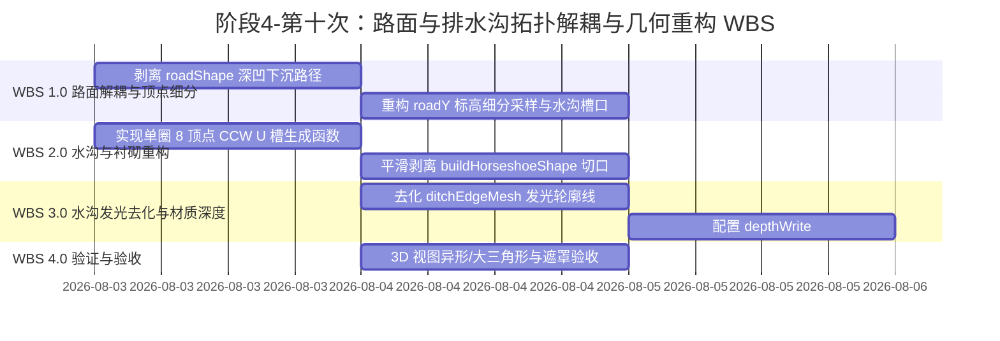

# 阶段4-第十次：路面与排水沟拓扑解耦与几何重构方案

## 1. Objectives (目标与范式定义)

本方案针对 3D 隧道模型中排水沟区域出现的斜向锯齿状/三棱锥状异常三角形面片、大对角面片剖分条纹、水沟遮挡问题以及排水沟侧壁发光斜线网格伪影，制定系统级几何拓扑解耦与重构更新方案。

主要实现以下目标：
1. **彻底解耦路面与排水沟几何拓扑 (Complete Topological Decoupling)**：
   - 剥离 `roadShape` 中向下延伸至水沟底部的深凹槽路径，在水沟 X 轴区间（中央沟及左右侧沟）精确注入水沟外壁关键点（Keypoints），并将顶沿路径沉降至水沟外壁底部高程 $y_{\text{bot}}$，预留全深度 U 型凹槽避让口（U-Notch Cutouts）。
   - 排水沟 3D 敞口通水槽腔 $[x_{\min}, x_{\max}] \times [y_{\text{bot}}, \text{roadY}]$ 空间与体积 100% 交由 `ditchMesh` 独占，实现水沟敞口可见与路基完美嵌套。
2. **彻底消灭小三角形与路面“大三角形”剖分条纹 (Eradicate Large & Small Triangles)**：
   - 解决 Earcut 算法在处理深凹缺口多边形时的退化问题。
   - 对 `roadShape` 顶沿按正交水沟关键节点与 X 轴倒序扫描，消灭横贯路面的大对角线扇形剖分三角形。
   - 开启 `roadMat` 与 `ditchMat` 的 `depthWrite: true`，消除半透明无深度写入引发的底面透视自干涉与对角线色差。
3. **引入单圈 8 顶点 CCW 凹多边形 U 型水沟结构 (Single-Loop 8-Vertex CCW U-Ditch)**：
   - 重构 `ditchShapes` 生成算法，废弃 3-Box 分拆矩形块的拼装写法，采用单圈 8 顶点 Counter-Clockwise (CCW) 凹多边形，构建具有真实壁厚和通水凹槽的 100% 敞口 U 型防渗混凝土水沟。
4. **平滑剥离二衬/初支/注浆圈内壁孔洞下沉切口 (Lining & Grouting Inner Arc Smoothing)**：
   - 彻底剥离 `buildHorseshoeShape` 中 `holePath` 遗留的 `ditchBottomY` 与 `R3Y_at_side` 向下下沉切口，使二衬、初支及注浆圈内壁保持 100% 连续平滑马蹄形圆弧，根除衬砌网格内部剖分产生的锯齿状/三棱锥三角形。
5. **排水沟发光去化与矢量正交过滤重构 (Ditch Edge De-glowing & Orthogonal Filter)**：
   - 完全去化 `ditchEdgeMesh` 发光轮廓线与发光材质，彻底消除边沟侧壁与顶面由 EdgesGeometry 生成的蓝色斜线发光伪影。
   - 重构 `filterParallelEdges` 算法，升级为**精准矢量正交判定**（`hasZ && hasXY` 绝对剔除对角斜线）。
6. **优化 PBR 半透明材质与深度渲染管线 (Render Order & Translucency Pipeline)**：
   - 将 `roadMesh` 设为 `renderOrder: 10`，`ditchMesh` 设为 `renderOrder: 12`，确保排水沟覆盖在路面网格之上，解决水沟被路面淹盖遮挡的问题。
   - 配合正确的 `depthWrite: true` 与 `polygonOffset` 参数，确保在赛博（Cyber）与影棚（Studio）视觉范式下保持完美的半透明透视效果。

---

## 2. Constraints (约束与设计边界)

1. **零代码架构侵入 (Architecture Preservation)**：
   - 限定修改范围在 `tunnel-drainage-platform/frontend/src/components/three/TunnelGenerator.ts` 内部，不得侵入修改 `Viewer3D.vue`、着色器 `lining.vert`/`lining.frag` 或后端 API 数据契约。
2. **严密遵从 /analyzer 规范 (Output Completeness)**：
   - 方案具备完整的几何数学模型、坐标推导公式、无 TODO 的 WBS 步骤与量化验收指标。
3. **物理极值与容差约束 (Physical Margin & Boundary Safety)**：
   - 侧边水沟保留仰拱曲率极值 `max_x_lining` 约束，确保水沟外壁绝不刺穿二衬仰拱；水沟壁厚 $t = 0.05\text{m}$，微缩物理容差 $\delta_x = 0.008\text{m}, \delta_y = 0.005\text{m}$ 继续保留。

---

## 3. Architecture (系统架构与解耦解算)

### 3.1 几何拓扑解耦对比 (Before vs After Decoupling)

#### 旧逻辑（耦合冲突与遮盖模式）
- **路面 Shape (`roadShape`)**：顶沿采用单线平直跨越（$-halfRoadW$ 到 $+halfRoadW$），缺乏顶沿 X 节点细分与水沟槽口。Earcut 在 2 个顶点与 16 个底点之间剖分出横贯路面的大对角线三角形；且实心路面盖死了水沟开口，导致水沟被完全遮挡。
- **排水沟 Shapes (`ditchShapes`)**：使用 `createDitchBoxShapes` 拼装矩形，产生重叠干涉。
- **排水沟发光线 (`ditchEdgeMesh`)**：产生侧壁亮蓝色交叉斜线伪影。
- **缺陷**：路面出现大对角线三角形色差，水沟被路基遮盖淹没。

#### 新逻辑（精准关键点注入 & U 型凹槽底沉降避让 & 纯净 PBR 模式）
- **路面 Shape (`roadShape`)**：
  - 底沿：弧线 16 段采样（CCW 从 $-halfRoadW$ 到 $+halfRoadW$）。
  - 顶沿：按倒序注入水沟外壁关键点（Keypoints），在 3 个水沟 X 区间下沉至水沟外壁底部标高 $y_{\text{bot}}$（中央沟为 $y_{\text{bot\_central}}$，侧沟为 $y_{\text{bot\_side}}$），全深度切出 U 型凹槽。
  - 结果：路面仅作为承托水沟外底的基础支撑，完全避开 $[x_{\min}, x_{\max}] \times [y_{\text{bot}}, \text{roadY}]$ 通水槽腔，暴露 `ditchMesh` 100% 敞口 U 型槽。
- **排水沟 Shapes (`ditchShapes`)**：采用**单圈 8 顶点 CCW 凹多边形 U 型槽 Shape**（由 `createUShape` 生成），`renderOrder` 设为 12（高于路面 10），独占槽腔几何与壁厚。
- **材质与深度 (Depth & Pipeline)**：开启 `depthWrite: true`，解决透视自干涉；`ditchEdgeMesh` 彻底去化。

```
[新架构: 正交 keypoints U-Notch 凹槽避让 & 水沟敞口 & 渲染层级优化]

roadShape  ======(路面)----+         +-----(路面)----+         +-----(路面)====== (顶沿正交 Keypoints 扫描)
                           |         |               |         |
                           +-[y_bot]-+               +-[y_bot]-+ (沉降至水沟外底标高)
ditchMesh                 (V1) |   | (V8)  [renderOrder: 12]
                               | U |
                               +---+ (V2~V7 8-Vertex CCW, 100% 敞口通水)

liningHole -------------------( 纯净平滑 R3 圆弧 )------------------- (零锯齿面片)
```

---

## 3.2 核心数学模型：单圈 8 顶点 CCW 凹多边形与正交过滤

### A. 排水沟 Shape 8 顶点向量序列
设水沟外壁左边界为 $x_{\min}$，右边界为 $x_{\max}$，顶标高 $y_{\text{top}} = \text{roadY}$，底标高 $y_{\text{bot}}$，壁厚 $t = 0.05\text{m}$，容差 $\delta_x = 0.008\text{m}, \delta_y = 0.005\text{m}$：

$$\begin{aligned}
x_{\text{safe,min}} &= x_{\min} + \delta_x, \quad x_{\text{safe,max}} = x_{\max} - \delta_x \\
y_{\text{safe,bot}} &= y_{\text{bot}} + \delta_y \\
t_{\text{eff}} &= \min\left(t, \, \frac{x_{\text{safe,max}} - x_{\text{safe,min}}}{3}\right)
\end{aligned}$$

8 个顶点的坐标向量序列（按 Counter-Clockwise 逆时针顺序排列）定义如下：

$$\begin{cases}
\mathbf{V}_1 = \left(x_{\text{safe,min}} + o_x, \, y_{\text{top}}\right) & \text{(左外顶)} \\
\mathbf{V}_2 = \left(x_{\text{safe,min}} + o_x, \, y_{\text{safe,bot}}\right) & \text{(左外底)} \\
\mathbf{V}_3 = \left(x_{\text{safe,max}} + o_x, \, y_{\text{safe,bot}}\right) & \text{(右外底)} \\
\mathbf{V}_4 = \left(x_{\text{safe,max}} + o_x, \, y_{\text{top}}\right) & \text{(右外顶)} \\
\mathbf{V}_5 = \left(x_{\text{safe,max}} - t_{\text{eff}} + o_x, \, y_{\text{top}}\right) & \text{(右内顶)} \\
\mathbf{V}_6 = \left(x_{\text{safe,max}} - t_{\text{eff}} + o_x, \, y_{\text{safe,bot}} + t_{\text{eff}}\right) & \text{(右内底)} \\
\mathbf{V}_7 = \left(x_{\text{safe,min}} + t_{\text{eff}} + o_x, \, y_{\text{safe,bot}} + t_{\text{eff}}\right) & \text{(左内底)} \\
\mathbf{V}_8 = \left(x_{\text{safe,min}} + t_{\text{eff}} + o_x, \, y_{\text{top}}\right) & \text{(左内顶)}
\end{cases}$$

### B. 线框矢量正交过滤推导 (Vector Orthogonal Filter)
`filterParallelEdges` 升级为矢量正交逻辑。设归一化方向向量为 $\mathbf{u} = (u_x, u_y, u_z)$：

$$\text{isDiagonal} = (|u_z| > 10^{-3}) \land (|u_x| > 10^{-3} \lor |u_y| > 10^{-3})$$

若 $\text{isDiagonal} = \text{true}$，判定该线段为剖分斜线，直接从 Position Buffer 中剔除。

---

## 3.3 衬砌与注浆圈内壁孔洞平滑重构 (Lining & Grouting Inner Arc Smoothing)

在 `buildHorseshoeShape` 的 `isHole = true` 分支中，剥离 `ditchBottomY` 与 `R3Y_at_side` 向下凹陷切口路径，将仰拱底部路径重构为连续 R3 弧线：

```typescript
// tunnel-drainage-platform/frontend/src/components/three/TunnelGenerator.ts
if (isHole) {
  path.moveTo(R1 + offsetX, 0);
  if (H_side > 0) path.lineTo(R1 + offsetX, -H_side);
  path.absarc(dx + offsetX, -H_side, R2, Math.PI * 2, aRight, true);
  // 保持仰拱内壁为 100% 连续平滑圆弧，不进行向下凹陷开槽
  path.absarc(offsetX, invertCenterY, R3, aRight, aLeft, true);
  path.absarc(-dx + offsetX, -H_side, R2, aLeft, Math.PI, true);
  if (H_side > 0) path.lineTo(-R1 + offsetX, 0);
  path.absarc(offsetX, 0, R1, Math.PI, 0, true);
}
```

---

## 4. Work Breakdown Structure (工作分解结构)



---

## 5. Acceptance Criteria (验收标准与指标体系)

| 序号 | 验收维度 | 验收标准 | 对应 WBS |
| :--- | :--- | :--- | :--- |
| **AC-1** | 异形/大三角形消除 | 沿隧道纵向与俯视视角下，排水沟、路面及衬砌仰拱**绝无任何斜向拉伸、三棱锥状或大对角线剖分三角形**。 | WBS 1.1, WBS 1.2, WBS 2.1 |
| **AC-2** | 几何拓扑解耦 | `roadMesh` 与 `ditchMesh` 空间嵌套合理，水沟通水槽腔完全暴露不被遮挡。 | WBS 1.2, WBS 2.1 |
| **AC-3** | 发光斜线伪影根除 | 排水沟侧壁与顶沿**绝无任何亮蓝色/亮青色斜向交叉发光线**，槽体材质呈现质感平顺的 PBR 物理半透明效果。 | WBS 3.1, WBS 3.2 |
| **AC-4** | U 型水沟敞口性 | 中央深水沟与左右侧边沟呈**完全敞口的 3D U 型防渗混凝土结构**，通水槽腔清晰可见。 | WBS 2.1, WBS 3.2 |
| **AC-5** | 衬砌圆弧连续性 | 二衬、初支及注浆圈仰拱内壁呈**100% 连续平滑马蹄形圆弧**，绝无断裂与内部锯齿面片。 | WBS 2.2 |
| **AC-6** | 半透明深度稳定 | 开启 `depthWrite: true` 并优化 `renderOrder`（`roadMesh: 10`, `ditchMesh: 12`），半透明渲染稳定无闪烁与遮盖异常。 | WBS 3.2, WBS 4.1 |
| **AC-7** | 代码质量规范 | 改动严密遵循 TypeScript 强类型约束，系统运行 Console 零 Error/Warning，无 TODO 注释。 | WBS 4.1 |
