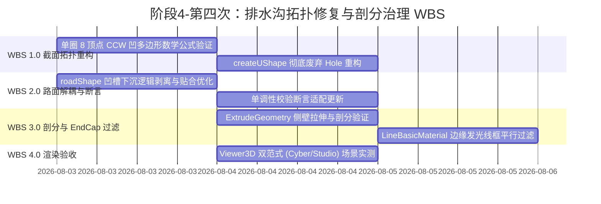

# 阶段4-第四次：排水沟拓扑几何修复与剖分异常治理方案

## Objectives

1. **彻底消除跨沟通发光斜向三角形乱纹**：治理由于二维 Shape 退化 Hole 与 Earcut 三角剖分崩溃导致的跨越左、中、右水沟的斜向拉伸发光三角形面片。
2. **完全解封排水沟顶部与内部空间**：消除 ExtrudeGeometry 拉伸顶部横向封闭边生成的纵向顶盖面片，恢复排水沟 100% 敞口 U 型槽结构；解决沥青路面几何体下嵌充填水沟内腔的问题。
3. **建立严格的 2D 拓扑单调性与 Winding Order 规范**：废弃 `Shape + Hole` 的脆弱建模方式，全面引入**单圈 8 顶点 Counter-Clockwise (CCW) 凹多边形拓扑模型**。
4. **保障 3D 渲染与物理容差无瑕**：确保路面、三沟槽、衬砌与水管网络之间的空间切离无 Z-Fighting 闪烁，渲染性能保持高帧率运行。

---

## Constraints

1. **零代码架构侵入 (Architecture Preservation)**：严格限定在 `TunnelGenerator.ts` 及几何解算模块内部调整，不得修改 `Viewer3D.vue`、`lining.frag` 及后端 API 数据接口契约。
2. **严密遵从 /analyzer 规范 (Output Completeness)**：方案必须具备完整的逻辑推导、数学公式表达、架构解耦图解与无 TODO 的可执行 WBS 步骤。
3. **保留物理容差与渐变优化**：保留已引入的物理缩进容差（$\delta_x = 0.008\text{m}, \delta_y = 0.005\text{m}$）与平行边线框过滤机制（`filterParallelEdges`）。

---

## Architecture

### 1. 缺陷根因分析与几何物理解构

#### (1) 排水沟被封闭根因 (Closed Ditch Issue)
- **Top 顶盖产生**：原 `createUShape` 函数构造了一个包含顶部水平边 `(safeXMin, yTop) -> (safeXMax, yTop)` 的矩形 Outer Shape `s`。当 `ExtrudeGeometry` 将其沿 Z 轴拉伸 1.0m 时，该顶边生成了一个长 1m 的水平顶面（Top Side Quad）。`removeExtrudeEndCaps` 函数由于仅剔除 `za == zb == zc` 的 Z 轴垂直端面，无法剔除沿 Z 轴延伸的侧面顶盖，导致水沟被完全封死。
- **路面实体充填**：原 `roadShape` 在遇到水沟时向下下沉至 `yBot_side` / `yBot_central`，将水沟凹槽区域渲染成了实心沥青路面几何体，填充了水沟内腔。

#### (2) 异形斜向三角形乱纹根因 (Diagonal Triangle Artifact Issue)
- **退化 Hole (Degenerate Hole)**：原代码尝试使用 `s.holes.push(hole)` 扣除水流腔体，但 Hole 顶角顶点 `(x, yTop)` 完全重合在 Outer Shape 的 `yTop` 边界上。Earcut 三角剖分算法在处理边界重合共线 Hole 时会发生二义性崩溃。
- **Winding Order 颠倒**： Outer `s` 采用顺时针 (CW)，Inner `hole` 采用逆时针 (CCW)，且顶点未规整，引发剖分器生成跨越不同 Shape 的乱纹索引，在剔除端面后残留横跨左中右水沟的高亮发光斜向三角形。

---

### 2. 核心数学模型：单圈 8 顶点 CCW 凹多边形 (Single-Loop 8-Vertex CCW Model)

为了彻底根治以上两个缺陷，废弃 `Shape + Hole` 范式，将 U 型排水沟截面定义为**无 Hole 的单一 8 顶点 Counter-Clockwise (CCW) 凹多边形**。

设水沟外壁左下角坐标为 $(x_{\min}, y_{\text{bot}})$，右上角为 $(x_{\max}, y_{\text{top}})$，壁厚为 $t$，物理容差为 $\delta_x, \delta_y$：
$$\begin{aligned}
x_{\text{safe,min}} &= x_{\min} + \delta_x, \quad x_{\text{safe,max}} = x_{\max} - \delta_x \\
y_{\text{safe,bot}} &= y_{\text{bot}} + \delta_y \\
t_{\text{effective}} &= \min\left(t, \frac{x_{\text{safe,max}} - x_{\text{safe,min}}}{3}\right)
\end{aligned}$$

8 个顶点的坐标向量序列（按 Counter-Clockwise 逆时针排列）定义如下：

$$\begin{cases}
\mathbf{V}_1 = \left(x_{\text{safe,min}} + o_x, \, y_{\text{top}}\right) & \text{(左外顶)} \\
\mathbf{V}_2 = \left(x_{\text{safe,min}} + o_x, \, y_{\text{safe,bot}}\right) & \text{(左外底)} \\
\mathbf{V}_3 = \left(x_{\text{safe,max}} + o_x, \, y_{\text{safe,bot}}\right) & \text{(右外底)} \\
\mathbf{V}_4 = \left(x_{\text{safe,max}} + o_x, \, y_{\text{top}}\right) & \text{(右外顶)} \\
\mathbf{V}_5 = \left(x_{\text{safe,max}} - t_{\text{effective}} + o_x, \, y_{\text{top}}\right) & \text{(右内顶)} \\
\mathbf{V}_6 = \left(x_{\text{safe,max}} - t_{\text{effective}} + o_x, \, y_{\text{safe,bot}} + t_{\text{effective}}\right) & \text{(右内底)} \\
\mathbf{V}_7 = \left(x_{\text{safe,min}} + t_{\text{effective}} + o_x, \, y_{\text{safe,bot}} + t_{\text{effective}}\right) & \text{(左内底)} \\
\mathbf{V}_8 = \left(x_{\text{safe,min}} + t_{\text{effective}} + o_x, \, y_{\text{top}}\right) & \text{(左内顶)}
\end{cases}$$

```
(V1) 左外顶 +------+ (V8) 左内顶         (V5) 右内顶 +------+ (V4) 右外顶
            |      |                                 |      |
            |      +---------------------------------+      |
            |              (V7)          (V6)               |
            |             左内底        右内底              |
            +-----------------------------------------------+
       (V2) 左外底                                      (V3) 右外底
```

**数学特性**：
1. $\mathbf{V}_4 \to \mathbf{V}_5$ 与 $\mathbf{V}_8 \to \mathbf{V}_1$ 仅绘制管壁顶部的两段厚度线。水沟中央开孔区域区间 $(x_{\text{safe,min}} + t, x_{\text{safe,max}} - t)$ 无任何线段连接！
2. 几何拉伸后，中央开孔区域 100% 敞开，绝不产生顶部顶面。
3. 没有任何内孔 (Holes)，Earcut 三角剖分结果绝对收敛且无乱纹面片。

---

### 3. 路面-水沟空间凹槽解耦架构 (Road Bed & Ditch Structural Decoupling)

修改 `roadShape` 的顶部 profile：
- 路面多边形在遇水沟位置时，顶部线直接从 `sideLeftX` 水平连接至 `sideLeftXInner`（或通过弧线贴合仰拱），不再向下沉入水沟槽内部，将水沟凹槽空间完整留给 `ditchMesh`。
- 排水沟 `ditchMesh` 嵌套在路面预留的槽位中，利用 $\delta_x, \delta_y$ 的容差保证两侧不发生 Z-Fighting。

---

## Work Breakdown Structure



### 详细任务分解：

- **WBS 1.1**：在 `TunnelGenerator.ts` 中重构 `createUShape` 函数，实现单圈 8 顶点 CCW 凹多边形生成算法。
- **WBS 1.2**：更新 `ditchShapes.push(...)` 调用的偏移与坐标计算，确保中央深水沟与两侧水沟参数无缝输入。
- **WBS 2.1**：修正 `roadShape` 顶部边与底部仰拱弧线的闭合算法，剥离原先侵入水沟槽腔的多边形下沉路径。
- **WBS 2.2**：同步更新 `topVertices` 拓扑单调性校验逻辑，确保在动态参数调整时不触发拓扑抛错。
- **WBS 3.1**：重新运行 `removeExtrudeEndCaps` 剔除端面，验证 U 型槽 1.0m 拉伸后的无盖性。
- **WBS 3.2**：检查 `filterParallelEdges` 在新 U 槽几何体下的线框过滤结果，确保无斜向发光线。
- **WBS 4.1**：在 `Viewer3D.vue` 界面中切换透视与正交视角，实测水沟敞口性与异形三角形乱纹消除情况。

---

## Acceptance Criteria

1. **水沟 100% 敞口性**：中央深水沟与左右侧边沟在 3D 视图中呈现完全敞开的 U 型防渗混凝土槽结构，无任何覆盖在顶部的盖板或封死面片。
2. **零跨沟斜向三角形**：彻底消除原附图中连接左右侧水沟与中央水沟的半透明青色斜向三角形乱纹。
3. **零 Z-Fighting 闪烁**：沥青路面边缘与水沟外壁切口无缝拼接，视角旋转时不产生面片穿透或黑条闪烁。
4. **代码完整性**：改动完全符合 TypeScript 强类型约束，无 TODO 注释，系统运行无 Console 报错。
