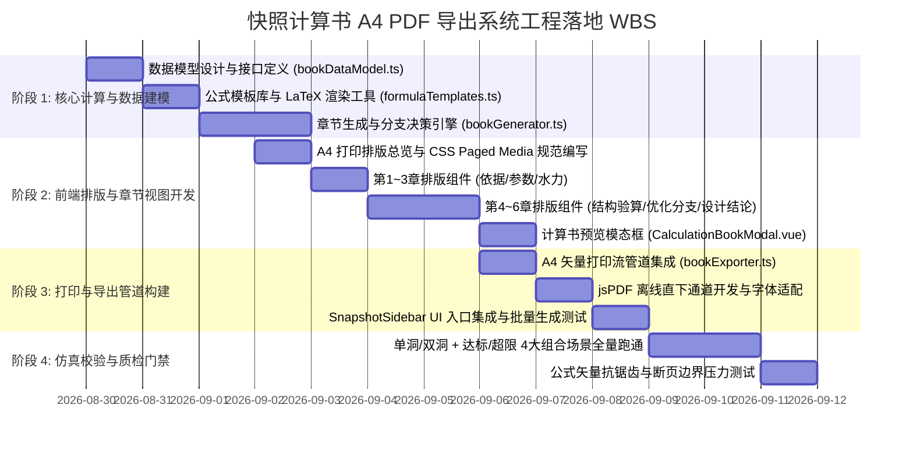

# 阶段4-专题-快照防排水优化设计计算书A4-PDF参数化生成与导出架构方案

## Objectives

本方案旨在为“隧道工程多维协同智能排水自适应平台”中的**工况快照（Snapshot）**构建标准化的**《隧道防排水优化设计计算书》A4 PDF 自动生成与导出系统**。

用户在前端快照管理侧边栏（`SnapshotSidebar.vue`）或对比看板中，可对任意一个历史计算工况/分区快照，一键预览并下载排版严谨、公式优美、具备工程法定效力的标准 A4 计算书。

```mermaid
flowchart TB
    subgraph SnapshotData [工况快照数据源 (Snapshot Model)]
        SnapParams[输入参数 params: 几何/地质/结构/水文]
        SnapResults[计算结果 results: 原始解 original / 临界解 critical]
        SnapMeta[快照元数据: 里程桩号/工况备注/时间戳]
    end

    subgraph BookEngine [计算书参数化解构与分支决策引擎]
        Branch1{工况拓扑判别}
        Branch1 -->|单洞| SingleTubeCalc[单洞渗流影响半径 R_inf 算法]
        Branch1 -->|双洞| DoubleTubeCalc[双洞映射等效半径 R_map 算法]

        Branch2{安全系数临界判别}
        Branch2 -->|Fs >= 2.0 无临界| DirectSafeFlow[免注浆直通达标流水线]
        Branch2 -->|Fs < 2.0 有临界| CriticalInvertFlow[临界水头反算 & 注浆厚度解析推导]

        ChapterComposer[6大章节结构化数据装配器]
    end

    subgraph RenderPipeline [排版渲染与公式渲染管线]
        KaTeXEngine[KaTeX 数学公式矢量渲染引擎]
        PagedA4Layout[A4 竖向工程版式 & 三线表 & 智能断页控制]
        PreviewModal[前端实时预览模态框 (A4 Print Preview)]
    end

    subgraph ExportPipe [高保真 PDF 导出管线]
        PrintVector[原生矢量打印管道 (window.print / Tauri PDF)]
        JsPDFDirect[jspdf + html2canvas 300DPI 备用直下一键导出]
    end

    SnapshotData --> BookEngine
    SingleTubeCalc --> ChapterComposer
    DoubleTubeCalc --> ChapterComposer
    DirectSafeFlow --> ChapterComposer
    CriticalInvertFlow --> ChapterComposer
    ChapterComposer --> KaTeXEngine
    KaTeXEngine --> PagedA4Layout
    PagedA4Layout --> PreviewModal
    PreviewModal --> PrintVector
    PreviewModal --> JsPDFDirect
```

### 核心目标分解

1. **计算书大纲与规范深度对齐（参考 `ref/隧道防排水优化设计计算书.md`）**：
   - 完整涵盖规范与工程计算的 6 大核心篇章：
     - **第 1 章 设计依据**：行业规范标准（JTG 3370.1-2018、GB 50108-2008）、SCS-CN 水文模型、多层圆筒渗流理论与梁-弹簧衬砌结构力学模型。
     - **第 2 章 基础计算参数**：隧道几何参数、水文地质参数、结构与材料力学参数清单。
     - **第 3 章 原始状态渗流水力计算**：高/低水位判别、降雨入渗有效水头推导、单洞/双洞渗流场计算、多层圆筒外水压力与涌水量计算。
     - **第 4 章 原始状态衬砌结构安全验算**：泰沙基围岩压力计算、梁-弹簧内力解算（最不利截面轴力 $N$ 与弯矩 $M$）、大偏心受压截面安全系数 $K$ 验算。
     - **第 5 章 防排水优化设计**：
       - **超限工况**：临界控制水头 $h_{\text{crit}}$ 与临界水压 $P_{\text{crit}}$ 反算、临界注浆圈外径 $r_{g,\text{crit}}$ 及注浆厚度 $t_{g,\text{crit}}$ 解析推导、优化后涌水量与水压复核、环向/纵向/横向排水系统水力设计。
       - **达标工况**：结构自适应安全达标认证、基准环向/纵向/横向排水管网容量复核。
     - **第 6 章 最终设计结论**：注浆堵水与加固方案汇总、排水系统管网选型与坡度参数、优化效益与降水降压幅度综合评价。

2. **拓扑与状态多分支全自适应（单双洞 / 有无临界状态）**：
   - **单洞 vs 双洞（Single vs Double Tube）**：
     - 单洞：省略双洞间距 $D$，渗流影响半径直接采用 $\beta_1 \cdot h_0$，纵向主排水管按单洞汇水流量设计；
     - 双洞：载入双洞中心距 $D$，基于保角映射法求解映射角 $\phi$ 与折减等效半径 $R_{\text{map}}$，排水管网考虑双洞水力分配。
   - **有无临界状态（With vs Without Critical State）**：
     - 有临界加固（$K_{\text{orig}} < 2.0$）：出具完整反算推导步骤、公式演进过程、参数对比矩阵与闭环验证；
     - 无临界加固（$K_{\text{orig}} \ge 2.0$）：明确标注“原始结构安全性满足规范允许安全系数 $[K]=2.0$”，自动屏蔽注浆反算冗余章节，聚焦标准排水系统选型。

3. **公式渲染优美与版式工程化（A4 PDF）**：
   - 采用 **LaTeX/KaTeX** 级别数学排版，根号、分式、上标下标、对数及微积分符号达到学术出版级抗锯齿与排版美感。
   - 遵循标准 ISO 216 A4 竖向规格（$210\,\text{mm} \times 297\,\text{mm}$），页边距严格控制（上下 $20\,\text{mm}$，左右 $18\,\text{mm}$），提供标准工程三线表、章节树形编号、公式居中标号、页眉页脚（含工程名称、工况编号与“第 X 页 / 共 Y 页”动态页码）以及智能断页保护。

4. **最优技术选型论证与工程落地**：
   - 论证纯前端、纯后端及混合渲染方案在性能、离线支持、公式排版及跨平台（Web + Tauri）下的最优解。

---

## Constraints

### 1. 技术栈与环境约束
- 前端框架：Vue 3 (Composition API, `<script setup lang="ts">`)、TypeScript、Pinia、Element Plus。
- 跨平台兼容：必须同时支持 Web 浏览器端与 Tauri 桌面端运行环境，支持**100% 离线脱机**导出计算书，不得强依赖后端外部微服务。
- 零破坏兼容：计算书数据源严格基于现有的 `Snapshot` 结构（`snapshotStore.ts`），并沿用 `extractSnapshotValue` 降级提取体系。

### 2. 排版与数学公式约束
- 公式排版严禁采用低清截图或粗糙 ASCII 字符拼凑，必须采用矢量级数学字体与精确排版引擎（KaTeX / MathJax）。
- 打印与导出时必须具备 CSS Paged Media 深度控制能力：
  - 避免公式跨页割裂（`break-inside: avoid`）。
  - 避免表格表头跨页丢失或表格行中途截断。
  - 大章节强制分页起始（`page-break-before: always`）。

### 3. 数据降级与鲁棒性约束
- 若快照处于 `pending`（未完成计算）状态，禁用计算书导出并弹出友好提示。
- 历史老版本快照若缺少某些次要中间变量（如 $CN$ 查表值），引擎需具备默认规范值自动回填（Fallback）能力，严禁出现 `undefined` 或 `NaN` 导致计算书崩溃。

---

## Architecture

### 1. 最优技术选型对比与决策

针对“A4 PDF 计算书导出”以及“公式渲染优美”的诉求，对比以下 4 种技术路线：

| 选型方案 | 渲染与排版核心 | 公式美观度 | 离线与跨平台 | 导出耗时 | 选型结论 |
| :--- | :--- | :--- | :--- | :--- | :--- |
| **方案 A：后端 Python + Weasyprint / Typst CLI** | 后端 Jinja2 模板 + Typst 编译 / Weasyprint | 极高 (Typst/LaTeX 级) | 差 (依赖后端环境及外部二进制，离线桌面端受限) | 500~1500ms (存在网络 I/O) | ❌ 架构较重，不利于本地快照离线即时生成 |
| **方案 B：纯前端 html2canvas + jsPDF 粗暴位图转存** | DOM 截图转图像后贴入 PDF | 中 (位图文字模糊，公式放大失真) | 好 (纯前端) | 200~400ms | ❌ 文字不可选，打印模糊，无法满足工程计算书质检要求 |
| **方案 C：纯前端 Typst WASM (@myriaddreamin/typst.ts)** | WebAssembly 运行 Typst 编译器直接出 PDF | 极高 (原生矢量) | 良好 (需打包 8MB+ WASM 与字体包) | 100~300ms | ⚠️ 依赖包体积较大，需复杂 Vite WASM 插件配置 |
| **方案 D【最优推荐】：前端响应式语义模板 + KaTeX 矢量渲染 + CSS Paged Media 原生矢量打印/PDF 管道 (兼备 jsPDF 备选)** | Vue 3 语义化模板 + KaTeX 矢量排版 + `window.print()` 矢量驱动 | **极高 (KaTeX 矢量公式)** | **极佳 (0 后端依赖，完全支持 Web 与 Tauri 离线)** | **< 50ms 实时预览，秒级导出** | ✅ **综合最优选型** |

#### 选型落地决策：
采用 **方案 D**：
1. **渲染层**：引入轻量级 `katex`（前端 gzip 仅 ~40KB），将计算书中的百余个数学公式以极其轻量、高精度的 HTML/SVG 矢量格式输出。
2. **预览层**：提供 `CalculationBookModal.vue` 计算书预览弹窗，用户可像翻阅纸质书籍一样实时预览、校核数据。
3. **导出层（双通道）**：
   - **主通道（矢量保真度 100%）**：通过隔离的隐藏 iframe 触发 CSS Paged Media 规范的无损矢量打印管道（支持另存为标准矢量 A4 PDF，文本可检索复制，公式绝对锐利）。
   - **快捷备用通道**：提供基于 `jspdf` 的一键本地静默下载，满足单机免打印对话框快速归档场景。

---

### 2. 模块架构与职责分解

```
tunnel-drainage-platform/frontend/src/
├── utils/
│   ├── calculationBook/
│   │   ├── bookDataModel.ts          # 计算书纯数据模型与类型接口
│   │   ├── bookGenerator.ts          # 6 大章节数据拼装、公式生成与单双洞/临界分支决策核心
│   │   ├── formulaTemplates.ts       # 规范化 LaTeX 算式模板与参数插值工具
│   │   └── bookExporter.ts           # A4 矢量打印流与 PDF 导出管道
├── components/
│   ├── calculationBook/
│   │   ├── CalculationBookModal.vue  # 计算书预览模态框（含页眉页脚、缩放、目录导航）
│   │   ├── CalculationReportView.vue # A4 打印母版视图（严格遵循 CSS Paged Media 标准）
│   │   ├── chapters/                 # 6 大章节子组件（保持模块独立）
│   │   │   ├── Chapter1Basis.vue     # 第1章：设计依据
│   │   │   ├── Chapter2Params.vue    # 第2章：基础计算参数
│   │   │   ├── Chapter3Seepage.vue   # 第3章：原始状态渗流水力计算
│   │   │   ├── Chapter4Mech.vue      # 第4章：原始状态衬砌结构安全验算
│   │   │   ├── Chapter5Optimize.vue  # 第5章：防排水优化设计（分支自适应）
│   │   │   └── Chapter6Conclusion.vue# 第6章：最终设计结论
└── components/ui/
    └── SnapshotSidebar.vue           # 注入【计算书】导出与预览入口按钮
```

---

### 3. 六大章节内容与数学模型映射

严格参照 `ref/隧道防排水优化设计计算书.md` 的推导脉络与公式体系：

#### 第 1 章 设计依据 (Design Basis)
- 规范清单：《公路隧道设计规范 第一册 土建工程》（JTG 3370.1-2018）、《地下工程防水技术规范》（GB 50108-2008）。
- 计算理论：SCS-CN 降雨入渗理论、多层圆筒渗流理论、双洞复变保角映射理论、深埋隧道泰沙基围岩压力理论、荷载-结构法（梁-弹簧衬砌有限元分析模型）。

#### 第 2 章 基础计算参数 (Basic Parameters)
按标准三线表输出三大类参数：
1. **隧道几何参数**：二衬内半径 $r_0$、二衬外半径 $r_s$、初支外半径 $r_p$、初始注浆圈外半径 $r_g$、中心埋深 $h_1$、双洞中心距 $D$（双洞工况）、计算分区长度 $L$（起止里程 DK...~DK...）。
2. **水文地质参数**：围岩渗透系数 $k_r$、二衬渗透系数 $k_s$、初支渗透系数 $k_p$、注浆圈渗透系数 $k_g$、初始静水位水头 $H$、年降雨量 $p$、地表条件及径流曲线数 $CN$、水的重度 $\gamma$、围岩天然重度 $\gamma_s$、围岩浮重度 $\gamma'_s$、侧压力系数 $\lambda$、地基抗力系数 $K_s$。
3. **结构与材料力学参数**：混凝土等级（C30）与抗压强度设计值 $R_w$、钢筋类型（HRB400）与强度设计值 $R_g$、单侧配筋面积 $A_g$、保护层厚度 $a_s$、规范允许安全系数 $[K]=2.0$。

#### 第 3 章 原始状态渗流水力计算 (Original Seepage Hydraulics)
1. **计算工况判别**：
   - 依据内半径与静水头比值 $\frac{r_0}{H}$ 与阈值 $0.062$ 判别高/低水位工况；
   - 依据 `tunnel_type` 判别单洞或双洞工况。
2. **降雨补给有效水头计算（SCS-CN 模型）**：
   - 潜在最大滞留量：$S = \frac{25400}{CN} - 254$
   - 初始损失量：$I_a = 0.2 S$
   - 地表径流量：$h_s = \begin{cases} \frac{(p - I_a)^2}{p - I_a + S} & (p > I_a) \\ 0 & (p \le I_a) \end{cases}$
   - 最终降雨入渗折算有效水头：$h_0 = H + \frac{p - h_s}{1000}$
3. **渗流影响半径与双洞映射计算**：
   - 单洞影响半径系数：$\beta_1 = 1.635 + 0.43 \lg k_r + 0.029 (\lg k_r)^2$
   - 单洞影响半径：$R_{\text{inf}} = \beta_1 \cdot h_0$
   - **分支逻辑**：
     - **单洞工况**：有效渗流半径取 $R = R_{\text{inf}}$；
     - **双洞工况**：当双洞半间距 $D/2 < R_{\text{inf}}$ 时，计算映射圆心角 $\phi = 2 \arccos\left(\frac{D/2}{R_{\text{inf}}}\right)$，等效映射半径 $R_{\text{map}} = \left(1 - \frac{\phi_{\text{rad}}}{2\pi}\right) R_{\text{inf}} + \frac{R_{\text{inf}}}{\pi} \sin\left(\frac{\phi_{\text{rad}}}{2}\right)$，有效渗流半径取 $R = R_{\text{map}}$；若 $D/2 \ge R_{\text{inf}}$，渗流漏斗不干涉，直接取 $R_{\text{map}} = R_{\text{inf}}$。
4. **多层圆筒串联渗流计算**：
   - **高水位工况（$r_0 / H < 0.062$）**：
     - 衬砌外水压力公式：
       $$P = \frac{\gamma R \cdot \ln(r_s / r_0)}{\ln\frac{r_s}{r_0} + \frac{k_s}{k_r}\ln\frac{R}{r_g} + \frac{k_s}{k_g}\ln\frac{r_g}{r_p} + \frac{k_s}{k_p}\ln\frac{r_p}{r_s}}$$
     - 延米单位涌水量公式：
       $$q = \frac{2\pi k_r R}{\ln\frac{R}{r_g} + \frac{k_r}{k_g}\ln\frac{r_g}{r_p} + \frac{k_r}{k_p}\ln\frac{r_p}{r_s} + \frac{k_r}{k_s}\ln\frac{r_s}{r_0}}$$
   - **低水位工况（$r_0 / H \ge 0.062$）**：
     - 结合中心埋深 $h_1$ 与保角映射等效半径 $R_{\text{conf}} = \frac{r_0^2}{h_1 - \sqrt{h_1^2 - r_0^2}}$，求解渗透折减系数 $\beta$ 及拱顶/仰拱非对称外水压力（$P_{\text{crown}} = \gamma(\beta h_0 - r_s), P_{\text{invert}} = \gamma(\beta h_0 + r_s)$）。
   - 分区总涌水量：$Q = q \cdot L$。
5. **原始渗流指标汇总表**：有效水头 $h_0$、单位涌水量 $q$、总涌水量 $Q$、衬砌外水压力 $P$。

#### 第 4 章 原始状态衬砌结构安全验算 (Structural Safety Check)
1. **围岩压力计算（泰沙基理论）**：
   - 围岩压力拱高：$H_q = 0.45 \times 2^{\frac{6 - \text{grade}}{6}} \cdot B$（其中 $B = 2 r_s$，深埋工况 $h_1 > H_q$）；
   - 深埋浮重度土压力计算：$p = \gamma'_s \cdot H_q$。
2. **梁-弹簧有限元内力求解**：
   - 荷载组合：竖向土压力 + 侧向梯形土压力 + 全断面法向外水压力 $P$；
   - 提取最不利截面控制内力：轴力 $N$（受压为正）与弯矩 $M$。
3. **偏心受压截面极限状态与安全系数验算（JTG 3370.1-2018 附录 N）**：
   - 截面有效高度 $h_{0,\text{sec}} = h - a_s$（避免与水文有效水头 $h_0$ 混淆），截面宽度 $b = 1000\,\text{mm}$；
   - 界限受压区高度与界限轴力：$\xi_b = 0.55, \quad N_b = R_w \cdot b \cdot \xi_b \cdot h_{0,\text{sec}}$；
   - 截面偏心距：$e = \frac{M}{N} + \frac{h}{2} - a_s$；
   - 大偏心极限抗力矩（当受压区高度 $x < 2a_s$ 时）：$M_u = R_g \cdot A_g \cdot (h_{0,\text{sec}} - a_s)$；
   - 实际安全系数：$K = \frac{M_u}{N \cdot e}$；
   - **安全达标判定**：比对 $K$ 与 $[K] = 2.0$。

#### 第 5 章 防排水优化设计 (Optimization & Drainage Design)

根据第 4 章的验算结论，自适应切换两种分支路径：

##### 分支 A：超限工况（$K_{\text{orig}} < 2.0$，需注浆加固）
1. **临界控制水头反算**：
   - 以目标安全系数 $K = 2.0$ 为边界约束，采用二分法/步进迭代反算临界控制水头 $h_{\text{crit}}$；
   - 临界控制水压力：$P_{\text{crit}} = \gamma \cdot h_{\text{crit}}$。
2. **临界注浆圈几何参数解析推导**：
   - 将 $P_{\text{crit}}$ 代入多层圆筒渗流公式反解注浆圈外径 $r_{g,\text{crit}}$：
     $$\ln r_g = \frac{\frac{\gamma R \ln(r_s / r_0)}{P_{\text{crit}}} - \left[ \ln\frac{r_s}{r_0} + \frac{k_s}{k_r}\ln R - \frac{k_s}{k_g}\ln r_p + \frac{k_s}{k_p}\ln\frac{r_p}{r_s} \right]}{k_s \left( \frac{1}{k_g} - \frac{1}{k_r} \right)}$$
   - 临界注浆圈外半径：$r_{g,\text{crit}} = e^{\ln r_g}$；
   - 临界注浆加固厚度：$t_{g,\text{crit}} = r_{g,\text{crit}} - r_p$；
   - **参数边界与极值约束**：
     - 注浆圈渗透性改善约束：$k_g < k_r$；
     - 达标下限：若反算 $r_{g,\text{crit}} \le r_p$，物理上对应初支本身已满足控水要求，注浆厚度置为 $t_{g,\text{crit}} = 0$；
     - 极限承压边界：$P_{\text{crit}} \ge P_{\text{min}}$（无限大注浆圈厚度时的极限残余水压）。
   - 优化后水力指标复核：计算加固后的单位涌水量 $q_{\text{opt}}$、总涌水量 $Q_{\text{opt}}$ 与衬砌外水压力 $P_{\text{opt}}$，并输出反算闭环相对误差（$< 0.01\%$）。
3. **排水系统自适应水力计算（曼宁公式）**：
   - 曼宁日过流能力公式：$Q_{\text{cap}} = \frac{86400}{n} A R_h^{2/3} i^{1/2} \quad (\text{m}^3/\text{d})$；
   - **环向打孔盲管**：按推荐间距 $S_{\text{ring}}$ 与优化涌水量计算单侧边汇水量 $Q_{\text{side}} = \frac{q_{\text{opt}} \cdot S_{\text{ring}}}{2}$，验算所选管径（如 DN50）过流能力裕度；
   - **纵向排水盲管**：单洞全线总流量 $Q_{\text{long}} = \frac{Q_{\text{opt}}}{2}$，验算 DN100 贯通管过流能力；
   - **横向排水支管**：按纵向汇水间距验算 DN80/DN100 穿衬管坡度与排泄能力。

##### 分支 B：达标工况（$K_{\text{orig}} \ge 2.0$，无临界超限）
1. **结构安全性合规认证**：
   - 声明：当前围岩及水文地质条件下，衬砌结构截面抗力充盈（$K = K_{\text{orig}} \ge [K]$），无需实施深孔注浆加固圈堵水工程。
2. **常规防排水管网水力校核**：
   - 基于原始涌水量 $q_{\text{orig}}$ 与 $Q_{\text{orig}}$，校核环向盲管（标准间距 10.0m、DN50）、纵向盲管（DN100）及横向支管（DN80）的排泄安全裕度。

#### 第 6 章 最终设计结论 (Final Conclusions)
1. **工程措施参数总表**：
   - 注浆堵水方案：临界控制水压 $P_{\text{crit}}$、注浆圈外径 $r_{g,\text{crit}}$、注浆厚度 $t_{g,\text{crit}}$（达标工况标注“不设”）；
   - 排水系统方案：环向盲管规格与间距、横向盲管规格与坡度、纵向主排水管规格与坡度。
2. **优化效益前后对比表**：
   - 外水压力变化（$P_{\text{orig}} \to P_{\text{opt}}$，降幅百分比）；
   - 分区涌水量变化（$Q_{\text{orig}} \to Q_{\text{opt}}$，降幅百分比）；
   - 安全系数提升（$K_{\text{orig}} \to K_{\text{opt}} = 2.00$ 或维持安全水平）；
3. **工程会签与法定责任栏**：设计、复核、审核、项目负责人签字栏与出图日期戳。

---

### 4. A4 排版与公式美学设计规范

#### 4.1 A4 页面物理规格与 CSS Paged Media 控制
- 页面尺寸：`@page { size: A4 portrait; margin: 20mm 15mm 20mm 15mm; }`
- 色彩体系：
  - 正文：工程深灰/黑（`#1F2937`）
  - 一级标题：深海军蓝（`#0F172A`，加粗，下附 1.5pt 主题色装饰线 `#2563EB`）
  - 二级/三级标题：钢青色（`#1E40AF` / `#334155`）
  - 表格表头：浅蓝灰（`#F1F5F9`），标准三线表（顶底线 1.5pt，栏目线 0.75pt）
  - 重点提示框：浅蓝底（`#EFF6FF`）配蓝色左侧边框（`#3B82F6`）
- 断页规则：
  - `.chapter-container { page-break-before: always; }`（大章节强制分页起排）
  - `.formula-card, .table-container, .metric-box { break-inside: avoid; page-break-inside: avoid; }`（防止公式和表格中途断页）
  - 动态页脚：`content: "第 " counter(page) " 页 · 共 " counter(pages) " 页";`

#### 4.2 KaTeX 数学公式渲染标准
- 独立公式块统一采用 KaTeX Display Mode（`displayMode: true`），水平居中，右侧附公式序号（如 `(3-4)`）。
- 行内公式（`displayMode: false`）与中文正文基线严密对齐，字体大小按 `1.05em` 微调，杜绝上下跳动。

---

## Work Breakdown Structure



### 任务拆解清单 (Detailed Tasks)

| 编号 | 模块 / 文件 | 核心任务与产出 |
| :--- | :--- | :--- |
| **WBS 1.1** | `frontend/src/utils/calculationBook/bookDataModel.ts` | 定义计算书 6 大章节完整的 TypeScript 接口，规范输入快照到报告数据包的映射协议。 |
| **WBS 1.2** | `frontend/src/utils/calculationBook/formulaTemplates.ts` | 封装标准 LaTeX 字符串生成器，支持水力、渗流、有限元、偏心受压及临界反算公式的参数化插值与 KaTeX 编译。 |
| **WBS 1.3** | `frontend/src/utils/calculationBook/bookGenerator.ts` | 编写数据组装核心：执行工况判别（单/双洞）、安全状态判别（达标/超限），多级降级提取快照数据，输出完整的结构化计算书对象。 |
| **WBS 2.1** | `frontend/src/components/calculationBook/CalculationReportView.vue` | 编写符合 ISO A4 规格的打印母版，定义精美的工程排版样式（三线表、标题层次、边距、页眉页脚）。 |
| **WBS 2.2** | `frontend/src/components/calculationBook/chapters/*.vue` | 分离实现 6 个独立章节的 Vue 组件，保障代码高可维护性与公式局部渲染性能。 |
| **WBS 2.3** | `frontend/src/components/calculationBook/CalculationBookModal.vue` | 封装全屏/弹窗式计算书预览组件，支持目录跳转、A4 纸张缩放预览（Zoom In/Out）与快捷导出按钮。 |
| **WBS 3.1** | `frontend/src/utils/calculationBook/bookExporter.ts` | 实现 `printReport` 矢量打印函数（支持 Web 与 Tauri 环境的静默打印/保存为 PDF）与 `downloadPdfDirect` 快速下载函数。 |
| **WBS 3.2** | `frontend/src/components/ui/SnapshotSidebar.vue` | 在每个快照卡片的操作按钮栏增加“计算书”下拉菜单（【📑 预览计算书】/【📥 导出 A4 PDF】），绑定异步导出事件。 |
| **WBS 4.1** | 全工况矩阵验证与回归测试 | 验证“单洞+达标”、“单洞+超限”、“双洞+达标”、“双洞+超限”4 类工况生成的计算书准确性与公式渲染质量。 |

---

## Acceptance Criteria

### 1. 业务与内容验收标准
- [ ] **完整覆盖 6 大章节**：生成的计算书必须严格包含《设计依据》、《基础计算参数》、《原始状态渗流水力计算》、《原始状态衬砌结构安全验算》、《防排水优化设计》、《最终设计结论》全部内容，无任何章节遗漏。
- [ ] **拓扑与状态分支 100% 准确**：
  - 双洞工况必须呈现双洞中心距 $D$、映射角 $\phi$ 与折减等效半径 $R_{\text{map}}$ 的完整计算步骤；单洞工况严禁出现双洞映射冗余参数。
  - 原始安全系数 $K < 2.0$ 时，必须输出第 5 章临界水头反算、临界注浆厚度推导与加固后涌水量复核；原始 $K \ge 2.0$ 时，必须输出“结构安全达标认证”并跳转至标准排水系统水力设计。
- [ ] **数据与算法闭环**：计算书中的所有参数数值（如有效水头 $h_0$、外水压力 $P$、涌水量 $Q$、安全系数 $K$、临界注浆厚度 $t_g$ 等）必须与当前快照的计算结果 100% 吻合，计算误差 $< 0.01\%$。

### 2. 视觉排版与公式渲染验收标准
- [ ] **LaTeX 公式优美**：全部数学公式（包括根号、分式、上标下标、对数及微积分）均采用 KaTeX 矢量排版，清晰锐利、无锯齿、无文本重叠，行内公式与正文基线严格对齐。
- [ ] **标准 A4 页面与三线表**：打印预览符合标准 A4 纵向规格，表格采用经典工程三线表格式；页眉显示工程项目名称与当前工况里程，页脚显示动态总页码与时间戳。
- [ ] **分页断点零瑕疵**：章节之间分页明确，公式块、关键图表与三线表完整居于单页之内，严禁出现公式或表格被跨页横向切断的排版故障。

### 3. 性能与跨平台验收标准
- [ ] **生成速度**：单份计算书从点击到前端 A4 预览界面渲染完成耗时 $\le 100\,\text{ms}$。
- [ ] **跨平台与离线可用**：在纯离线状态下（断网模式）以及 Tauri 桌面客户端环境下，均可正常预览并导出标准 A4 PDF 文件。
- [ ] **鲁棒性门禁**：对未计算（`pending`）快照进行拦截提示；对缺少非核心字段的历史快照自动优雅降级，杜绝页面崩溃。
