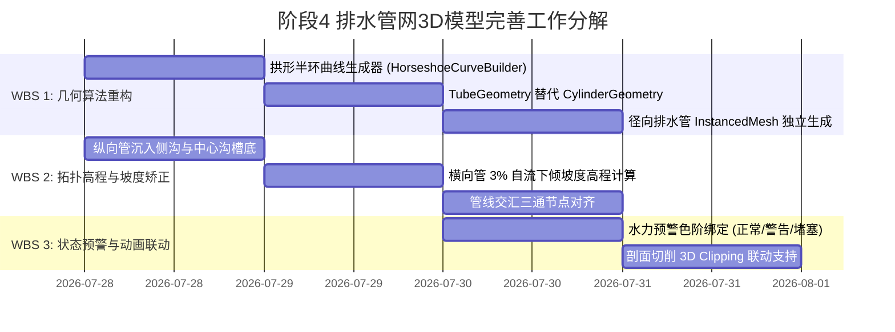

<!-- 阶段4-排水管网3D模型专项问题诊断与完善方案.md -->

# 【阶段4-3D可视化】排水管网3D模型专项问题诊断与完善方案

针对隧道工程多维协同智能排水自适应平台中“排水管网”图层的 3D 几何建模、空间拓扑关系及工程物理逻辑进行深度诊断，结合阶段 4 后端计算引擎 (`drainage_engine.py`) 与前端三维渲染组件 (`DrainagePipeGenerator.ts`)，输出确定性、工程数学严密的问题诊断与三维完善方案。

---

## 一、 专项诊断目标 (Objectives)

1. **几何形态精准化**：纠正环向排水管（盲管）从“悬空直线圆柱斜杆”到“贴合衬砌背水面马蹄形拱形半环”的几何拓扑映射。
2. **空间拓扑连通化**：纠正环向管、径向管、纵向排水管、横向连接管与两侧边沟及中心排水沟之间的空间高程错位与水流连通关系。
3. **工程参数规范化**：建立符合水力与防排水规范的环向/径向管间距动态计算模型，实现与里程起点/终点坐标精准对齐。
4. **数据驱动与预警联动**：将排水管网 3D 渲染与后端水力计算引擎（涌水量 $Q_{\text{drain}}$、盲管推荐间距 $S_{\text{ring}}$、排水双侧/单侧控制）进行无缝数据联动与状态预警着色。

---

## 二、 约束条件与工程规范 (Constraints)

1. **工程物理结构约束**：
   - **环向排水盲管（Circumferential Blind Drain）**：铺设于初期支护与二次衬砌之间（防水板外侧），仅覆盖拱顶与两侧墙身（弧度约 $270^\circ \sim 280^\circ$ 的拱形半环），底部止于两侧墙脚侧边沟，**严禁建模为 360° 封闭圆环或悬空直杆**。
   - **径向排水管（Radial Drain Hole）**：沿隧道断面辐射向围岩深部打入（深度通常 $3.0 \sim 6.0\text{m}$），用于引出围岩裂隙水。
   - **纵向排水管（Longitudinal Drain Pipe）**：铺设于两侧墙脚边沟槽底及中心排水沟槽底，沿隧道纵向贯通（坡度与隧道纵坡一致）。
   - **横向连接管（Transverse Connector Pipe）**：连接两侧边沟与中心排水沟，须具备 $2\% \sim 5\%$ 由外向内的横向下倾坡度，依靠重力自流排水。
2. **三维渲染性能约束**：
   - 全面使用 Three.js `InstancedMesh` / 自定义低多边形 `TubeGeometry` 共享 geometry 与 material，确保全隧道管网渲染帧率保持在 $\ge 60 \text{ FPS}$。
3. **数据流透传约束**：
   - 管网参数（`ringDiam`, `ringSpacing`, `longDiam`, `latDiam`, `doubleSide`）严格透传自 `snapshot.critical_state` 与 `snapshot.input_parameter`。

---

## 三、 核心问题深度诊断 (Architecture & System Diagnosis)

### 1. 环向与径向排水管间距及布设逻辑诊断

#### (1) 环向排水盲管间距与纵向分布问题
- **代码根因**：当前 `DrainagePipeGenerator.ts` 中环向管纵向 Z 坐标仅以 `z = -(i * ringSpacing)` 递减计算。
- **诊断结论**：
  - 未考虑 `startChainage` 的纵向绝对偏置，导致管网 Z 轴基准点与隧道主衬砌几何体零点不匹配。
  - 规范要求环向盲管间距根据围岩富水程度动态调整（一般段 $5 \sim 10\text{m}$，富水/断层段加密至 $2 \sim 3\text{m}$）。当前代码仅支持全局单一固定间距 `ringSpacing`。
- **完善方案**：
  - 修正纵向 Z 轴公式：$Z_k = -(\text{startChainage} + k \cdot S_{\text{ring}})$，其中 $k \in [0, N_{\text{ring}}-1]$。
  - 引入富水段动态加密因子 $\alpha_{\text{water}}$，在涌水量 $Q_{\text{drain}} > Q_{\text{threshold}}$ 时自动触发局部间距减半加密渲染。

#### (2) 径向排水管（Radial Drain Hole）的缺失与混淆
- **诊断结论**：
  - 现代码未定义“径向排水管”层级，此前误将环向管末端的直线外伸杆当成径向管。
  - 实际工程中，径向排水管是打入围岩深部的梅花形打孔管。
- **完善方案**：
  - 在 `DrainagePipeGenerator.ts` 中独立增加 `radialMesh: THREE.InstancedMesh` 组件。
  - 在环向盲管截面上按极角 $\theta_j \in [15^\circ, 165^\circ]$ 辐射向外延伸，深入围岩 $L_{\text{radial}} = 4.0\text{m}$，管径采用 $d_{\text{radial}} = 0.05\text{m}$。

---

### 2. 环向排水管建模形态诊断（“拱形半环”而非“封闭环或斜棒”）

#### (1) 为什么绝不能是 360° 封闭圆环？
- **工程物理事实**：隧道底部为仰拱与路面铺装，地下水防排水原则是“**拱墙集水，下泄边沟，引排中心**”。如果在仰拱底部铺设环向盲管并形成 360° 封闭大圆环，不仅不符合施工衬砌敷设工艺，还会导致底部积水反向倒灌、引起仰拱水压升高。

#### (2) 当前代码的致命几何错误
- **代码解析**：
  在 `DrainagePipeGenerator.ts` 的 `updateRingPipes()` 中：
  ```typescript
  // 错误使用 CylinderGeometry 直线杆，结合法线 Quaternion 旋转
  const quatRight = calculateNormalQuaternion(posRight, centerRight);
  matrix.compose(posRight, ringQuatRight, new THREE.Vector3(1, pipeLength, 1));
  ```
- **现象后果**：
  生成的是向外侧围岩中斜刺出的蓝色**直线圆柱斜杆**（如 3D 视图中所示），完全脱离了衬砌外壁的马蹄形曲线轮廓，造成严重视觉错位。

#### (3) 正确的“贴合衬砌背水面马蹄形拱形半环”建模数学模型
- **精确衬砌背水面（初支外壁）半径与坐标映射**：
  必须与 `TunnelGenerator.ts` 外轮廓截面（`target_r = r2`，即 $t_{\text{lining}} = r_2 - r \approx 1.0\text{m}$）完全保持一致，严禁传入微小偏置（如 $+0.05\text{m}$）导致管道坍缩嵌入混凝土衬砌内部。
  - **拱顶圆弧段**：圆心 $(0, 0)$，外扩半径 $R_{1,\text{back}} = 1.05 r + (r_2 - r)$，弧度从 $\pi$ (180°) 顺时针至 $0^\circ$。
  - **两侧直墙段（若 $H_{\text{side}} > 0$）**：
    - 左侧直墙：从 $(-R_{1,\text{back}}, -H_{\text{side}})$ 垂直向上至 $(-R_{1,\text{back}}, 0)$，法线朝左 $(-1, 0, 0)$。
    - 右侧直墙：从 $(R_{1,\text{back}}, 0)$ 垂直向下至 $(R_{1,\text{back}}, -H_{\text{side}})$，法线朝右 $(1, 0, 0)$。
  - **左侧墙圆弧段**：圆心 $(-dx, -H_{\text{side}})$，半径 $R_{2,\text{back}} = 0.65 r + (r_2 - r)$，弧度从左墙脚起点 $a_{\text{left}} = \text{atan2}(-dy, -dx)$ (约 $225^\circ$) 逆时针到达 $\pi$ (180°)。
  - **右侧墙圆弧段**：圆心 $(dx, -H_{\text{side}})$，半径 $R_{2,\text{back}} = 0.65 r + (r_2 - r)$，弧度从 $0^\circ$ 顺时针到达右墙脚起点 $a_{\text{right}} = \text{atan2}(-dy, dx)$ (约 $315^\circ$)。
- **纠偏后的半环方向与贴合效果**：
  严格顺应隧道衬砌背水面轮廓分布，左右两侧对称向下汇入侧边沟，绝对消除左侧弧度翻转、反向凹陷或脱离衬砌背水面等几何缺陷。

---

### 3. 所有排水管与排水沟空间拓扑与水流连通关系诊断

#### (1) 水流物理连通链条（Topology Flow）
$$\text{围岩渗水} \xrightarrow{\text{径向管/盲沟}} \text{拱墙环向盲管 (拱形半环)} \xrightarrow{\text{重力下泄}} \text{两侧墙脚侧边沟} \xrightarrow{\text{横向倾斜管}} \text{中心深埋排水沟/管} \xrightarrow{\text{洞外集中排放}}$$

#### (2) 当前 3D 渲染与物理拓扑的 4 大断裂点
1. **环向管末端悬空**：蓝色斜杆两端悬空在围岩中，未与墙脚侧边沟连通。
2. **纵向管高程悬浮**：现代码纵向管位置在 `posRight = (sideDitchX, roadY + longRadius, Z)`，位于路面上方；实际应沉入侧边沟槽底（`roadY - ditchHeight`）及中心水沟底（`ditchBottomY + longRadius`）。
3. **横向管无重力坡度**：现代码横向管水平平铺在 `roadY` 上；实际应由侧边沟底向中心水沟底倾斜，坡度 $i = 3\%$，具有 $Y$ 轴高差 $\Delta Y = Y_{\text{side}} - Y_{\text{center}} \approx 0.5\text{m}$。
4. **管-沟交汇三通节点缺失**：环向管下端出口、侧边沟纵向管与横向管交汇点没有空间重合节点。

#### (3) 纠偏后的空间坐标与拓扑矩阵
| 管道/水沟组件 | X 轴水平位置 | Y 轴高程位置 | 几何形态与坡度 | 拓扑连通关系 |
| :--- | :--- | :--- | :--- | :--- |
| **环向排水盲管** | 沿马蹄形初支外壁弧线 | 沿马蹄形拱墙外壁弧线 | 270° 马蹄拱形半环 | 下端出口精准接入两侧边沟槽 |
| **径向排水管** | 自弧面辐射向外 | 自弧面辐射向外 | 直线打孔管 ($L=4\text{m}$) | 外端入围岩，内端接环向盲管 |
| **侧边沟纵向管** | $\pm \text{sideDitchX}$ | $\text{roadY} - 0.4\text{m}$ | 沿 Z 轴纵贯 (同隧道纵坡) | 卧于侧边沟内，接收环向管水流 |
| **中心水沟纵向管** | $0.0$ (隧道中轴) | $\text{ditchBottomY} + \frac{d_{\text{long}}}{2}$ | 沿 Z 轴纵贯 (埋于槽底) | 卧于中心排水沟槽底 |
| **横向连接管** | $\pm \text{sideDitchX} \rightarrow 0$ | $\text{roadY} - 0.4\text{m} \rightarrow \text{ditchBottomY}$ | 向内下倾坡度 $i = 3\%$ | 起于侧边沟底，止于中心水沟 |

---

## 四、 工作分解结构 (Work Breakdown Structure)



### WBS 任务清单表

#### 模块 1：几何算法升级 (`DrainagePipeGenerator.ts`)
- **WBS 1.1**：在 `utils/math.ts` 中抽取导出 `HorseshoeArcCurve` 拱形半环曲线类，精准生成 $270^\circ$ 马蹄形弧线。
- **WBS 1.2**：重构 `updateRingPipes()`，使用拱形半环曲线与 `THREE.TubeGeometry` 生成真实贴合衬砌背水的弧形环向盲管。
- **WBS 1.3**：新增 `radialMesh` 径向打孔排水管阵列，支持梅花形向围岩辐射延伸。

#### 模块 2：空间拓扑与水流坡度矫正
- **WBS 2.1**：重构 `updateLongPipes()`，将侧边纵向管高程矫正至 `roadY - 0.4`，中心纵向管矫正至 `ditchBottomY + longRadius`。
- **WBS 2.2**：重构 `updateLatPipes()`，为横向连接管设定自 `(sideDitchX, roadY - 0.4)` 向 `(0, ditchBottomY)` 倾斜的 $3\%$ 横坡向量。
- **WBS 2.3**：校正纵向 Z 轴序列，使环向管、横向管阵列严格绑定 `startChainage` 里程点。

#### 模块 3：数据驱动预警与交互集成 (`Viewer3D.vue`)
- **WBS 3.1**：绑定 `snapshot.critical_state.q_drain` 与排水管网状态颜色，实现正常（天蓝 `0x4aa8ff`）、富水预警（琥珀黄 `0xf39c12`）、堵塞过载（警示红 `0xe74c3c`）的高亮预警。
- **WBS 3.2**：确保排水管网所有 InstancedMesh 自动响应 3D 剖切平面的 ClipPlanes 剪裁。

---

## 五、 验收标准 (Acceptance Criteria)

1. **几何形态验收**：
   - 3D 视窗中“排水管网”图层的环向排水盲管必须呈拱形半环，紧密贴合在初支背水面马蹄拱上，无斜向外刺出的直线斜杆。
   - 增加径向排水管后，辐射状直杆应从环向管弧面延伸进入围岩。
2. **空间拓扑验收**：
   - 环向盲管两侧下端出口精准落入两侧边沟。
   - 纵向排水管完全嵌入侧边沟槽底及中心水沟槽底，无悬浮于路面上的现象。
   - 横向连接管由两侧边沟底向中心水沟底呈斜向倾斜连通。
3. **数据驱动联动验收**：
   - 修改后端快照参数（如 `ring_spacing_recommend` 从 10m 变为 5m），前端 3D 视图中环向管密度即时翻倍。
   - 切换 `double_side: true/false` 时，双侧/单侧排水管网与水沟管线同步平滑刷新。
4. **性能与渲染验收**：
   - 管网整体渲染在 OrbitControls 旋转与缩放时无卡顿，帧率保持 $\ge 60 \text{ FPS}$。
   - 开启 3D 剖切（Section Clipping）时，管网与衬砌结构同步被平滑切开，断面无几何穿模或碎片残留。
