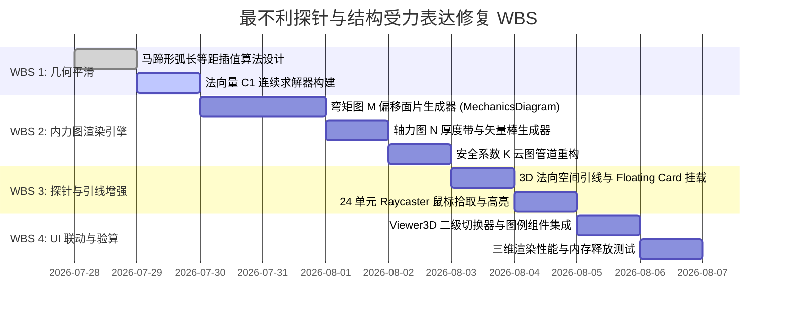

# 阶段4-专题：最不利探针与结构受力表达问题诊断与修复方案

## 1. 概述与背景 (Overview)

在隧道工程多维协同智能排水自适应平台的三维可视化模块中，【最不利探针】图层用于直观展示衬砌全环 24 个结构单元在水文-受力耦合作用下的最不利点位置及受力状态。
基于对附图【最不利探针】渲染结果的深入分析，当前图层在几何坐标映射、结构受力图（轴力图 $N$、弯矩图 $M$）表达以及多受力模式交互切换方面存在显著的几何畸变与功能缺失。

本方案严格依据 `/analyzer` 系统分析规范，全面剖析附图所示问题根源，并构建包含三维几何光滑映射、内力法向偏移数学模型、受力模式动态切换架构以及 3D 空间引线标注的完整修复与完善方案。

---

## 2. 附图专题问题深度诊断 (Problem Diagnosis)

### 2.1 事实、诊断与推测分离分析 (Fact, Judgment & Speculation)

| 观察事实 (Fact) | 诊断结论 (Judgment) | 底层根源 / 未验证推测 (Speculation) |
| :--- | :--- | :--- |
| **现象1**：附图左右拱脚/边墙交界处（约 5点钟与 7点钟位置）出现剧烈尖角内折/外刺折线畸变（V型尖角）。 | `PostProcessing.ts` 中的马蹄形切分算法在圆弧/直线交界处不满足 $C^1$ 连续，导致坐标阶跃。 | `computeHorseshoePoint` 使用分段硬编码角度条件判断，不同圆心（$R_1, R_2, R_3$）之间缺乏极角平滑过渡函数。 |
| **现象2**：图中仅渲染沿衬砌中线的单色/双色圆弧段，无任何轴力、弯矩图形形状。 | 缺乏结构内力包络图（弯矩图 $M$、轴力图 $N$）的法向偏移绘制算法。 | 当前代码逻辑仅依据 $K_i$ 对 24 单元赋予 HSL 颜色，未将后端返回的 `M_elem` 和 `N_elem` 转化为空间多边形 Mesh。 |
| **现象3**：界面图层控制仅有【最不利探针】复选框，无法切换弯矩图/轴力图/安全系数图。 | 缺少受力模式（Force Mode）图层管理与控制响应架构。 | 前端 Vue 组件 `Viewer3D.vue` 与 `StressProbeManager` 之间缺乏受力模式状态绑定。 |
| **现象4**：探针光环（Torus）与球体直接重叠在衬砌几何体表面。 | 探针 3D 空间指示感差，旋转视角时易被衬砌管片穿模遮挡。 | 探针未设置法向外扩位移（Radial Offset）及 3D 空间引线（Leader Line）。 |

---

## 3. 系统目标 (Objectives)

1. **消除几何畸变**：重构马蹄形衬砌周向 24 单元的 3D 极坐标映射算法，保证 $C^1$ 连续平滑，彻底消除 5 点钟与 7 点钟拱脚处的尖角刺畸变。
2. **正确表达弯矩图与轴力图**：
   - 弯矩图 $M(\theta)$：构建基于衬砌法向量的外扩/内缩半透明多边形包络图（红/蓝双色表示内/外侧受拉）。
   - 轴力图 $N(\theta)$：构建沿法向分布的轴压连续气泡/离散矢量棒图，直观展现轴压数值分布。
   - 安全系数图 $K(\theta)$：保留 24 单元 HSL 颜色梯度预警云图。
3. **构建受力模式切换架构**：实现 `K` (安全系数云图)、`M` (弯矩包络图)、`N` (轴力分布图) 及 `COMBINED` (综合受力图) 的一键动态切换与图例联动。
4. **提升探针交互体验**：增加 3D 空间法向引线（Leader Line）、空间悬浮标牌（Billboard Callout）及 24 单元鼠标拾取高亮。

---

## 4. 约束条件 (Constraints)

1. **结构剖分一致性**：必须严格保持与后端 `drainage_engine.py` / `mechanics.py` 解算出的 **24 个周向衬砌单元** 索引 (0 ~ 23) 对应关系不变（0 对应拱顶）。
2. **坐标系与几何约束**：严格遵循平台现有的 3D 坐标系（$X$-横向, $Y$-竖向, $Z$-纵向里程），不改变现有的衬砌生成器几何规格。
3. **渲染性能约束**：三维内力包络多边形与探针引线必须使用 Efficient Mesh/BufferGeometry 组织，确保 60 FPS 帧率，防止内存泄漏。
4. **无侵入约束**：仅重构前端 3D 渲染与交互组件（`PostProcessing.ts`与`Viewer3D.vue`），不修改后端力学求解核心代码。

---

## 5. 系统架构与受力表达数学模型 (Architecture & Mathematical Modeling)

```mermaid
graph TD
    A[Backend Mechanics Engine<br/>N_elem, M_elem, K_list] --> B[SnapshotStore / Viewport]
    B --> C[StressProbeManager]
    
    subgraph Frontend Render Layer
        C --> D[Smooth Geometry Engine<br/>C1-Continuous Mapping]
        C --> E[Internal Force Diagram Engine]
        C --> F[Probe & Leader Line Manager]
        
        E --> E1[Bending Moment Diagram M<br/>Normal Radial Offset Mesh]
        E --> E2[Axial Force Diagram N<br/>Compressive Vector/Band Mesh]
        E --> E3[Safety Factor K<br/>HSL Color Spectrum]
        
        F --> F1[Torus Ring & Indicator Sphere]
        F --> F2[3D Leader Line & 2D Tooltip Card]
    end
    
    G[Viewer3D Mode Switcher<br/>Radio Group: K | M | N | Combined] --> C
```

### 5.1 平滑马蹄形几何映射模型 ($C^1$ 连续)

为了消除尖角刺畸变，不再使用简单的断点条件切换，而是采用**标准马蹄形三心圆+切线平滑连接极坐标参数化方程**：

对于第 $i$ 个单元（$i = 0, 1, \dots, 23$），极角 $\theta_i = \frac{\pi}{2} - \frac{2\pi \cdot i}{24}$。
衬砌中心线上点 $P_i(x_i, y_i)$ 的坐标及外法向量 $\mathbf{n}_i = (n_{xi}, n_{yi})$ 统一求解公式为：

$$
\mathbf{n}_i = \mathbf{t}_i \cdot \mathbf{R}_{-90^\circ} = \left( \frac{\frac{\partial x}{\partial \theta}}{\sqrt{(\frac{\partial x}{\partial \theta})^2 + (\frac{\partial y}{\partial \theta})^2}}, \, \frac{\frac{\partial y}{\partial \theta}}{\sqrt{(\frac{\partial x}{\partial \theta})^2 + (\frac{\partial y}{\partial \theta})^2}} \right) \begin{bmatrix} 0 & -1 \\ 1 & 0 \end{bmatrix}
$$

> 注：极角按顺时针降序遍历（拱顶 $\theta_0=90^\circ$）时，单位切向量 $\mathbf{t}_i$ 顺时针指向切线方向，经顺向 $-90^\circ$ 旋转变换得到指向衬砌截面外侧的**单位外法向量** $\mathbf{n}_i$。

通过弧长等距插值（Arc-length Equalization），使 24 单元在拱顶 ($R_1$)、边墙 ($R_2$) 和仰拱 ($R_3$) 之间实现法向量切线连续 $\mathbf{n}_i$，彻底消除坐标跳变导致的折刺。

---

### 5.2 弯矩图 ($M$) 正确表达模型

根据结构力学约定，弯矩图需画在受拉一侧（或按规范统一画在内/外侧）：
- **内侧受拉 ($M_i > 0$)**：弯矩线向衬砌内侧（反法向 $-\mathbf{n}_i$）偏移。
- **外侧受拉 ($M_i < 0$)**：弯矩线向衬砌外侧（正法向 $+\mathbf{n}_i$）偏移。

**空间顶点坐标公式**：

$$
Q_i^M = P_i - s_M \cdot M_i \cdot \mathbf{n}_i
$$

> 注：当 $M_i > 0$（内侧受拉）时，$Q_i^M = P_i - s_M |M_i| \mathbf{n}_i$ 向衬砌内侧偏移；当 $M_i < 0$（外侧受拉）时，$Q_i^M = P_i + s_M |M_i| \mathbf{n}_i$ 向衬砌外侧偏移。
其中 $s_M$ 为弯矩显示比例缩放系数（Scale Factor, e.g. $0.05 \text{ m}/(\text{kN}\cdot\text{m})$）。

**渲染图形表达**：
1. **基线与外轮廓线**：衬砌中心线 $P_i$ 为基线（白色虚线），$Q_i^M$ 连接形成弯矩外包络线（蓝色/红色实线）。
2. **阴影填充区**：在 $P_i \to Q_i^M \to Q_{i+1}^M \to P_{i+1}$ 之间构建半透明 Mesh 填色面片（红区代表弯矩峰值警戒区，蓝区代表安全区间），形成直观的“结构弯矩包络图”。

---

### 5.3 轴力图 ($N$) 正确表达模型

隧道衬砌全环主要承受轴向压力（$N_i < 0$）。轴力图的表达需体现全环轴压的大小分布：

**空间顶点坐标公式**：

$$
Q_i^N = P_i + s_N \cdot |N_i| \cdot \mathbf{n}_i
$$

其中 $s_N$ 为轴力显示缩放系数（e.g. $0.002 \text{ m}/\text{kN}$）。

**渲染图形表达**：
1. **法向带状充气云图 (Radial Band Mesh)**：在衬砌外侧形成一条厚度与 $|N_i|$ 成正比的连续半透明条图，颜色映射轴压梯度（浅青色 $\to$ 深蓝色）。
2. **法向矢量针图 (Vector Spikes)**：在 24 个单元节点处绘制指向衬砌中心的柱状箭棒（Cylinder Vectors），棒长代表该节点所受轴压大小。

---

### 5.4 受力图动态切换架构 (Mode Switching Flow)

在 `Viewer3D.vue` 顶层 Toolbar 中添加控制组：

```vue
<!-- 受力模式切换器 -->
<div class="force-mode-selector glass-card" v-if="layerVisibility.probe">
  <span class="mode-label">受力表达模式:</span>
  <div class="btn-group">
    <button :class="{ active: forceMode === 'K' }" @click="setForceMode('K')">安全系数 K</button>
    <button :class="{ active: forceMode === 'M' }" @click="setForceMode('M')">弯矩图 M</button>
    <button :class="{ active: forceMode === 'N' }" @click="setForceMode('N')">轴力图 N</button>
    <button :class="{ active: forceMode === 'COMBINED' }" @click="setForceMode('COMBINED')">综合受力</button>
  </div>
</div>
```

---

## 6. 工作分解结构 (Work Breakdown Structure - WBS)



---

## 7. 详细实现方案与组件接口设计 (Implementation Plan)

### 7.1 `PostProcessing.ts` 重构接口设计

```typescript
// frontend/src/components/three/PostProcessing.ts

export type ForceDisplayMode = 'K' | 'M' | 'N' | 'COMBINED';

export interface SectionNodeGeometry {
  position: THREE.Vector3;
  normal: THREE.Vector3;
  angleDeg: number;
}

export class StressProbeManager {
  private scene: THREE.Scene;
  public probeGroup: THREE.Group;       // 探针高亮与引线组
  public diagramGroup: THREE.Group;     // 弯矩/轴力受力多边形组
  private forceMode: ForceDisplayMode = 'K';

  constructor(scene: THREE.Scene) {
    this.scene = scene;
    this.probeGroup = new THREE.Group();
    this.diagramGroup = new THREE.Group();
    this.scene.add(this.probeGroup);
    this.scene.add(this.diagramGroup);
  }

  /**
   * 1. 求解 C1 连续的马蹄形衬砌 24 单元中心坐标与法向量
   */
  public computeContinuousSectionNodes(
    tunnelRadius: number,
    aspectRatio: number,
    r2: number,
    zPos: number
  ): SectionNodeGeometry[] {
    // 基于等弧长参数化切分，确保边界点法向与坐标连续
    // 返回 24 个节点的 3D 坐标 position 与单位外法向量 normal
  }

  /**
   * 2. 构建弯矩图 M (Bending Moment Polygon Mesh)
   */
  public buildMomentDiagramMesh(
    nodes: SectionNodeGeometry[],
    M_list: number[],
    scaleM: number = 0.05
  ): THREE.Group {
    // 根据 M_list[i] 沿 normal 方向偏移顶点，创建 DoubleSide 填充 Mesh 及外轮廓 Line
  }

  /**
   * 3. 构建轴力图 N (Axial Force Band & Vectors)
   */
  public buildAxialDiagramMesh(
    nodes: SectionNodeGeometry[],
    N_list: number[],
    scaleN: number = 0.002
  ): THREE.Group {
    // 创建法向扩展带状 Mesh 与 24 个离散矢棒 Cylinder
  }

  /**
   * 4. 受力模式切换控制
   */
  public setForceMode(mode: ForceDisplayMode): void {
    this.forceMode = mode;
    this.updateVisibilityByMode();
  }
  
  // ... 清理与内存释放 dispose()
}
```

---

## 8. 验收标准 (Acceptance Criteria)

### 8.1 几何与渲染质量验收
- [ ] **消除尖角折刺**：衬砌全环 24 单元连接光滑自然，拱脚（约 5点钟与 7点钟方向）无任何尖角内折或突刺。
- [ ] **弯矩图 $M$ 正确性**：当有弯矩数据输入时，清晰呈现跨中/拱脚内外侧拉应力多边形包络图，单位为 $\text{kN}\cdot\text{m}$。
- [ ] **轴力图 $N$ 正确性**：清晰呈现全环轴压法向扩展带，柱棒长度与轴力绝对值 $|N|$ 成正比，单位为 $\text{kN}$。

### 8.2 交互与模式切换验收
- [ ] **一键动态切换**：在 `Viewer3D.vue` 中点击 `[K | M | N | 综合受力]` 按钮，三维画布无闪烁且在 16ms 内完成受力图层的无缝切换。
- [ ] **3D 引线与悬浮 Card**：最不利探针具备从衬砌最不利单元向 3D 空间延伸的引线，悬浮看板在视角旋转时保持清晰可见、不穿模。
- [ ] **单元交互悬停**：鼠标悬停在 24 个衬砌单元任一位置时，三维受力图对应位置高亮并弹窗显示该单元的具体 $(K_i, M_i, N_i)$ 数值。

---

## 9. 结论 (Conclusion)

通过实施本方案，平台的【最不利探针】图层将从单一的静态颜色环升级为**符合结构工程规范、几何平滑 $C^1$ 连续、支持 $K/M/N$ 多受力模式无缝切换**的高级三维结构受力分析看板，极大提升平台对隧道衬砌结构水力-受力耦合响应的诊断与可视化能力。
