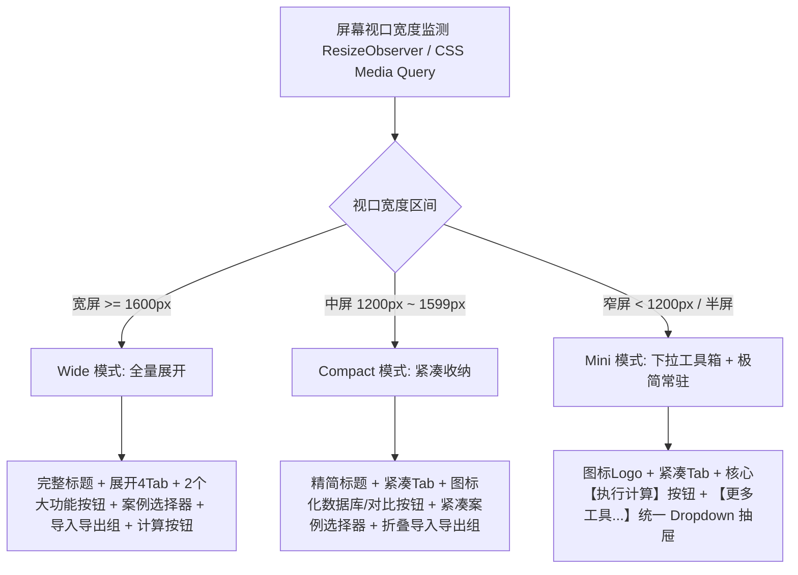
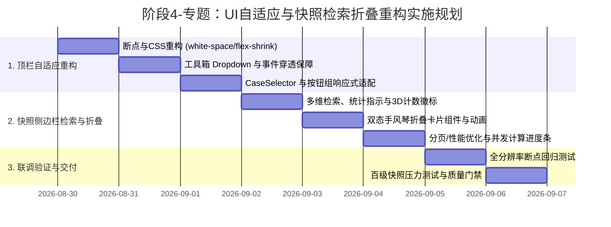

# 阶段4-专题-自适应顶栏与百级快照侧边栏检索折叠架构方案

## Objectives

本方案旨在系统性解决隧道工程多维协同智能排水自适应平台在**不同屏幕分辨率下的顶栏挤压破损**问题，以及在**百级隧道分段工况快照下侧边栏检索困难、滚动性能劣化与信息层级过载**问题。

### 核心目标分解

1. **顶栏（Dashboard Header/Toolbar）自适应响应式架构治理**：
   - 彻底根治顶栏在常见工作分辨率（1366×768、1440×900、1920×1080 分屏半屏窗口及笔记本环境）下的换行破损、文本竖排及按钮挤压溢出问题。
   - 建立三级响应式断点（Wide 宽屏模式、Compact 紧凑模式、Mini 极简/抽屉模式），对功能进行重要度分级（P0核心计算/视图协同、P1辅助工具、P2次要操作），保证核心操作在任何尺寸下一目了然。
2. **百级工况快照侧边栏（SnapshotSidebar）检索、筛选与折叠体系重构**：
   - **快速检索与智能筛选**：支持按“桩号区间（如 K1+200~K2+500）”、“工况备注/名称”、“计算状态（全部/待计算/已计算/失败）”、“安全预警等级（正常 Fs≥2.0 / 预警 Fs<2.0）”进行多维即时复合过滤。
   - **手风琴与全量折叠状态机**：支持“一键全部折叠 / 一键全部展开”，每张卡片具备轻量折叠态（40px 紧凑单行：桩号+状态Tag+安全系数Fs+操作）与深度展开态（完整指标与管径推荐矩阵）。
   - **百级工况性能与批量调度**：针对 100~300 个区间卡片的大数据量场景，建立防卡顿的分页/虚拟渲染支撑，提供工况统计指示器（已算/未算/高危段计数），并强化批量勾选 3D 渲染与批量调度能力。

---

## Constraints

1. **框架与技术栈约束**：
   - 前端基于 Vue 3 (Composition API, `<script setup lang="ts">`)、Element Plus、Pinia（`snapshotStore`, `parameterStore`, `themeStore`）。
   - 必须保持既有 Pinia Store 状态与数据契约向下兼容，不得破坏已有的计算 API、Excel 导入导出与 3D 联动逻辑。
2. **无缝视觉与主题兼容约束**：
   - 所有自适应组件与新增折叠控制项必须严格遵循已有的“科技蓝（Dark）”与“明亮白（Light）”双套 CSS 变量体系（`--sys-bg-toolbar`, `--sys-bg-panel`, `--sys-border` 等）。
3. **零破坏性原则（Scope Preservation）**：
   - 不改变底层力学计算模型与 3D Three.js 渲染管线，仅聚焦于 UI/UX 响应式布局、交互状态管理与组件重构。

---

## Architecture

### 1. 顶栏（Dashboard Toolbar）自适应与多级折叠架构

#### 1.1 顶栏功能优先级分级（Feature Hierarchy）

| 优先级 | 功能模块 | 业务属性 | 布局策略 |
| :--- | :--- | :--- | :--- |
| **P0 (核心常驻)** | 平台标题 / Logo<br>视图模式切换（协同/输入/3D/结果）<br>执行云计算主按钮 | 核心操作流 | 全尺寸常驻可见；小屏时标题转为紧凑简称，视图按钮转为图标+短文本 |
| **P1 (高频工具)** | 参数台账库<br>双视角对比<br>典型案例快速预设 | 辅助配置与对比 | 宽屏直列展示；紧凑屏下转为紧凑图标按钮；小屏下收纳进“工具箱”下拉菜单 |
| **P2 (辅助操作)** | 下载参数模板<br>批量导入 Excel<br>主题明暗切换 | 批处理与环境配置 | 宽屏直列展示；紧凑屏下合并为“导入/导出”下拉按钮组或收纳进抽屉折叠区 |

#### 1.2 响应式断点与布局形态模型（Responsive Breakpoint Model）



#### 1.3 顶栏结构重构设计契约

- **左侧核心品牌区**：
  - `<div class="toolbar-brand">`：包含系统图标与标题。通过 CSS `white-space: nowrap` 与媒体查询，在窄屏下自动切换为“智能排水自适应平台”或带 Tooltip 的图标，防止文字被拆行竖排。
- **中间视图模式控制区**：
  - `<div class="toolbar-view-modes">`：`el-radio-group` 采用固定 `min-width: fit-content`，按钮文字设置 `white-space: nowrap`，杜绝内部汉字折行。
- **右侧功能与操作区**：
  - **宽屏下**：完整排列“参数数据库”、“双视角对比”、“案例预设”、“导入导出”、“主题切换”、“执行计算”。
  - **紧凑/窄屏下**：
    - 案例预设：将 `CaseSelector.vue` 优化为无外部冗余 Label 的紧凑选择器（使用 `placeholder="典型案例"`），宽度自适应。
    - 组合折叠菜单 `<el-dropdown trigger="click">`：
      - 将“下载隧道参数模板”、“批量导入 Excel”、“参数台账库”、“双视角对比”收拢在“工程工具箱 ▾”中，释放超 400px 横向空间。
    - 主题切换：缩减为紧凑无字图标 Switch 或保留标准 switch。
    - “执行云计算”：作为全局最终操作（Call to Action），始终保持高亮并锁定最小宽度。

---

### 2. 百级快照侧边栏（SnapshotSidebar）检索、筛选与手风琴折叠架构

#### 2.1 快照数据状态机与多维过滤管道（Data Pipeline）

```mermaid
flowchart LR
    RawList[原始快照列表 snapshotStore.snapshots (100+ 条)] --> FilterEngine[多维过滤引擎 (Computed Pipeline)]
    
    subgraph Filters [过滤条件集]
        F1[桩号范围/模糊搜索 chainageFilter / searchKeyword]
        F2[计算状态 statusFilter: 全部 / 待计算 / 已完成 / 失败]
        F3[安全风险等级 riskFilter: 全部 / 危险 Fs<2.0 / 正常 Fs>=2.0]
    end
    
    Filters --> FilterEngine
    FilterEngine --> FilteredList[过滤后快照序列 (filteredSnapshots)]
    FilteredList --> RenderStrategy{渲染策略与分页}
    RenderStrategy -->|分页模式/虚拟流| ViewList[视图卡片列表]
    
    subgraph CardUI [卡片交互与展现]
        CollapseState[全局折叠状态 / 单卡片折叠 Map]
        CollapseState --> CompactCard[紧凑折叠态 (40px)]
        CollapseState --> DetailedCard[深度展开态 (指标网格/临界矩阵)]
    end
    ViewList --> CardUI
```

#### 2.2 侧边栏工具条与筛选交互设计

1. **概览统计与快捷过滤指示栏（Stats & Filter Bar）**：
   - 顶部提供实时工况状态微缩徽章（Badges）：
     - 📊 总计：`N` 段
     - 🟢 已完成：`N_done` 段
     - 🟡 待计算：`N_pending` 段
     - 🔴 预警(Fs<2.0)：`N_risk` 段
     - 🧊 3D渲染中：`N_selected / N_total`（直观展示当前三维拼装覆盖率，杜绝过滤后勾选状态认知混淆）
   - 点击徽章可一键触发快速过滤（例如点击“🔴 预警: 12”，列表立即筛选出所有 Fs<2.0 的危险区段）。
2. **复合搜索面板（Search & Filter Controls）**：
   - **桩号/关键字搜索框**：支持输入桩号如 `1200` 或 `K1` 或备注名 `断层段`，即时防抖模糊匹配。
   - **状态与风险下拉选择器**：快速过滤指定工况。
   - **一键全折叠/全展开切换按钮**：快速切换侧边栏整体信息密度，配置 `scrollIntoView` 锚定机制防止高度剧变引起视口跳动。
   - **批量 3D 勾选控制器**：明确区分【勾选当前筛选可见集】、【全选全线所有段】与【清空 3D 勾选】。
3. **百级批量计算并发与进度反馈机制**：
   - 为 `quickCalculatePending` 引入动态进度条 `<el-progress :percentage="calcProgress" :status="calcStatus" />`。
   - 采用并发池（限制最大并发请求数 3~5），避免 100+ 接口瞬时爆发引起浏览器连接耗尽，并提供随时【中断计算】控制。

#### 2.3 双态卡片组件设计（Compact vs. Detailed）

```
+-------------------------------------------------------------------------+
| [✓] K0+000 ~ K0+050  [普通工况段]       [🟢 已计算] [Fs: 2.35] [▼展开] [🗑️] |  <-- 40px 折叠紧凑态
+-------------------------------------------------------------------------+
| [✓] K0+050 ~ K0+100  [断层富水段]       [🔴 临界预警] [Fs: 1.42] [▲折叠] [🗑️] |  <-- 展开态头部
|  ---------------------------------------------------------------------  |
|  原始状态: 水头 28.5m | Fs: 1.42 (不安全)                               |
|  [环向间距: 3.00m] [环向孔径: 100mm] [横向管径: 150mm] [涌水Q: 320m³/d] |
|  临界状态: 水头 15.2m | Fs: 2.10 (安全)                                 |
|  [临界间距: 2.00m] [临界孔径: 150mm] [临界管径: 200mm] [临界Q: 450m³/d] |
|  [📥 导出结果]  [⚡ 单段重算]  [📐 施工图导出]                           |
+-------------------------------------------------------------------------+
```

1. **折叠态（Collapsed State）**：
   - 高度仅 40px，横向单行排列：复选框 + 桩号里程标签 + 备注名称（省略号） + 状态 Tag + 核心指标微标（Fs 预警变红） + 展开折叠箭头。
   - 点击卡片空白处依然精准触发 `restoreSnapshot`，并将 `parameterStore.isDirty` 同步重置为 `false`。
2. **展开态（Expanded State）**：
   - 平滑动画展开当前卡片下方指标网格与临界推荐矩阵。
   - 支持全局状态 `isAllCollapsed = ref(true/false)`，以及局部响应式 `collapsedMap = ref<Record<string, boolean>>({})`。

#### 2.4 大数据量承载性能保障策略

- 当快照数量达 100~300 条时：
  - **分页/分页器（Pagination Mode）**：侧边栏底部提供极简微型分页器（如每页展示 15~20 个区间卡片），确保单页 DOM 节点控制在安全范围（<300 个 DOM），彻底杜绝滚动掉帧。
  - **3D 数据契约独立性**：分页仅影响视图呈现，底层 `snapshotStore.snapshots` 中所有被勾选（`selectedFor3D=true`）的跨页快照依然完整向 [Viewer3D.vue](file:///d:/offices/Github/隧道工程多维协同智能排水自适应平台/tunnel-drainage-platform/frontend/src/components/three/Viewer3D.vue#L1333) 提供三维组合拼装，数据无缝衔接。

---

## Work Breakdown Structure (WBS)



### 任务细分与责任清单

1. **Task 1.1：`Dashboard.vue` 顶栏响应式架构与 CSS 治理**
   - 给 `.toolbar .title`、`.focus-switch`、`.actions` 添加 `flex-shrink: 0` 与 `white-space: nowrap` 规则，禁止单字竖排换行。
   - 编写 `@media (max-width: 1500px)` 及 `@media (max-width: 1200px)` 样式类与收缩策略。
   - 实现自适应“工程工具箱（`el-dropdown`）”，将模板下载、批量导入、参数数据库、双视角对比等次级入口在窄屏时自动整合，并确保导入事件精确穿透触发隐藏的 `fileInput`。

2. **Task 1.2：`CaseSelector.vue` 紧凑模式增强**
   - 优化案例选择器内部样式，去除外部占用宽度的长文本标签，统一采用带浮动占位符（Placeholder）的紧凑 `el-select`。

3. **Task 2.1：`SnapshotSidebar.vue` 检索筛选与统计引擎开发**
   - 新增响应式状态：`searchKeyword`（桩号/备注关键字）、`filterStatus`（状态过滤）、`filterRisk`（安全风险过滤）、`isAllCollapsed`（全量折叠控制）。
   - 构建 `filteredSnapshots` 计算属性，结合桩号解析函数实现跨区间智能匹配。
   - 构建顶部状态指示条：展示总段数、已算数、待算数、预警数及当前 3D 渲染段数（`N_selected / N_total`）。

4. **Task 2.2：快照卡片手风琴折叠与双态视图重构**
   - 重构卡片模板：划分为紧凑顶栏（常驻）与详细指标抽屉（折叠）。
   - 提供“全部折叠 / 全部展开”一键切换按钮，并加入滚动视口锚定，防止高度剧变引起画面跳动。
   - 强化批量操作：明确区隔“勾选当前筛选结果”与“全选全线所有工况”。

5. **Task 2.3：百级数据分页与并发批量计算调度**
   - 在快照列表下方集成 `el-pagination`（`small`, `layout="prev, pager, next"`, `page-size="15"`），保证 100+ 卡片顺畅无卡顿。
   - 实现并发调度池与进度条组件（`calcProgress`），提供实时的进度与取消支持。

---

## Acceptance Criteria

| 模块 | 验收项 | 验收指标与量化标准 |
| :--- | :--- | :--- |
| **顶栏响应式** | 窄屏防挤压 (1024px~1440px) | 标题与视图切换按钮（协同/输入/三维全景/结果）在任何分辨率下**绝对不出现文字竖排或折行断裂**；右侧操作区自适应收折，无任何组件溢出屏幕。 |
| **顶栏功能完备** | 响应式工具箱 | 紧凑/窄屏下通过“工程工具箱”下拉菜单，所有功能（模板下载、Excel 导入、参数数据库、双视角对比、案例切换、云计算）均可正常触发，隐藏 `fileInput` 上传链路完备。 |
| **快照快速检索** | 桩号与关键字过滤 | 输入桩号数字（如 `150`）或工况名称时，列表以 `<50ms` 延迟即时过滤匹配区间；支持清空一键还原。 |
| **快照多维筛选** | 状态与风险筛选 | 切换“待计算 / 正常 / 临界预警”筛选器时，准确呈现对应区段；点击顶部预警徽章可秒级定位所有 Fs<2.0 危险工况。 |
| **全量/局部折叠** | 手风琴折叠体验 | 点击“全部折叠”后，所有卡片瞬间收缩至 40px 紧凑单行；单卡片点击展开/收起过渡流畅；折叠切换无滚动视口突跳；折叠态依然可直接勾选 3D、回溯参数、查看 Fs 预警。 |
| **百级卡片性能** | 大数据量流畅度 | 在 100~300 个工况快照数据下，页面渲染无卡顿，列表滚动帧率稳定在 60 FPS，内存无泄漏。跨页勾选在 3D Viewer 中完整装配。 |
| **批量调度体验** | 并发与进度指示 | 一键批量计算时显示百分比进度条与当前完成段数，采用限制并发请求（3~5），支持中途终止，无假死现象。 |
| **主题自适应** | 科技蓝/明亮白 | 新增的筛选栏、折叠卡片、统计徽章、下拉工具箱在“科技蓝”与“明亮白”下均具有高对比度与统一设计语言。 |

