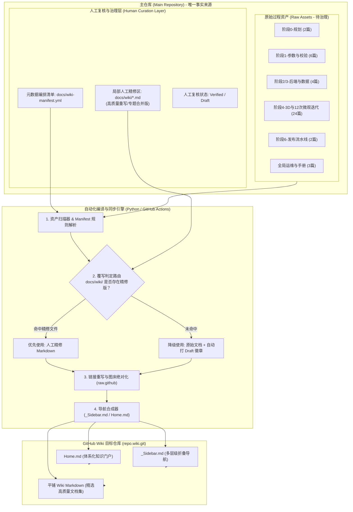

# 阶段6-GitHub-Wiki知识库体系化构建与自动化同步方案

> **文档版本**：v1.1.0  
> **文档状态**：System Analysis & Architectural Design (Enhanced with Human-in-the-Loop Curation)  
> **所属阶段**：阶段 6 - 工程化交付、知识沉淀与 CI/CD 体系建设  
> **适用范围**：隧道工程多维协同智能排水自适应平台全过程文档体系

---

## 1. 现状解构与问题定义 (Problem Statement)

### 1.1 资产盘点现状
当前仓库根目录下积累了 **50+** 份关键文件，其中过程技术文档多达 **38 篇**，完整覆盖了工程各阶段的研发历程：
- **阶段 0（顶层架构与规划）**：工程总体架构、开发计划（2篇）。
- **阶段 1（环境与核心算法对齐）**：Python 依赖、虚拟环境、前端初始化、参数对齐、对比校验等（6篇）。
- **阶段 2（后端与调试）**：后端单元测试与 Debug 方案（1篇）。
- **阶段 3（数据层与台账）**：数据库定义、脏数据标注、台账式表单流转（3篇）。
- **阶段 4（3D可视化、空间拓扑与专题）**：总体方案、12 次迭代演进记录、9 大专项攻坚方案（共 24 篇，占文档总量 60%+）。
- **阶段 6（交付体系与 CI/CD）**：双模式交付架构、自动化发布流水线（2篇）。
- **全局运维与协议**：系统使用说明书、计算参数 prompt、更新日志等（3篇）。

### 1.2 核心痛点与工程现实（杂乱原始文档治理矛盾）
1. **草稿性与过程杂音并存（Garbage In, Garbage Out 风险）**：
   - 原始文档多为研发过程中的阶段性纪要、临时 Debug 记录、攻坚推演草稿（如阶段 4 的 12 次微观迭代排查记录）。
   - 若直接通过无脑扫描、1:1 自动化强行推送到 Wiki，不仅会导致 Wiki 充斥低信噪比信息，还会破坏整体专业度。
2. **纯自动化 vs 纯手工的两难困境**：
   - **纯自动归纳**：缺乏语义辨识能力，无法识别哪些文档属于废弃草案、哪些需要提炼合并，对复杂数学公式与破损排版无力修复；
   - **纯人工迁移**：38 篇文档迁移工作量庞大，且一旦主仓库代码或文档更新，脱离 Git 跟踪的纯人工 Wiki 极易腐化脱节；
   - **全量覆写导致人工修改丢失**：若只配置简单推送脚本，开发者在 Wiki 页面进行的人工排版润色会在下一次自动化运行中被彻底冲掉。
3. **平台展示与根目录组织脱节**：
   - 根目录下 38 篇平铺文件严重污染仓库结构；缺乏人工梳理的分层收敛与全局导读目录。

---

## 2. 模式选型与人机协同演进决策

针对核心疑问：“**是自动归纳、逻辑整理？还是增加人工复核与局部人工更新，以应对原始文档比较杂乱？**”，本方案进行深度架构对比与终局选型。

### 2.1 技术路径对比矩阵

| 评估维度 | 路径 A：纯规则全自动归纳 (Fully Automated) | 路径 B：纯手工搬运与更新 (Purely Manual) | 路径 C：人机协同分层治理架构 (Human-in-the-Loop Curation - 推荐) |
| :--- | :--- | :--- | :--- |
| **应对原始文档杂乱** | **极差**。原始文档的草稿腔调、格式破损、过时结论被原封不动搬上 Wiki | **较好**。全流程人工审查重写，但极其耗费时间 | **卓越**。自动化负责资产底座保底，人工专注核心章节精修与合并 |
| **局部更新与精修容错** | **无**。下一次 CI 流水线触发将覆盖所有手动调整 | **完全依赖人工**。极易发生遗漏和版本漂移 | **高**。通过“局部覆写区 (Override Layer)”隔离，精修成果永久受版本控制受保护 |
| **全量资产覆盖时效** | 秒级全量生成 | 数周/月，极易半途而废 | 即时形成 100% 覆盖草案，随后按需渐进式复核精修 |
| **主仓库与Wiki一致性** | 强绑定，自动同步 | 极弱，Wiki 与代码迅速脱节 | 强绑定。元数据清单 (`wiki-manifest.yml`) 纳入主仓库 Git 版本控制 |
| **工程维护成本** | 低（但产出质量低下） | 极高（不可持续） | 中低（关键节点人工介入，常规节点自动化托管） |

### 2.2 终局裁决：三维一体“人机协同治理机制” (Human-in-the-Loop Curation)
> **决策结论**：**坚决摒弃“纯自动暴力映射”与“纯手动脱节录入”两个极端，采用“自动提取托底 + 清单元数据调度 + 人工精修局部覆写 (Local Manual Override)”的人机协同治理架构**。
>
> 1. **自动归类与语法规格化（机器负责繁琐工作）**：
>    - 负责全量扫描 38 篇文档，执行字符集规范化、URL 防破损重写、图床路径转换、侧边栏树形索引动态生成。
> 2. **元数据清单调度（配置驱动人工意图）**：
>    - 通过配置文件 `docs/wiki-manifest.yml`，人工显式定义每一篇文档的收录策略（直接收纳、合并归纳、标记弃用、隐藏）。
> 3. **局部人工更新与覆写区（人工专注高质量表达）**：
>    - 在主仓库建立 `docs/wiki/` 目录。当某篇复杂技术文档（或归纳后的专题演进）在 `docs/wiki/` 存在人工精修版时，编译引擎**优先采用精修版覆盖原始草稿**；若无精修版，则优雅降级采用原始文档自动版，并打上状态徽章。

---

## 3. GitHub Wiki 系统拓扑与双层覆写架构



---

## 4. “人机协同”分层治理与局部覆写规则规范

为彻底解决原始 38 篇文档存在草稿腔调、局部杂乱、重复累赘的问题，制定以下分级治理标准：

### 4.1 文档分级治理策略 (Document Triage Strategy)

| 资产级别 | 范畴定义 | 涉及文档范例 | 治理与更新策略 |
| :--- | :--- | :--- | :--- |
| **Tier 1: 核心规范与门面 (Curated Core)** | 外部协作者必读、架构定义、系统部署与交付手册 | 总体技术架构、系统使用说明书、阶段6双模式交付方案 | **必须人工逐行精修复核**。确保排版精美、术语准确，放置于 `docs/wiki/` 覆写区。 |
| **Tier 2: 复杂演进合并归纳 (Synthesized Topics)** | 研发过程极其繁琐、零碎迭代众多的专题记录 | 阶段 4 的 12 次微观迭代排查记录（原 4 篇零碎文档） | **禁止1:1直接平铺，采用人工/半自动合并归纳**。提炼为 1 篇《阶段4三维可视化12次演进全景回顾》，其余原始记录归入附录。 |
| **Tier 3: 原始技术细节归档 (Raw Details)** | 算法推导细节、特定日期的专项排查报告、计算书提示词 | 中间排水沟几何建模推导、探针随动推导、计算参数资产 | **由引擎自动抽取转换**。页面顶部自动注入提示：`> ℹ️ [本页为研发过程原始技术档案，保留历史推演细节]`。 |
| **Tier 4: 废弃或过时草稿 (Deprecated / Redundant)** | 早期已被新方案完全取代的草稿或废弃中间态 | 早期版本依赖排查草稿、已被合并的废弃临时测试方案 | **在 Manifest 中显式标记 `status: ignore`**，流水线跳过生成，防止污染 Wiki 检索。 |

### 4.2 编排清单格式规范 (`docs/wiki-manifest.yml`)
在主仓库根目录下提供机器可读、人工可编辑的元数据编排清单，赋予开发者对 Wiki 呈现逻辑的 100% 控制权：

```yaml
# docs/wiki-manifest.yml
# GitHub Wiki 自动化同步与人工编排控制清单
version: "1.1.0"
settings:
  sidebar_collapsible: true
  asset_cdn_prefix: "https://raw.githubusercontent.com/TREYWANGCQU/-----------------/main"

categories:
  - id: "phase0"
    title: "📌 阶段 0：顶层设计与规划"
    pages:
      - source: "阶段0-工程总体技术架构设计方案.md"
        wiki_title: "工程总体技术架构"
        slug: "Phase0-System-Architecture"
        tier: 1
        status: "curated"  # 已人工精修
      - source: "阶段0-工程开发计划.md"
        wiki_title: "工程开发计划与里程碑"
        slug: "Phase0-Development-Plan"
        tier: 2
        status: "verified"

  - id: "phase4"
    title: "📌 阶段 4：3D 可视化与空间协同体系"
    pages:
      - source: "阶段4-3D可视化交互工程总体方案.md"
        wiki_title: "3D 可视化交互工程总体方案"
        slug: "Phase4-3D-Visualization-Overview"
        tier: 1
        status: "curated"
      # 将原 12 次零碎微观迭代合并为统一精修篇章，避免杂乱
      - source: "docs/wiki/Phase4-Evolution-Summary.md"  # 人工重构的合并归纳篇
        override: true                                # 声明强制使用精修内容
        wiki_title: "12次微观迭代演进全景复盘"
        slug: "Phase4-Evolution-Summary"
        tier: 2
        status: "curated"
        original_references:
          - "阶段4-3D模型与界面微观优化开发计划-第1-3次迭代.md"
          - "阶段4-3D模型与界面微观优化开发计划-第4-6次迭代.md"
          - "阶段4-3D模型与界面微观优化开发计划-第7-9次迭代.md"
          - "阶段4-3D模型与界面微观优化开发计划-第10-12次迭代.md"
```

### 4.3 局部人工覆写优先级机制 (Override Priority Flow)
编译转换脚本执行时遵循以下优先级阶梯：
1. **第一优先级（人工精修覆写）**：检查 `docs/wiki/<slug>.md` 或清单指定的 `override` 路径是否存在。若存在，直接将此文件作为 Wiki 正文，享受最高渲染排版待遇。
2. **第二优先级（原始文档清洗转译）**：若无精修覆写，读取根目录对应原始文档，执行自动净化（移除本地绝对路径、转换 Markdown 引用为 Wiki 语法、重写图片链接）。
3. **状态标记（Status Badging）**：
   - 对未经过人工复核的页面，引擎自动在顶部注入醒目警示框：
     ```markdown
     > [!NOTE]
     > **文档状态声明**：本文档由主仓库原始研发记录自动同步生成，可能包含特定时期的过程调试痕迹。如需查验最新架构基准，请优先参考系统主文档。
     ```

---

## 5. 治理后的 Wiki 知识库大纲规划（收敛优化版）

经由“人工归纳合并”后，原 38 篇臃肿平铺的大纲被浓缩为 **20 篇高信噪比词条**，既保留了全过程溯源链条，又赋予协作者清晰脉络：

### 5.1 侧边栏导航架构 (`_Sidebar.md`)

```markdown
# 隧道工程多维协同智能排水平台知识库

* [[🏠 知识库主页|Home]]
* [[📖 系统双模式部署与使用说明书|Manual-System-Deployment-Guide]]

---
### 📌 阶段 0：顶层设计与规划
* [[工程总体技术架构|Phase0-System-Architecture]]
* [[工程开发计划与里程碑|Phase0-Development-Plan]]

### 📌 阶段 1：算法核心与参数基准
* [[输入参数全系统更新与对齐方案|Phase1-Input-Parameters-Alignment]]
* [[计算引擎对比校验与精度验证|Phase1-Engine-Verification]]
* [[排水管网3D标注与推荐管径对齐|Phase1-Drainage-Annotation-Alignment]]
* [[Python环境与依赖排查规范|Phase1-Python-Environment-Setup]]

### 📌 阶段 2 & 3：后端服务与数据底座
* [[后端测试与 Debug 详细工程方案|Phase2-Backend-Testing-Debug]]
* [[数据库专项定义与数据清洗规范|Phase3-Database-Sanitization-Combined]]
* [[前端台账式表单与数据流转落地|Phase3-Form-DataFlow-Architecture]]

### 📌 阶段 4：3D 可视化与空间协同体系
* [[3D 可视化交互工程总体方案|Phase4-3D-Visualization-Overview]]
* [[3D 多维协同看板与模型核算|Phase4-Dashboard-And-Model-Verification]]
* [[Agent 编码实现与快照特征标准|Phase4-Agent-And-Snapshot-Standard]]
* **专项攻坚方案集 (Special Topics)**
  * [[中间排水沟自适应几何建模架构|Phase4-Topic-Central-Ditch-Modeling]]
  * [[Typst 引擎计算书导出与打包|Phase4-Topic-Typst-Calculation-Export]]
  * [[快照卡片施工设计图自动生成|Phase4-Topic-Snapshot-CAD-Generation]]
  * [[最不利受力探针随动架构|Phase4-Topic-Critical-Stress-Probe]]
  * [[自适应顶栏与百级快照侧边栏检索|Phase4-Topic-Header-Sidebar-Retriever]]
  * [[排水管网3D模型专项问题诊断|Phase4-Topic-Drainage-Network-Diagnosis]]
* **微观迭代演进史 (Evolution History)**
  * [[12次微观迭代演进全景复盘 (合并精选版)|Phase4-Evolution-Summary]]

### 📌 阶段 6：工程交付与自动化流水线
* [[服务器与桌面独立GUI双模式交付架构|Phase6-Dual-Mode-Delivery-Architecture]]
* [[GitHub 自动发布与大版本 CI/CD 流水线|Phase6-GitHub-Release-Pipeline]]

---
* [[📝 变更日志 (CHANGELOG)|CHANGELOG]]
* [[💡 计算书参数提示词资产|Prompt-Calculation-Asset]]
```

---

## 6. 工作分解结构 (WBS 1.1.0)

针对人机协同与局部更新的落地，在 WBS 中正式增设**文档分级治理与局部人工精修节点**：

```
WBS 知识库建设与同步工程 (v1.1.0)
│
├── 1. 资产整理、清单编制与分级治理 (Curation & Manifest)
│   ├── 1.1 扫描根目录 38 篇文档并完成 Tier 1~4 分级归类
│   ├── 1.2 编写 docs/wiki-manifest.yml 编排控制清单 (定义标题、Slug 与归属)
│   └── 1.3 针对阶段4的12次微观迭代进行人工/半自动总结，产出 Phase4-Evolution-Summary.md
│
├── 2. 局部覆写区与转换引擎开发 (Compiler & Override Engine)
│   ├── 2.1 建立 docs/wiki/ 局部人工精修工作目录与示例模板
│   ├── 2.2 编写 scripts/wiki/build-wiki.py 转换解析器
│   │   ├── 读取并校验 wiki-manifest.yml 配置语法
│   │   ├── 检查 docs/wiki/ 局部覆写文件，实现“人工精修优先”路由判定
│   │   ├── 对未精修文件注入“过程草稿/待复核”状态警示框
│   │   ├── 统一处理图片绝对化引用与超链接语法适配
│   │   └── 动态生成 _Sidebar.md 与聚合门户 Home.md
│   └── 2.3 编写 scripts/wiki/sync-local-wiki.py 本地手动灾备工具
│
├── 3. CI/CD 自动化流水线配置 (GitHub Actions Implementation)
│   ├── 3.1 编写 .github/workflows/wiki-sync.yml
│   │   ├── 触发事件：监听 docs/** 及根目录技术文档的 Push / PR 事件
│   │   ├── 临时检出 target.wiki.git 并执行 Python 编译引擎
│   │   └── 校验输出差异，执行 git commit 并推送到 Wiki 独立仓库
│   └── 3.2 配置仓库 GitHub Actions 权限 (`contents: write`)
│
└── 4. 首次全量发布与人工复核门禁 (Verification & Quality Gate)
    ├── 4.1 在 GitHub 网页端开启 Wikis 功能并完成初始化
    ├── 4.2 触发首次全量编译发布
    ├── 4.3 执行人工复核检查表 (Link Check / Layout Audit / Code Block Test)
    └── 4.4 针对排版有缺陷的页面，直接在 docs/wiki/ 提交局部人工精修更新
```

---

## 7. 验收准则与质量门禁矩阵 (Acceptance Criteria)

| 门禁维度 | 验收指标 (Metric) | 测量方法与合格判据 |
| :--- | :--- | :--- |
| **信噪比与文档洁净度** | Tier 1 & 2 文档 100% 精修或合并 | 关键架构、部署指南及微观演进完成逻辑收敛，无破损代码块或未闭合标签。 |
| **局部更新保护性** | 人工精修 100% 零覆盖丢失 | 凡提交至 `docs/wiki/` 的人工精修文档，在后续流水线运行时绝不被原始文档冲刷。 |
| **链接有效率** | 零坏链 (Zero Broken Links) | 自动化脚本扫描 Wiki 页面超链接，内部跳转连通率 100%。 |
| **状态标识清晰度** | 100% 具备明确状态声明 | 访客能够清晰识别当前页面是“权威架构基准 (Curated)”还是“原始研发记录 (Draft)”。 |
| **自动化发布时延** | Push 触发后 ≤ 120 秒生效 | 修改主仓库 `docs/` 或清单并合并后，线上 Wiki 在 2 分钟内同步展现。 |
| **双轨容灾能力** | 离线脚本可独立执行 | 断网或 CI 故障时，本地运行 Python 脚本可一键将治理后产物推至 Wiki。 |

---

## 8. 下一步具体落地行动

1. **第一步（资产分类确认）**：依照第 4 节分级治理策略，在主仓库初始化 `docs/wiki-manifest.yml` 与 `docs/wiki/` 目录。
2. **第二步（合并提炼草稿）**：优先将阶段 4 的 12 次微观迭代排查记录精简归纳为一篇演进综述，消除低信噪比杂音。
3. **第三步（工具链研发）**：实现具备局部覆写判断逻辑的 `scripts/wiki/build-wiki.py` 及 GitHub Actions 流水线。
4. **第四步（上线与渐进式精修）**：Wiki 开通后，自动化流水线负责持续保底，团队可按需对关键技术文档逐篇在 `docs/wiki/` 进行渐进式人工精修。
