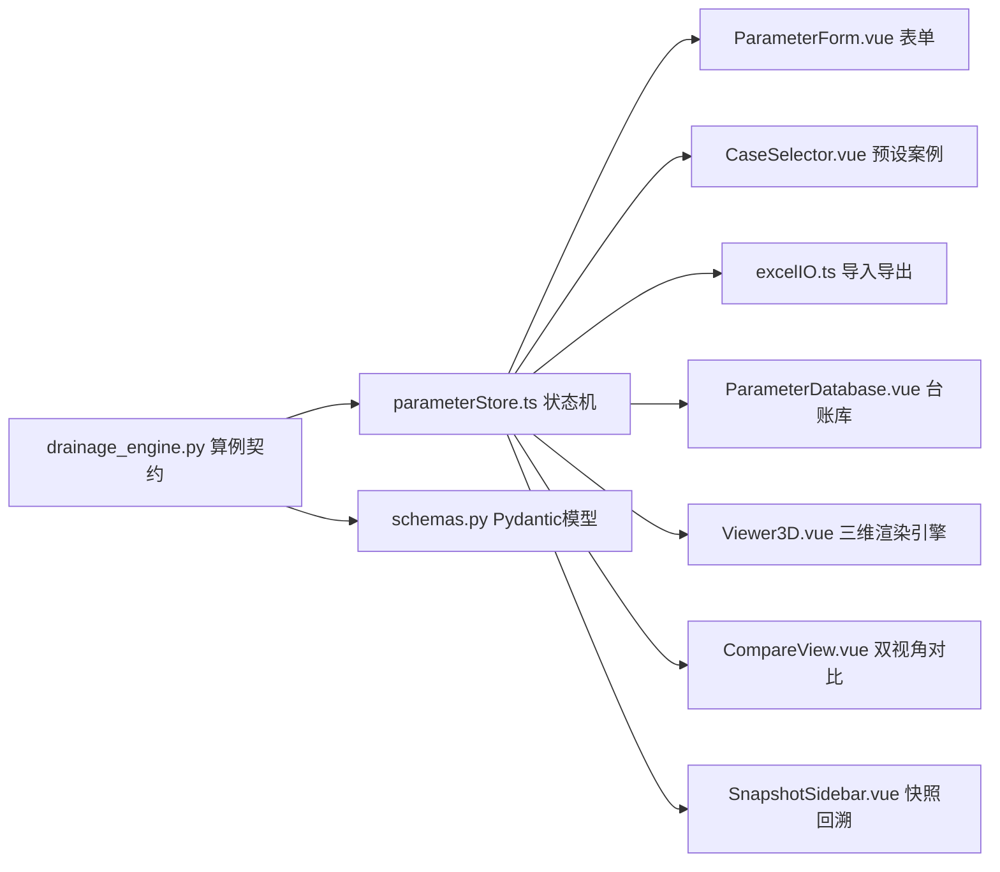

# 隧道防排水智能自适应平台 输入参数全系统更新与对齐方案

## 1. 概述与目标 (Overview & Objectives)

本方案 strictly 依据后端核心计算引擎 [drainage_engine.py](file:///d:/offices/Github/%E9%9A%A7%E9%81%93%E5%B7%A5%E7%A8%8B%E5%A4%9A%E7%BB%B4%E5%8D%8F%E5%90%8C%E6%99%BA%E8%83%BD%E6%8E%92%E6%B0%B4%E8%87%AA%E9%80%82%E5%BA%94%E5%B9%B3%E5%8F%B0/tunnel-drainage-platform/backend/app/services/drainage_engine.py) 的求解接口契约，针对前端工作台 [Dashboard.vue](file:///d:/offices/Github/%E9%9A%A7%E9%81%93%E5%B7%A5%E7%A8%8B%E5%A4%9A%E7%BB%B4%E5%8D%8F%E5%90%8C%E6%99%BA%E8%83%BD%E6%8E%92%E6%B0%B4%E8%87%AA%E9%80%82%E5%BA%94%E5%B9%B3%E5%8F%B0/tunnel-drainage-platform/frontend/src/views/Dashboard.vue)、参数表单 [ParameterForm.vue](file:///d:/offices/Github/%E9%9A%A7%E9%81%93%E5%B7%A5%E7%A8%8B%E5%A4%9A%E7%BB%B4%E5%8D%8F%E5%90%8C%E6%99%BA%E8%83%BD%E6%8E%92%E6%B0%B4%E8%87%AA%E9%80%82%E5%BA%94%E5%B9%B3%E5%8F%B0/tunnel-drainage-platform/frontend/src/components/ui/ParameterForm.vue)、典型案例预设 [CaseSelector.vue](file:///d:/offices/Github/%E9%9A%A7%E9%81%93%E5%B7%A5%E7%A8%8B%E5%A4%9A%E7%BB%B4%E5%8D%8F%E5%90%8C%E6%99%BA%E8%83%BD%E6%8E%92%E6%B0%B4%E8%87%AA%E9%80%82%E5%BA%94%E5%B9%B3%E5%8F%B0/tunnel-drainage-platform/frontend/src/components/ui/CaseSelector.vue)、Excel 模板与批导入 [excelIO.ts](file:///d:/offices/Github/%E9%9A%A7%E9%81%93%E5%B7%A5%E7%A8%8B%E5%A4%9A%E7%BB%B4%E5%8D%8F%E5%90%8C%E6%99%BA%E8%83%BD%E6%8E%92%E6%B0%B4%E8%87%AA%E9%80%82%E5%BA%94%E5%B9%B3%E5%8F%B0/tunnel-drainage-platform/frontend/src/utils/excelIO.ts)、参数数据库台账 [ParameterDatabase.vue](file:///d:/offices/Github/%E9%9A%A7%E9%81%93%E5%B7%A5%E7%A8%8B%E5%A4%9A%E7%BB%B4%E5%8D%8F%E5%90%8C%E6%99%BA%E8%83%BD%E6%8E%92%E6%B0%B4%E8%87%AA%E9%80%82%E5%BA%94%E5%B9%B3%E5%8F%B0/tunnel-drainage-platform/frontend/src/views/ParameterDatabase.vue) 及关联 3D 渲染与快照模块，制定确定性的参数更新与重构路线图。

核心目标如下：
1. **接口契约全量对齐**：消除前端、导出模板、数据库存储与后端计算引擎之间的字段冗余与命名分歧（例如彻底清理计算引擎未调用的废弃参数 `beta2`，规范化 `Ag` 配筋面积单位换算）。
2. **工程物理防呆校验**：建立严密的几何级数约束（$r_0 < r_s < r_p \le r_g < H$）和空间拓扑约束（`start_chainage < end_chainage`），阻断非法参数传入引发的引擎计算崩溃或 3D 渲染异常。
3. **全系统联动覆盖**：明确受影响的所有前后端模块及数据传递链路，保证参数变更的完全闭环。

---

## 2. 约束条件 (Constraints)

1. **计算引擎协议不可变**：后端 [drainage_engine.py](file:///d:/offices/Github/%E9%9A%A7%E9%81%93%E5%B7%A5%E7%A8%8B%E5%A4%9A%E7%BB%B4%E5%8D%8F%E5%90%8C%E6%99%BA%E8%83%BD%E6%8E%92%E6%B0%B4%E8%87%AA%E9%80%82%E5%BA%94%E5%B9%B3%E5%8F%B0/tunnel-drainage-platform/backend/app/services/drainage_engine.py) 的 `run_calculation(data)` 函数读取参数键名必须保持 100% 兼容。
2. **底层计算逻辑保护**：不更改 [hydrocalc.py](file:///d:/offices/Github/%E9%9A%A7%E9%81%93%E5%B7%A5%E7%A8%8B%E5%A4%9A%E7%BB%B4%E5%8D%8F%E5%90%8C%E6%99%BA%E8%83%BD%E6%8E%92%E6%B0%B4%E8%87%AA%E9%80%82%E5%BA%94%E5%B9%B3%E5%8F%B0/tunnel-drainage-platform/backend/app/services/hydrocalc.py) 与 [mechcalc.py](file:///d:/offices/Github/%E9%9A%A7%E9%81%93%E5%B7%A5%E7%A8%8B%E5%A4%9A%E7%BB%B4%E5%8D%8F%E5%90%8C%E6%99%BA%E8%83%BD%E6%8E%92%E6%B0%B4%E8%87%AA%E9%80%82%E5%BA%94%E5%B9%B3%E5%8F%B0/tunnel-drainage-platform/backend/app/services/mechcalc.py) 中的物理求解与力学有限元算法。
3. **数据库向下兼容**：历史存储的 JSON 数据在反序列化载入 Pinia Store 时，必须具备默认补全能力，防止因为缺少新增参数或含有废弃字段导致运行期错误。

---

## 3. 全系统参数映射矩阵 (Parameter Mapping Matrix)

严格审查 `drainage_engine.py` 内部 `get_val()` 逻辑后提取的全量参数规范如下：

| 参数 Key | 兼容 Key | 中文名称 | 物理单位 | 默认值 (Hc/Mc) | 单/双洞适用 | 后端接收对象 | 优化与更新策略 |
| :--- | :--- | :--- | :--- | :--- | :--- | :--- | :--- |
| `tunnel_type` | - | 隧道洞型 | - | `'single'` | 通用 | `parHc.tunnel_type` | 保持 `'single'` / `'double'` 枚举 |
| `start_chainage` | - | 分区起点里程 | m | `0.0` | 通用 | `parHc.start_chainage` | 必填，校验小于终点里程 |
| `end_chainage` | - | 分区终点里程 | m | `47.0` | 通用 | `parHc.end_chainage` | 必填，校验大于起点里程 |
| `K` | - | 围岩渗透系数 | m/d | `0.15` | 通用 | `parHc.k_r` | 核心水文参数 |
| `h` | - | 初始静水位水头 | m | `100.0` | 通用 | `parHc.H` | 必填，校验 `h <= c` |
| `r` | - | 二衬内半径(等效) | m | `7.95` | 通用 | `parHc.r_0` | 几何递增约束 $r < r_1$ |
| `r1` | - | 二衬外半径 | m | `8.35` | 通用 | `parHc.r_s` | 几何递增约束 $r_1 < r_2$ |
| `r2` | - | 初支外半径 | m | `8.57` | 通用 | `parHc.r_p` | 几何递增约束 $r_2 \le r_g$ |
| `rg` | - | 注浆圈外半径 | m | `8.57` | 通用 | `parHc.r_g` | 几何上限约束 $r_g < h$ |
| `K2` | - | 二衬渗透系数 | m/d | `0.000864` | 通用 | `parHc.k_s` | 建议 UI 提高小数保留精度 |
| `K1` | - | 初支渗透系数 | m/d | `0.00864` | 通用 | `parHc.k_p` | 水文透水层参数 |
| `Kg` | - | 注浆圈渗透系数 | m/d | `0.00864` | 通用 | `parHc.k_g` | 封水层参数 |
| `P_crit` | - | 临界控制水压力 | kPa | `500.0` | 通用 | `parHc.P_crit` | 反算控制阈值 |
| `ha` | - | 隧道中心水头/低水头| m | `0.0` | 双洞特有 | `parHc.h_1` | `tunnel_type=='double'` 时有效 |
| `c` | `depth` | 隧道埋深/拱顶埋深 | m | `50.0` | 通用 | `c_val` / `parMc.depth` | 同步映射水文与力学埋深 |
| `D_spacing` | - | 双洞中心间距 | m | `40.0` | 双洞特有 | `parHc.D_spacing` | `tunnel_type=='double'` 时有效 |
| `p_mm` | - | 年降雨量 | mm | `1000.0` | 通用 | `parHc.p_mm` | SCS-CN 降雨补给项 |
| `cn_condition` | - | 灌溉条件 | - | `'灌溉良好'` | 通用 | `parHc.cn_condition` | 限选：灌溉良好/灌溉较差 |
| `land_use` | - | 用地类型 | - | `'居住地'` | 通用 | `parHc.land_use` | 限选：6大用地类型 |
| `gamma` | - | 水的重度 | kN/m³| `10.0` | 通用 | `parHc.gamma` | 高级参数 |
| `double_side` | - | 双侧排水开关 | bool | `True` | 通用 | `parHc.double_side` | 布尔类型 |
| `S_min` | - | 盲管最小允许间距 | m | `3.0` | 通用 | `parHc.S_min` | 高级参数 |
| `S_code_max` | `S_max` | 规范最大盲管间距 | m | `10.0` | 通用 | `parHc.S_max` | 高级参数 |
| `n_long` / `I_long`| `i_long` | 纵向管糙率与坡降 | - | `0.012`/`0.02`| 通用 | `parHc.n_long`/`i_long`| 高级参数 |
| `n_ring` / `I_ring`| `i_ring` | 环向管糙率与水力坡 | - | `0.012`/`0.73`| 通用 | `parHc.n_ring`/`i_ring`| 高级参数 |
| `n_lat` / `I_lat` | `i_lat` | 横向管糙率与坡降 | - | `0.012`/`0.01`| 通用 | `parHc.n_lat`/`i_lat` | 高级参数 |
| `d_long_default`| `d_long0`| 纵向管初始直径 | m | `0.10` | 通用 | `parHc.d_long0` | 高级参数 |
| `d_ring_default`| `d_ring0`| 环向管初始直径 | m | `0.05` | 通用 | `parHc.d_ring0` | 高级参数 |
| `d_lat_default` | `d_lat0` | 横向管初始直径 | m | `0.08` | 通用 | `parHc.d_lat0` | 高级参数 |
| `aspect_ratio` | - | 隧道高宽比 h/w | - | `1.0` (默认) | 通用 | `aspect_ratio` | 控制衬砌断面高度 hh |
| `grades` | - | 围岩级别 | 级 | `4` (IV级) | 通用 | `parMc.grades` | 输入 1-6 或 'I'-'VI' |
| `concrete_grade`| - | 混凝土标号 | - | `'C35'` | 通用 | `parMc.concrete_grade`| 支持 'C30' 或 30 数值 |
| `Ag` | - | 配筋面积 | m² | `0.002` | 通用 | `parMc.Ag` | 引擎自动换算 <1.0 -> mm² |
| `as_mm` | - | 钢筋保护层厚度 | mm | `50.0` | 通用 | `parMc.as_mm` | 高级力学参数 |
| `tol_safety_factor`| -| 容许安全系数 | - | `2.0` | 通用 | `parMc.tol_safety_factor`| 高级力学参数 |
| `rebar_type` | - | 钢筋类型 | - | `'HRB400'` | 通用 | `rebar_type` | HRB300/400/500 |
| **`beta2`** | - | 涌水量折减系数 | - | - | - | **未在引擎中使用** | **从全系统中清理废弃** |

---

## 4. 全系统受影响模块拆解与具体更新方案

### 4.1 前端状态机 ([parameterStore.ts](file:///d:/offices/Github/%E9%9A%A7%E9%81%93%E5%B7%A5%E7%A8%8B%E5%A4%9A%E7%BB%B4%E5%8D%8F%E5%90%8C%E6%99%BA%E8%83%BD%E6%8E%92%E6%B0%B4%E8%87%AA%E9%80%82%E5%BA%94%E5%B9%B3%E5%8F%B0/tunnel-drainage-platform/frontend/src/store/parameterStore.ts))
1. **接口定义清理**：从 `SingleTubeParams` 与 `DoubleTubeParams` 中彻底注销 `beta2` 字段。
2. **默认值更新**：把初始化数据中为 `0` 的水文/几何字段替换为符合物理规范的保底数值（`r: 7.95, r1: 8.35, r2: 8.57, rg: 8.57, K: 0.15, h: 30.0, c: 50.0`），防止初次挂载时出现除零错误。
3. **数据加载容错**：在 `overrideAll` 方法中加入缺失字段默认补全逻辑，保证导入不完整 JSON 数据时不会打断响应式更新。

### 4.2 后端模型与数据库 ([schemas.py](file:///d:/offices/Github/%E9%9A%A7%E9%81%93%E5%B7%A5%E7%A8%8B%E5%A4%9A%E7%BB%B4%E5%8D%8F%E5%90%8C%E6%99%BA%E8%83%BD%E6%8E%92%E6%B0%B4%E8%87%AA%E9%80%82%E5%BA%94%E5%B9%B3%E5%8F%B0/tunnel-drainage-platform/backend/app/models/schemas.py) & [init_db.py](file:///d:/offices/Github/%E9%9A%A7%E9%81%93%E5%B7%A5%E7%A8%8B%E5%A4%9A%E7%BB%B4%E5%8D%8F%E5%90%8C%E6%99%BA%E8%83%BD%E6%8E%92%E6%B0%B4%E8%87%AA%E9%80%82%E5%BA%94%E5%B9%B3%E5%8F%B0/tunnel-drainage-platform/backend/app/db/init_db.py))
1. **Pydantic 模型修正**：同步删除 `SingleTubeSchema` 与 `DoubleTubeSchema` 中的 `beta2` 描述项。
2. **初始化种子数据校准**：更新 `init_db.py` 内预置数据库记录的 `parameters_json`，剔除废弃的 `beta2` 字段。

### 4.3 核心参数表单 ([ParameterForm.vue](file:///d:/offices/Github/%E9%9A%A7%E9%81%93%E5%B7%A5%E7%A8%8B%E5%A4%9A%E7%BB%B4%E5%8D%8F%E5%90%8C%E6%99%BA%E8%83%BD%E6%8E%92%E6%B0%B4%E8%87%AA%E9%80%82%E5%BA%94%E5%B9%B3%E5%8F%B0/tunnel-drainage-platform/frontend/src/components/ui/ParameterForm.vue))
1. **界面元素清理**：删除折叠面板 3 中的“涌水量折减系数 (`beta2`)” `el-form-item` 控件。
2. **新增几何层级校验**：
   - 编写自定义校验规则 `validateRadius`，强制验证 $r < r_1 < r_2 \le r_g$。
   - 增加水头与埋深逻辑校验 `h <= c`。
3. **单位标注一致化**：统一 `Ag`（配筋面积）UI 标注为 `m²`（注：提示用户输入小数值，如 `0.002`，后端引擎会自动换算）。

### 4.4 典型工程案例预设 ([CaseSelector.vue](file:///d:/offices/Github/%E9%9A%A7%E9%81%93%E5%B7%A5%E7%A8%8B%E5%A4%9A%E7%BB%B4%E5%8D%8F%E5%90%8C%E6%99%BA%E8%83%BD%E6%8E%92%E6%B0%B4%E8%87%AA%E9%80%82%E5%BA%94%E5%B9%B3%E5%8F%B0/tunnel-drainage-platform/frontend/src/components/ui/CaseSelector.vue))
1. **清理预设字典**：从 `karst_double_high` 与 `urban_single_low` 的预设数据对象中删除 `beta2` 键。
2. **数据完整性校验**：确认预设的几何半径严格满足梯级关系，补齐包含 13 个高级设置在内的全量参数。

### 4.5 Excel 模板生成与批量导入 ([excelIO.ts](file:///d:/offices/Github/%E9%9A%A7%E9%81%93%E5%B7%A5%E7%A8%8B%E5%A4%9A%E7%BB%B4%E5%8D%8F%E5%90%8C%E6%99%BA%E8%83%BD%E6%8E%92%E6%B0%B4%E8%87%AA%E9%80%82%E5%BA%94%E5%B9%B3%E5%8F%B0/tunnel-drainage-platform/frontend/src/utils/excelIO.ts))
1. **字典字段更新**：从 `fieldMapping` 移除 `'设计涌水量折减系数': 'beta2'`。
2. **下载模板范例行修正**：更新 `downloadTemplate()` 导出的默认参考值，将零值占位符全部替换为工程可计算值。
3. **导出存档闭环**：确保导出当前数据 (`exportCurrentData`) 和分段计算结果 (`exportSnapshotResult`) 时不会出现废弃或断层字段。

### 4.6 参数数据库与对标分析 ([ParameterDatabase.vue](file:///d:/offices/Github/%E9%9A%A7%E9%81%93%E5%B7%A5%E7%A8%8B%E5%A4%9A%E7%BB%B4%E5%8D%8F%E5%90%8C%E6%99%BA%E8%83%BD%E6%8E%92%E6%B0%B4%E8%87%AA%E9%80%82%E5%BA%94%E5%B9%B3%E5%8F%B0/tunnel-drainage-platform/frontend/src/views/ParameterDatabase.vue))
1. **对标抽屉字段过滤**：对标分析抽屉 (`openCompare`) 生成 `compareKeys` 时自动过滤废弃参数。
2. **历史记录兼容处理**：在载入工作台 (`loadToWorkspace`) 时对旧数据库解包的参数做格式归一化。

### 4.7 3D 可视化驱动 ([Viewer3D.vue](file:///d:/offices/Github/%E9%9A%A7%E9%81%93%E5%B7%A5%E7%A8%8B%E5%A4%9A%E7%BB%B4%E5%8D%8F%E5%90%8C%E6%99%BA%E8%83%BD%E6%8E%92%E6%B0%B4%E8%87%AA%E9%80%82%E5%BA%94%E5%B9%B3%E5%8F%B0/tunnel-drainage-platform/frontend/src/components/three/Viewer3D.vue) & [DrainagePipeGenerator.ts](file:///d:/offices/Github/%E9%9A%A7%E9%81%93%E5%B7%A5%E7%A8%8B%E5%A4%9A%E7%BB%B4%E5%8D%8F%E5%90%8C%E6%99%BA%E8%83%BD%E6%8E%92%E6%B0%B4%E8%87%AA%E9%80%82%E5%BA%94%E5%B9%B3%E5%8F%B0/tunnel-drainage-platform/frontend/src/components/three/generators/DrainagePipeGenerator.ts))
1. **几何参数正确同步**：3D 生成器依赖的半径与高宽比参数在前端经防呆校验后，可彻底规避模型网格（Mesh）交叠或反转问题。

### 4.8 侧边栏与视图控制 ([SnapshotSidebar.vue](file:///d:/offices/Github/%E9%9A%A7%E9%81%93%E5%B7%A5%E7%A8%8B%E5%A4%9A%E7%BB%B4%E5%8D%8F%E5%90%8C%E6%99%BA%E8%83%BD%E6%8E%92%E6%B0%B4%E8%87%AA%E9%80%82%E5%BA%94%E5%B9%B3%E5%8F%B0/tunnel-drainage-platform/frontend/src/components/ui/SnapshotSidebar.vue), [CompareView.vue](file:///d:/offices/Github/%E9%9A%A7%E9%81%93%E5%B7%A5%E7%A8%8B%E5%A4%9A%E7%BB%B4%E5%8D%8F%E5%90%8C%E6%99%BA%E8%83%BD%E6%8E%92%E6%B0%B4%E8%87%AA%E9%80%82%E5%BA%94%E5%B9%B3%E5%8F%B0/tunnel-drainage-platform/frontend/src/views/CompareView.vue) & [Dashboard.vue](file:///d:/offices/Github/%E9%9A%A7%E9%81%93%E5%B7%A5%E7%A8%8B%E5%A4%9A%E7%BB%B4%E5%8D%8F%E5%90%8C%E6%99%BA%E8%83%BD%E6%8E%92%E6%B0%B4%E8%87%AA%E9%80%82%E5%BA%94%E5%B9%B3%E5%8F%B0/tunnel-drainage-platform/frontend/src/views/Dashboard.vue))
1. **快照还原与对比联动**：保证快照列表读取、双视角参数面板展示以及工作台一键“执行云计算”发送的 payload 的一致性。

---

## 5. 工作分解结构 (Work Breakdown Structure, WBS)

| 阶段 | 任务 ID | 对应文件路径 | 核心更新内容 | 依赖 |
| :--- | :--- | :--- | :--- | :--- |
| **阶段 1：数据模型与契约对齐** | `TSK-01` | `frontend/src/store/parameterStore.ts` | 移除 `beta2`，规范化初始化默认值 | 无 |
| | `TSK-02` | `backend/app/models/schemas.py` | 清理 Pydantic Schemas 中的 `beta2` 定义 | 无 |
| | `TSK-03` | `backend/app/db/init_db.py` | 修正默认种子 JSON 数据 | `TSK-02` |
| **阶段 2：交互表单与预设重构** | `TSK-04` | `frontend/src/components/ui/ParameterForm.vue` | 移除 `beta2` 控件，增加几何与水头校验规则 | `TSK-01` |
| | `TSK-05` | `frontend/src/components/ui/CaseSelector.vue` | 校准预设案例 JSON 数据 | `TSK-01` |
| **阶段 3：Excel与数据库重构** | `TSK-06` | `frontend/src/utils/excelIO.ts` | 调整 `fieldMapping` 字典，更新模板示例行 | `TSK-01` |
| | `TSK-07` | `frontend/src/views/ParameterDatabase.vue` | 优化对标分析过滤与载入容错 | `TSK-01` |
| **阶段 4：关联模块同步与审计** | `TSK-08` | `frontend/src/views/Dashboard.vue` | 验证计算指令发起 payload 完整性 | `TSK-04` |
| | `TSK-09` | `frontend/src/views/CompareView.vue` | 校验双视角对比参数展平逻辑 | `TSK-01` |
| | `TSK-10` | `frontend/src/components/three/Viewer3D.vue` | 验证参数修改后 3D 模型的几何响应 | `TSK-04` |

---

## 6. 验收标准 (Acceptance Criteria)

1. **接口对齐率 100%**：发送至 `/calculate` 接口的 JSON 请求体字段完全符合 [drainage_engine.py](file:///d:/offices/Github/%E9%9A%A7%E9%81%93%E5%B7%A5%E7%A8%8B%E5%A4%9A%E7%BB%B4%E5%8D%8F%E5%90%8C%E6%99%BA%E8%83%BD%E6%8E%92%E6%B0%B4%E8%87%AA%E9%80%82%E5%BA%94%E5%B9%B3%E5%8F%B0/tunnel-drainage-platform/backend/app/services/drainage_engine.py) 的要求，零废弃字段。
2. **表单校验防呆有效**：输入不符合物理规律的参数（如起点里程大于终点里程、半径不满足 $r_0 < r_s < r_p \le r_g$）时，表单会及时阻止提交并给出准确提示。
3. **Excel 导入导出闭环**：下载的 Excel 模板在填写后可顺利导入生成快照序列；导出存档可以无缝重新导入。
4. **全系统协同正常**：选择预设案例、载入历史数据库记录、或者执行快照回溯时，表单、3D 渲染及计算结果均能实时同步更新。
