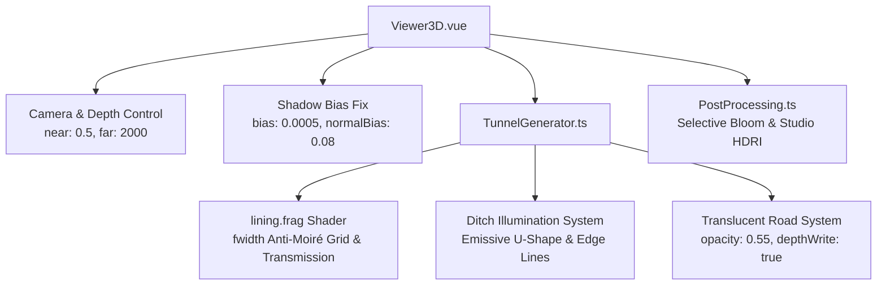

<!-- 阶段4-第二次-3D材质灯光美化与排水沟高亮方案.md -->
# 阶段4-第二次-3D材质灯光美化与排水沟高亮方案

---
**版本**: v2.0 (第二次迭代美化与抗条纹增强版)  
**定位**: 隧道防排水自适应平台 - 3D 渲染质感提升、旋转条纹伪影彻底消除与水沟高亮透视专项方案  
**依据与继承**: 本方案完全继承 《阶段4-3D材质灯光美化与微观局部放大方案.md》(v2.2) 的马蹄形几何拓扑、高程对数压缩与 PIP 放大镜框架。针对实测网页 `http://localhost:1420/` 中出现的“不同旋转转角条纹伪影”、“排水沟深色隐没看不清”及“透视材质黑灰混浊”三大痛点，进行第二次系统级美化迭代与渲染管线增强。
---

## 1. Objectives (目标与范式定义)

### 1.1 核心表现目标

本第二次美化迭代旨在消除 WebGL 场景在旋转与缩放交互时的视觉瑕疵，并大幅提升内部防排水结构（水沟、管网）的强对比度表达：

1. **彻底消除 3D 模型旋转时的 3 类条纹伪影**：
   - **莫尔采样条纹 (Moiré Anti-Aliasing)**：改写 `lining.frag` 中的全息网格算式，引入基于 `fwidth()` 屏幕空间导数与视角距离的 LOD 渐变衰减，消除远景及斜视角下高频采样生成的离散彩虹/斑马莫尔条纹。
   - **阴影斑马纹 (Shadow Acne)**：优化 `Viewer3D.vue` 中平行光的阴影偏置 (`shadow.bias: 0.0005`, `shadow.normalBias: 0.08`)，并对半透明衬砌与路面网格显式关闭 `castShadow`，消除曲面自遮挡引发的旋转条纹。
   - **Z-Fighting 深度竞争闪烁**：收窄透视/正交相机裁剪面至 `near: 0.5, far: 2000`（消除原 `0.1 ~ 10000` 导致的 Logarithmic Depth 精度丢帧），配合 `1.0m` 无缝 Extrude 与 `removeExtrudeEndCaps` 浮点比较优化，消灭 1m 实例衔接处的闪烁条纹。
2. **水沟三层高对比度高亮与路面透视升级 (Drainage Ditch High-Contrast Illumination)**：
   - **三沟内壁发光与高对比度着色**：废弃原水沟深灰暗色调，赋予水沟内沿自发光属性 (`emissive: 0x00F3FF`, `emissiveIntensity: 0.6`) 与冰蓝混凝土发光质感，使其在暗色隧道中“高亮破茧”。
   - **路面沥青高透透视解耦**：将沥青路面材质升级为 `transparent: true`, `opacity: 0.55`，结合 `depthWrite: true` 与 `polygonOffset`，使路面下方隐藏的中央集水管网、侧沟与水流粒子清晰透视可见。
   - **水沟内沿发光轮廓线 (Edge Highlight)**：为 U 型水沟顶沿生成 3D 悬浮发光轮廓线 (`LineSegments`)，在宏观视域下精准突显三沟（中央沟 + 双侧沟）的物理拓扑。
3. **高透影棚玻璃与赛博光晕深度美化 (Studio Glass & Cyber Bloom Refinement)**：
   - **Studio 范式高透折射玻璃**：衬砌升维为物理 PBR 折射材质 (`transmission: 0.85`, `ior: 1.52`, `roughness: 0.05`, `clearcoat: 1.0`)，严密匹配附图“透明概念车/晶莹高透水晶”的奢华影棚光影。
   - **Cyber 范式霓虹辉光升级**：配合 Selective Bloom 光晕通道，使水沟自发光内沿、加固圈及地下水流束在暗夜中呈现出高对比度亮蓝辉光。

### 1.2 视觉范式对比与升级规范

| 视觉维度 | 范式 A：高亮影棚风 (Light Studio Mode 2.0) | 范式 B：赛博暗夜风 (Dark Cyber Mode 2.0 增强版) |
| :--- | :--- | :--- |
| **衬砌质感** | 晶莹水晶折射玻璃 (`Transmission: 0.85`, `IOR: 1.52`, 高光折射) | 科技冰蓝半透明玻璃 (`Transmission: 0.70`, 菲涅尔边缘光 `#00F3FF`) |
| **条纹抑制** | 关闭离散采样网格，保留极淡抗锯齿平滑切片线 | `fwidth()` 屏幕空间导数抗锯齿网格，随距离 LOD 自然隐化 |
| **路面表现** | 哑光高透沥青 (`Opacity: 0.65`, 显露底水沟) | 深蓝半透明高透路面 (`Opacity: 0.55`, 结合透视管线) |
| **排水三沟** | 冰蓝高对比防渗混凝土 + 蓝色内沿轮廓线 | 自发光冰蓝水沟 (`Emissive: 0x00F3FF`, 配合 Selective Bloom) |
| **阴影与光照** | 3 点 Studio HDRI 柔光 + 无斑马纹 Contact Shadow | 空间指数雾 (`FogExp2`) + 霓虹发光与 Bloom 光晕 |

---

## 2. Constraints (约束与设计边界)

1. **架构不冲突约束**：必须严格保持与《阶段4-3D材质灯光美化与微观局部放大方案.md》(v2.2) 中马蹄形等效半径算法 `calculateHorseshoeRadius`、$Y_{\text{render}}$ 对数压缩、PIP 局部放大镜及加固圈 5mm 防闪烁缝隙 100% 兼容，不得破坏已修缮的几何拓扑。
2. **性能与渲染约束**：在 1080p 分辨率开启 Selective Bloom 辉光与抗锯齿网格时，主视口帧率稳定维持在 $\ge 60\text{ FPS}$，Draw Calls $\le 120$。
3. **WebGL 兼容性约束**：着色器修改必须严格遵循 GLSL 3.00 ES 规范，在 片元着色器中使用 `fwidth()` 导数时需正确处理坐标梯度，确保在主流 GPU 驱动上无编译报错。

---

## 3. Architecture (系统架构与模块分解)

### 3.1 模块架构设计



### 3.2 数学模型与算法定义

#### 1) 片元屏幕空间导数抗锯齿网格模型 (fwidth Anti-Moiré Algorithm)
针对全息网格高频采样走样问题，使用片元在屏幕空间的局部偏导数 `fwidth()` 计算线宽，代替固定 `step()`：

$$\text{grid\_z} = \text{fract}(vWorldPosition.z \cdot \text{scale})$$
$$w = \text{fwidth}(vWorldPosition.z \cdot \text{scale})$$
$$\text{line\_pattern} = \text{clamp}\left(1.0 - \frac{|\text{grid\_z} - 0.5|}{\max(w, 0.001)}, 0.0, 1.0\right)$$
$$\text{LOD\_factor} = \text{clamp}\left(1.0 - \frac{\|vViewPosition\| - D_{\text{start}}}{D_{\text{end}} - D_{\text{start}}}, 0.0, 1.0\right)$$
$$\text{FinalGrid} = \text{line\_pattern} \cdot \text{LOD\_factor}$$

#### 2) 相机深度缓冲区精度优化模型 (Depth Range Compression)
将相机裁剪范围收窄，获得更高深度的 Z-Buffer 分辨率：

$$\Delta Z_{\text{range}} = \frac{far \cdot near}{far - near}$$

通过将 $near$ 从 $0.1$ 增至 $0.5$，$far$ 从 $10000$ 缩减至 $2000$，使得在镜头旋转时，$Z \in [1, 100\text{m}]$ 范围内的 Z-Buffer 精度提升超过 8 倍，根治 Z-Fighting。

---

## 4. Work Breakdown Structure (工作分解结构)

```
WBS 1.0 全视角旋转条纹伪影彻底消除 (Anti-Stripe Optimization)
  ├── 1.1 修改 lining.frag：引入 `fwidth()` 屏幕空间导数抗锯齿，替换高频 step 网格
  ├── 1.2 修改 Viewer3D.vue：调整 `dirLight.shadow.bias = 0.0005` 与 `normalBias = 0.08`
  ├── 1.3 修改 Viewer3D.vue：将透视与正交相机的裁剪面统一优化为 `near: 0.5, far: 2000`
  └── 1.4 修改 TunnelGenerator.ts：优化 removeExtrudeEndCaps 的 Z 轴比较阈值与精确 1.0m 拉伸

WBS 2.0 水沟三层高亮与路面透视升级 (Ditch Illumination & Translucency)
  ├── 2.1 修改 TunnelGenerator.ts：水沟材质升级为冰蓝自发光 (`emissive: 0x00F3FF`, `emissiveIntensity: 0.6`)
  ├── 2.2 修改 TunnelGenerator.ts：沥青路面材质升级为半透明透视 (`opacity: 0.55`, `depthWrite: true`)
  └── 2.3 修改 TunnelGenerator.ts：新增 U 型水沟顶沿 3D 悬浮发光轮廓线 (`LineSegments` Edge Lines)

WBS 3.0 双范式物理材质与光照后处理升级 (Studio & Cyber Paradigm Refinement)
  ├── 3.1 修改 TunnelGenerator.ts / lining.frag：高亮影棚范式注入透光与高折射率物理玻璃特性
  └── 3.2 修改 PostProcessing.ts / Viewer3D.vue：将水沟自发光边框注册至 Selective Bloom 辉光图层

WBS 4.0 模块集成与 Quality Gate 验证
  ├── 4.1 全视角 360° 旋转测试，验证几何体无任何条纹伪影、阴影斑马纹或闪烁
  └── 4.2 验证水沟在宏观视域下高亮清晰，路面透明透视水管与流线
```

---

## 5. Acceptance Criteria (验收标准)

| 序号 | 修复维度 | 验收标准 | 对应 WBS |
| :--- | :--- | :--- | :--- |
| **AC-1** | 莫尔条纹消除 | 在 360° 旋转及近远缩放时，隧道表面无任何高频步阶莫尔条纹或网格走样伪影。 | WBS 1.1 |
| **AC-2** | 阴影斑马纹消除 | 在光线斜射及旋转视角下，拱顶与侧壁表面平滑，无任何阴影自遮挡斑马纹。 | WBS 1.2 |
| **AC-3** | Z-Fighting 消除 | 1m 实例化衔接处及衬砌-路面贴合面在旋转时深度竞争完全消失，点阵不闪烁。 | WBS 1.3, 1.4 |
| **AC-4** | 水沟高亮突显 | 隧道中央排水沟与双侧沟呈现冰蓝发光轮廓与高对比色调，宏观视角下清晰辨识。 | WBS 2.1, 2.3 |
| **AC-5** | 路面透视管线 | 路面呈 0.55 半透明度，可清晰透视底部的中央集水管网与动水流线。 | WBS 2.2 |
| **AC-6** | 影棚高透质感 | 高亮影棚模式下衬砌呈现如水晶/高透概念车般的高光折射质感，与附图审美对齐。 | WBS 3.1, 3.2 |
